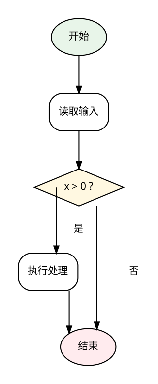
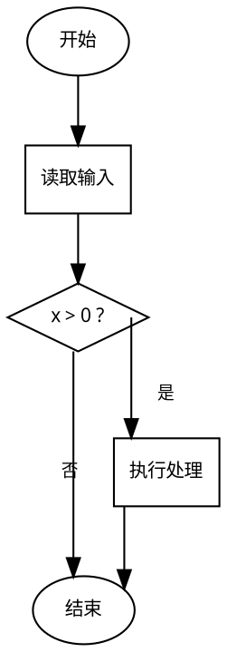
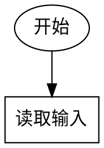
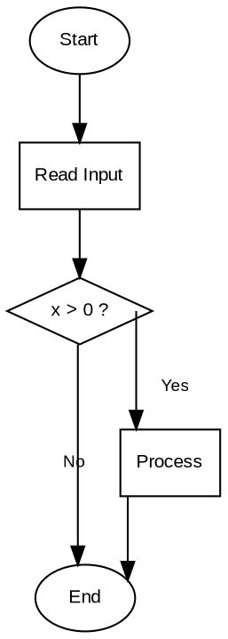
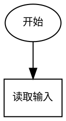
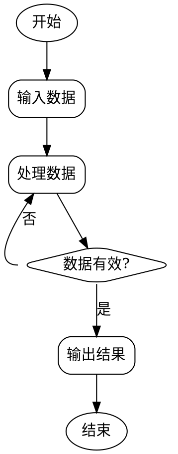

# DotPlainVisio

---
## 🧑‍💻 User

我想使用ai绘制visio流程图，有什么方法，目前的方法ai排版很混乱

---
## 🤖 Assistant

可以，而且**目前最稳的方式不是让 AI 直接“画 Visio 图”**，而是：

> **AI 先把流程整理成结构化数据/代码，Visio 或专业布局引擎负责排版。**

你现在觉得“AI 排版很混乱”，这其实很正常。因为 AI 在这件事上更擅长的是：

- 提炼流程逻辑
- 补全遗漏步骤
- 生成节点和连接关系

但它**不擅长一次性把复杂流程自动排得又美观又规范**。

---

# 先说结论：推荐你用这 3 种方法

| 方法 | 排版稳定性 | Visio可编辑性 | 适合场景 | 推荐 |
|---|---:|---:|---|---:|
| **AI → Excel结构表 → Visio Data Visualizer** | 高 | 高 | 业务流程、审批流程、跨部门流程 | ⭐⭐⭐⭐⭐ |
| **AI → Graphviz / Mermaid → SVG → 导入 Visio** | 很高（Graphviz）/ 中等（Mermaid） | 中 | 流程复杂、节点多 | ⭐⭐⭐⭐ |
| **AI → 生成 Visio VBA 宏** | 高 | 高 | 反复生成类似图、模板化场景 | ⭐⭐⭐⭐ |

最不推荐的是：

- **AI 直接出图片**
- **AI 直接生成自由排版流程图**

因为这两种最容易“看起来像图，但不好改、也不规范”。

---

# 为什么 AI 画流程图会乱？

主要是 5 个原因：

### 1）你给的是“自然语言”，不是“结构化流程”
比如一句话里同时包含：

- 条件判断
- 多个参与角色
- 例外分支
- 回退路径

AI 很容易混在一起，最后排版肯定乱。

---

### 2）节点太多，还想一页放完
如果一个流程图有：

- 20+ 节点
- 多个判断
- 跨部门泳道
- 回环

那不管是不是 AI，**一页都很容易乱**。

---

### 3）没有明确布局约束
如果你不告诉 AI：

- 从上到下还是从左到右
- 是否分泳道
- 判断节点最多几个出口
- 是否允许回环跨页
- 每个节点字数限制

它会自己猜，结果通常不稳定。

---

### 4）AI 不是真正的“图形排版引擎”
像 Graphviz、Visio、yEd 这类工具，专门就是干“布局”的；
AI 本质是语言模型，不是专业布局引擎。

---

### 5）一次性生成太多内容
正确姿势一般是：

1. 先让 AI 提炼流程步骤
2. 再让 AI 生成节点关系
3. 再让排版工具去布局
4. 最后在 Visio 微调

而不是“一句提示词直接出最终流程图”。

---

# 最推荐的方法：AI → Excel表 → Visio Data Visualizer

如果你**最终一定要在 Visio 里编辑**，这是我最推荐的。

## 为什么推荐
因为它是 **Visio 原生思路**：

- AI 负责整理流程
- Excel 负责承载结构
- Visio 负责生成图

这样出来的图通常比 AI 直接画稳定很多，而且**后续能继续在 Visio 里改**。

---

## 适合什么流程
特别适合：

- 审批流程
- 报销流程
- 工单流程
- 客诉流程
- 采购流程
- 跨部门协作流程

---

## 标准做法

你让 AI 先把你的流程整理成这种结构：

- `Process Step ID`
- `Process Step Description`
- `Next Step ID`
- `Connector Label`
- `Function`（部门/角色）
- `Phase`（阶段，可选）

然后导入 Visio 的 **Data Visualizer**（如果你的版本支持）。

---

## 关键点：一行不是一个节点，而是一条连接
这个特别重要，很多 AI 会写错。

比如流程是：

开始 → 提交申请 → 审核资料
审核资料 → 通过 → 进入审批
审核资料 → 不通过 → 退回修改

正确表格应该类似这样：

| Process Step ID | Process Step Description | Next Step ID | Connector Label | Function |
|---|---|---|---|---|
| Start | 开始 | Submit | | 申请人 |
| Submit | 提交申请 | Review | | 申请人 |
| Review | 审核资料 | Approve | 通过 | 运营 |
| Review | 审核资料 | Reject | 不通过 | 运营 |
| Approve | 进入审批 | End | | 经理 |
| Reject | 退回修改 | Submit | 修改后重新提交 | 申请人 |

注意：

- `Review` 出现两次是正常的
- 因为它有两条不同的连接
- 这样 Visio 才能识别分支

---

## 给 AI 的提示词模板
你可以直接复制这个：

```text
请把下面的业务流程整理成适合 Visio Data Visualizer 导入的表格。

要求：
1. 输出列名为：
   Process Step ID | Process Step Description | Next Step ID | Connector Label | Function | Phase
2. 一行表示一条连接，不是一行一个节点
3. 所有 Process Step ID 必须唯一且简短
4. 必须包含 Start 和 End
5. 判断节点最多两个出口，连接标签用“是/否”或“通过/不通过”
6. Function 表示部门/角色，用于泳道
7. Phase 表示阶段，可留空
8. 如果流程过大，请自动拆分为“主流程 + 子流程”
9. 先输出表格，再输出你发现的流程问题（如孤立节点、死路、循环）

流程说明如下：
【把你的流程文字贴这里】
```

---

# 第二种很稳的方法：AI → Graphviz DOT → 导入 Visio

如果你的流程：

- 节点很多
- 分支很多
- 跨部门多
- Mermaid 总是排不好

那我建议你**优先用 Graphviz，不要只用 Mermaid**。

## 为什么
因为：

- **Mermaid**：写起来方便，但复杂图容易乱
- **Graphviz DOT**：布局控制更强，复杂图通常更稳定

---

## 推荐思路
### 路线 A
1. 让 AI 生成 Graphviz DOT
2. 用 Graphviz 渲染成 SVG/PDF
3. 导入 Visio 做最后整理

### 路线 B
1. AI 生成 Graphviz DOT
2. 你先看布局是否合理
3. 再决定是否转成 Visio 里的原生图形

---

## 给 AI 的提示词模板
```text
请把下面流程转换为 Graphviz DOT 代码，要求：

1. 布局方向为从上到下（rankdir=TB）
2. 连线使用正交风格（splines=ortho）
3. 按部门分组显示
4. 开始/结束使用椭圆，处理步骤使用矩形，判断使用菱形
5. 节点文本超过12个字要自动换行
6. 尽量减少交叉线
7. 如果节点超过18个，请拆成“主流程 + 子流程”
8. 只输出 DOT 代码，不要解释

流程如下：
【你的流程文字】
```

---

## 什么时候用 Mermaid？
Mermaid 适合：

- 轻量流程
- 文档内嵌
- 10~15 个节点以内
- 快速草图

如果你只是“先理清逻辑，再放到 Visio”，Mermaid 也可以。

但如果你已经遇到“排版很乱”，**复杂流程就别死磕 Mermaid 了，直接上 Graphviz**。

---

# 第三种方法：AI 生成 Visio VBA 宏

如果你有以下需求，这个方法很实用：

- 同一类流程图要反复生成
- 你想全部在 Visio 里完成
- 希望图形是 Visio 原生对象
- 你愿意跑一下宏

## 做法
1. 先让 AI 生成流程的节点表/连接表
2. 再让 AI 生成 Visio VBA 宏
3. 宏自动在 Visio 里创建形状、连线、泳道、布局

---

## 优点
- 生成结果可重复
- 每次风格统一
- 后续在 Visio 中可编辑性强

## 缺点
- 比 Excel/Graphviz 稍复杂
- 对 Visio 版本和宏环境有要求

---

# 真正让排版不乱的关键原则

不管你用哪种方法，下面这些规则非常重要：

## 1. 一个节点只做一件事
不要写成：

- “审核并通知并归档”

应该拆成：

- 审核
- 通知申请人
- 归档

---

## 2. 判断节点最多 2 个出口
最好就是：

- 是 / 否
- 通过 / 不通过

如果一个判断有 4、5 个出口，图一定难看。

---

## 3. 每个节点都必须有 ID
比如：

- S01 开始
- A01 提交申请
- D01 是否资料完整
- A02 进入审批
- E01 结束

这样 AI 和工具都不容易搞乱。

---

## 4. 超过 15~20 个节点就拆图
建议拆成：

- 一级图：主流程总览
- 二级图：子流程细节

否则就算是人工画，也会乱。

---

## 5. 限制每个节点字数
建议一个节点控制在：

- **8~16 个字以内**

太长时，用编号 + 说明文档更清晰。

---

## 6. 先定方向
必须提前决定：

- 从上到下（TB）
- 或从左到右（LR）

不要让 AI 自己决定。

---

## 7. 跨部门流程用泳道，但不要太多
建议泳道：

- 3~5 个以内最合适

超过 6 个泳道，图通常会变得很难看。

---

## 8. 回环尽量少，长回环最好跨页
例如“退回修改后重新提交”这种：
如果线路太长，不要硬拉一根回线穿过整个页面。

可改成：

- 子流程
- 离页连接符
- 编号引用

---

# 一个非常实用的工作流

如果你要真正把 AI 用顺手，我建议你按这个顺序：

## 第 1 步：让 AI 先只提炼流程
只输出：

- 节点清单
- 节点类型（开始/处理/判断/结束）
- 部门/角色
- 前后关系

先不要画图。

---

## 第 2 步：让 AI 自检
让它检查：

- 是否有孤立节点
- 是否有死路
- 是否有多个开始/结束
- 是否有无意义循环
- 是否有判断节点出口过多

---

## 第 3 步：再输出成目标格式
目标格式可以选：

- Visio Data Visualizer 表格
- Mermaid
- Graphviz DOT
- Visio VBA

---

## 第 4 步：最后再进 Visio 微调
AI 负责 80%，最后 20% 的美化最好还是在 Visio 里做：

- 对齐
- 间距
- 文字换行
- 泳道宽度
- 连线避让

这样效率最高。

---

# 如果你一定要在 Visio 中最终交付，我的建议是

## 最优方案
### 方案 1：有 Data Visualizer
**AI → Excel结构表 → Visio生成图**

这是最均衡的方案。

---

## 备选方案
### 方案 2：没有 Data Visualizer，流程又复杂
**AI → Graphviz → SVG/PDF → 进 Visio整理**

---

## 高级方案
### 方案 3：经常重复出图
**AI → VBA 宏 → Visio自动生成**

---

# 直接不建议的方式

## 不建议 1：让 AI 直接生成 PNG/JPG 流程图
原因：

- 不可编辑
- 细节调整困难
- 放大容易糊
- 后期维护痛苦

---

## 不建议 2：一句话让 AI “帮我画个完整 Visio 流程图”
原因：

- 逻辑和排版同时做，极不稳定
- 分支一多就容易乱
- 每次生成结果都不一致

---

# 如果你愿意，我可以直接帮你做

你把你的流程文字发我，我可以直接给你以下任意一种：

### A. Visio 可导入的 Excel 表结构
适合你最终放到 Visio 里编辑。

### B. Mermaid 代码
适合你先快速看草图。

### C. Graphviz DOT 代码
适合你要更稳定的自动排版。

### D. 我先帮你把流程拆成“主流程 + 子流程”
适合你现在图太乱的情况。

---

如果你愿意，下一条你直接发给我：

1. **你的流程说明**
2. 是否有**部门/角色泳道**
3. 你想要：
 - `Visio表格`
 - `Mermaid`
 - `Graphviz`
 - `VBA宏`

我可以直接帮你生成第一版。

---
## 🧑‍💻 User

有没有什么办法让ai理解每个流程图的图标和框架，让ai完美排版

---
## 🤖 Assistant

有，但核心不是让 AI “自己学会画得完美”，而是把流程图变成一套**有语法、有约束的结构化语言**。

## 先说结论
**可以让 AI 更懂图标和框架，也能把排版做到很稳。**
但：

- **纯靠提示词让 AI 一步画出完美流程图，基本不现实**
- **让 AI 负责“理解语义”，让布局引擎负责“排版”**，这是最靠谱的方法

一句话总结：

> **AI 做流程理解，规则引擎做图标约束，布局引擎做自动排版，Visio 做最后编辑。**

---

# 你真正要教给 AI 的，不是“图标长什么样”，而是“图标代表什么规则”

比如 AI 认识“菱形”没太大意义，真正重要的是知道：

- **菱形 = 判断节点**
- 必须有 2 个主要出口
- 出口要标注“是/否”或“通过/不通过”
- 后续最好在若干步内汇合

这叫**图元语义**，比“形状外观”重要得多。

---

# 想让 AI 理解流程图，建议分成 4 层

## 1）先固定图的“语言体系”
不要混着用。

你要先选一种：

- **普通流程图**：开始、处理、判断、结束
- **泳道流程图**：适合跨部门
- **BPMN**：适合业务流程，语义最清晰
- **UML 活动图**：适合系统/软件逻辑

### 很关键：
**不要把普通流程图、BPMN、UML 活动图混在一起。**
AI 一混就容易图标乱用、结构混乱。

---

## 2）给 AI 一份“图标语义表”
例如：

| 类型 | 图形 | 规则 |
|---|---|---|
| Start | 椭圆 | 入度=0，出度=1 |
| Process | 矩形 | 普通处理步骤 |
| Decision | 菱形 | 通常 2 个出口，必须有标签 |
| Subprocess | 双边框矩形 | 可展开子流程 |
| End | 椭圆/终止符 | 入度>=1，出度=0 |

如果你公司有自定义图标，也可以加：

- 人工操作
- 系统任务
- 外部系统
- 文档
- 数据库
- 审批节点

**最好把每个图标对应到一个唯一类型名**，不要让 AI 猜。

---

## 3）不要让 AI 直接画图，先输出“结构化中间层”
这是最重要的一步。

让 AI 先输出：

- 节点 ID
- 节点类型
- 节点文本
- 所属泳道/部门
- 前后连接关系
- 分支标签
- 层级顺序（rank）
- 同层顺序（order）

比如这种 JSON 就比直接画图稳定得多：

```json
{
  "direction": "TB",
  "lanes": ["申请人", "系统", "审批人"],
  "nodes": [
    {"id": "S1", "type": "start", "text": "提交申请", "lane": "申请人", "rank": 0},
    {"id": "T1", "type": "process", "text": "校验资料", "lane": "系统", "rank": 1},
    {"id": "D1", "type": "decision", "text": "资料完整？", "lane": "系统", "rank": 2},
    {"id": "E1", "type": "end", "text": "结束", "lane": "审批人", "rank": 5}
  ],
  "edges": [
    {"from": "S1", "to": "T1"},
    {"from": "T1", "to": "D1", "label": ""},
    {"from": "D1", "to": "E1", "label": "是"}
  ]
}
```

### 为什么这样更稳？
因为 AI 对“语义结构”比对“空间排版”更擅长。

---

## 4）排版交给专业布局引擎，不要交给大模型自由发挥
真正决定美观的，是这些工具：

- **Graphviz**
- **ELK / elkjs**
- **Dagre**
- **GoJS**
- **yEd**
- **Visio 模板 + VBA / Data Visualizer**

这些工具擅长：

- 减少交叉线
- 同层对齐
- 正交连线
- 分支平衡
- 泳道分组
- 自动分层

这类事情，AI 不如专业布局算法稳定。

---

# 如果你想“接近完美排版”，最有效的是这 5 个约束

## 1. 固定方向
只能二选一：

- 从上到下（TB）
- 从左到右（LR）

---

## 2. 节点文本限长
建议每个框：

- 8～16 个字以内

太长就自动拆成子流程或注释。

---

## 3. 判断节点最多两个出口
这是保证图不乱的核心规则。

---

## 4. 超过 15～20 个节点自动拆图
拆成：

- 主流程
- 子流程 A
- 子流程 B

---

## 5. AI 只给“层级”和“泳道”，不要直接给 x/y 坐标
AI 更适合输出：

- `lane`
- `rank`
- `order`

而不是：

- `x = 483`
- `y = 217`

后者很容易乱。

---

# 如果你用的是 Visio，最稳的方法是什么？

## 最稳方案
**AI → 结构化 JSON/Excel → Visio 模板/VBA/Data Visualizer**

具体做法：

1. 在 Visio 里先做一个模板
 - 页面大小
 - 字体
 - 泳道
 - 图标库
 - 配色

2. 给每个图标一个固定“语义映射”
比如：
 - `start -> StartMaster`
 - `process -> ProcessMaster`
 - `decision -> DecisionMaster`

3. AI 只输出
 - 节点
 - 连线
 - 泳道
 - rank/order

4. 用 VBA 或导入工具生成图

5. 最后在 Visio 里微调 5%～10%

---

# 如果你真的想“训练 AI”，正确训练方向是什么？

## 值得训练的方向
**训练 AI 把文本转成图结构**
例如输出：

- BPMN XML
- JSON graph
- Graphviz DOT
- Visio VBA

## 不太值得训练的方向
**训练 AI 直接出最终图片**

因为图片看起来像流程图，但：

- 不可编辑
- 不稳定
- 细节无法控制
- 很难统一规范

---

# 如果你公司有自己的图标体系，怎么做最好？

你可以准备两样东西：

## A. 图例规范
告诉 AI：

- 每个图标叫什么
- 代表什么
- 可以连到哪些节点
- 用在什么场景

## B. 10～20 个标准样例
让 AI 学习：

- 你的排版习惯
- 你的命名风格
- 你的泳道结构
- 你的颜色和线条规则

这比单纯一句提示词强很多。

> 如果能做 RAG / 检索库，效果会更稳定
> 如果能微调，建议微调“语义输出格式”，不是“直接绘图”

---

# 最现实的结论
## 能不能做到“完美”？
**100% 自动完美：基本不现实。**

## 能不能做到“非常稳、非常像人工规范图”？
**可以。**

通常做到：

- **80% 靠结构化规则**
- **15% 靠布局引擎**
- **5% 靠人工微调**

这是目前最成熟的路线。

---

如果你愿意，我下一条可以直接帮你做一套可用模板，任选一种：

1. **“图标语义表”模板**
2. **“AI 输出 JSON Schema”模板**
3. **“Visio 生成用 VBA 模板”**
4. **“适合你公司流程图的专用提示词”**

你只要发我：

- 你常用的流程图类型（普通流程图 / 泳道 / BPMN）
- 你常用的图标
- 一个现有流程图示例

我可以直接帮你搭一个“AI 能稳定理解 + 好排版”的方案。

---
## 🧑‍💻 User

布局引擎有什么推荐的

---
## 🤖 Assistant

有，**流程图场景**我一般这样推荐：

## 先给结论
如果你是想做“**AI 生成流程结构 → 自动排版 → 最后进 Visio/网页**”，推荐顺序是：

1. **ELK / elkjs**：开源里综合最强
2. **Graphviz（dot）**：最稳、最省心
3. **Dagre**：简单小图够用
4. **yFiles**：商业级最强
5. **GoJS**：如果你还要网页编辑器
6. **yEd**：如果你不想写代码，先验证布局效果

---

# 1）最推荐的开源方案：ELK / elkjs
### 适合
- 复杂流程图
- 泳道流程图
- 有子流程/嵌套
- 想在前端自动布局
- 想要更像“专业图形软件”的效果

### 优点
- 对**层次布局**很强
- 支持**正交连线**
- 支持**嵌套节点/分组**
- 支持**端口约束**（比如线只能从上/下/左/右出来）
- 比较适合“AI 输出结构化 JSON，再自动排版”

### 缺点
- 参数比较多
- 上手比 Graphviz 难

### 我的评价
> **如果你要做长期可用的 AI 流程图系统，开源首选 ELK。**

---

# 2）最稳最省心：Graphviz（dot）
### 适合
- 批量出图
- 服务端脚本生成
- 静态流程图
- 你先想快速验证“自动排版能不能稳定”

### 优点
- 很成熟
- 语法简单
- 对“流程图/有向图”的层次布局非常稳
- 很适合 AI 先生成 DOT，再交给 Graphviz 排版

### 缺点
- 复杂泳道/嵌套场景不如 ELK 灵活
- 交互式编辑不强
- 对非常复杂的业务图，微调能力比不上 ELK/yFiles

### 我的评价
> **如果你现在就想把图排整齐，最快落地的是 Graphviz。**

---

# 3）轻量方案：Dagre
### 适合
- 前端小型流程图
- 节点不多
- 想快速接 React Flow / 自己的画布

### 优点
- 轻量
- 集成简单
- 学习成本低

### 缺点
- 复杂图容易乱
- 泳道、嵌套、约束能力一般
- 排版质量通常不如 ELK / Graphviz

### 我的评价
> **简单图可以，大图不要硬上。**

---

# 4）商业最强：yFiles
### 适合
- 企业级产品
- 对布局质量要求非常高
- 要求“接近人工专业排版”
- 有预算

### 优点
- 层次布局非常强
- 正交路由强
- 分组、泳道、增量布局都很成熟
- 适合真正做成产品

### 缺点
- 付费
- 成本较高

### 我的评价
> **预算够的话，yFiles 基本是“少踩坑”的顶级方案。**

---

# 5）如果你要“编辑器 + 布局”一起：GoJS
### 适合
- 浏览器里需要拖拽编辑
- 不只是自动出图，还要用户改图
- 想要现成的交互能力

### 优点
- 图形编辑能力完整
- 布局能力不错
- 比自己从零拼画布 + 布局快很多

### 缺点
- 商业授权
- 纯布局能力极致上通常不如 yFiles / ELK

### 我的评价
> **如果你要做网页版“Visio-like”编辑器，GoJS 很实用。**

---

# 6）不想写代码，先试效果：yEd
### 适合
- 你先想看“布局引擎到底能不能把图排好”
- 不想一上来就开发
- 想拿真实流程试跑

### 优点
- 直接可用
- 自动布局效果通常不错
- 适合做原型验证

### 缺点
- 更像工具，不是你最后嵌入系统的底层引擎

### 我的评价
> **想先验证布局效果，yEd 很值得试。**

---

# 你这个场景，怎么选最合适？

## 如果你最终还是要进 Visio
我建议：

### 方案 A：Graphviz / ELK 先算布局，再进 Visio
流程是：

**AI → 结构化节点/连线 → 布局引擎算坐标 → Visio 导入/宏生成**

这是最稳的。

### 推荐顺序
- 想快：**Graphviz**
- 想长期做强：**ELK**

---

## 如果你是网页系统里自动出流程图
### 推荐
- **React Flow + ELK**
- 或者 **GoJS**
- 或者预算高直接 **yFiles**

---

## 如果你是复杂泳道 / 跨部门流程
### 推荐
- **ELK**
- 预算够就 **yFiles**

因为这类图最怕：
- 交叉线多
- 回环多
- 泳道错位
- 决策节点出口乱飞

ELK/yFiles 在这些方面明显更强。

---

## 如果你只是想让 AI 先自动排个比较整齐的版本
### 推荐
- **Graphviz**
因为它最容易起步。

---

# 不建议的几类

## 1. 不要用“力导向布局”
比如很多关系图那种自由漂浮式布局。

它适合：
- 知识图谱
- 社交网络
- 关系网络

**不适合流程图。**

流程图应该优先选：
- **层次布局**
- **正交连线**
- **泳道/分组约束**

---

## 2. 不要只靠 Mermaid 处理复杂图
Mermaid 适合：
- 草图
- 文档嵌入
- 小流程

复杂流程图上，它通常不是“最终解”。

---

# 真正影响效果的，不只是引擎名字
你选哪个引擎都一样，**AI 最好输出这些结构，而不是直接给坐标**：

- 节点 ID
- 节点类型（开始/处理/判断/结束）
- 节点文本
- 泳道/部门
- 连线关系
- 分支标签（是/否）
- 布局方向（TB/LR）

不要让 AI 直接瞎给：
- `x=387`
- `y=214`

正确做法是：

> **AI 管语义，引擎管坐标。**

---

# 如果只给你一个简单选择建议

## 开源首选
**ELK**

## 最容易落地
**Graphviz**

## 商业最强
**yFiles**

## 不写代码先验证
**yEd**

---

# 一个很实用的组合建议

## 你如果现在就要开始
### 最低风险方案
**AI → Graphviz DOT → SVG/坐标 → Visio**

### 更长期的方案
**AI → ELK JSON → 自动布局 → Visio/网页编辑器**

---

# 给你一个超简版决策表

| 需求 | 推荐 |
|---|---|
| 想最快看到整齐效果 | Graphviz |
| 复杂流程/泳道/嵌套 | ELK |
| 小型前端流程图 | Dagre |
| 企业级高质量商用 | yFiles |
| 浏览器里还要编辑 | GoJS |
| 不想开发先试布局 | yEd |

---

如果你愿意，我下一条可以直接给你一套：

1. **ELK 的流程图 JSON 模板**
2. **Graphviz DOT 模板**
3. **Visio 导入/VBA 生成思路**
4. **适合你业务流程的完整技术栈建议**

你只要告诉我你是：
- **Python**
- **Node.js**
- **前端网页**
- **最终要进 Visio**

我可以直接按你的环境给你推荐最合适的一套。

---
## 🧑‍💻 User

1，我想做程序的流程图
2，我想知道这些排版引擎怎么生成visio流程图

---
## 🤖 Assistant

可以，分两部分说。

# 先给你结论

## 1）如果你要做“程序的流程图”
我最推荐：

- **首选：Graphviz**
- **第二选择：ELK / elkjs**
- **商业高质量：yFiles**

原因很简单：

- 程序流程图本质上是**有向控制流图**
- 有 `if / else / while / for / return / call` 这些结构
- 这类图最适合**分层布局引擎**，不是自由拖拽式布局

如果你最终还要导出成 **Visio 原生可编辑流程图**，目前最实用的方案是：

> **Graphviz / ELK 负责算坐标，Visio 自动化负责生成 .vsdx**

---

## 2）这些排版引擎并不会“直接生成 Visio”
它们本质上只做两件事：

1. **算节点位置**
2. **算连线路径**

真正生成 Visio 图的是后面那一层：

- **Visio VBA**
- **Visio COM 自动化（Python / C#）**
- **VSTO / Office 插件**
- 或者直接写 **VSDX/XML**（这个最麻烦）

所以正确理解应该是：

> **布局引擎 = 算版式**
> **Visio 导出器 = 把版式变成 Visio 形状**

---

---

# 一、如果是程序流程图，推荐哪个引擎？

## 方案 A：Graphviz
最适合你现在这种场景。

### 为什么适合程序流程图
因为程序流程图通常有这些特点：

- 从上到下
- 判断分支明确
- 回环比较多
- 需要尽量减少交叉线
- 希望 if/else、循环看起来规整

Graphviz 的 `dot` 对这种图非常成熟。

### 适合的图
- 算法流程图
- 代码逻辑流程图
- 控制流图简化版
- 函数调用内部逻辑图

### 优点
- 容易上手
- 输出稳定
- 很适合批量生成
- 很容易拿到布局结果再导入 Visio

### 我对你的建议
如果你现在想先把系统跑起来：

> **优先用 Graphviz**

---

## 方案 B：ELK / elkjs
如果你后面还想做：

- 网页预览
- 交互式编辑
- 子流程折叠
- 嵌套分组
- 更复杂的端口控制

那 ELK 比 Graphviz 更强。

### 优点
- 对复杂图控制更细
- 支持端口、分组、嵌套
- 很适合前端系统

### 缺点
- 比 Graphviz 难一点
- 你要自己多管一点参数

### 什么时候选它
如果你不是只想“生成一个图”，而是想做成：

- 一个程序流程图平台
- 一个网页编辑器
- 一个“AI 解释代码并自动画图”的系统

那 ELK 更适合长期方案。

---

## 方案 C：yFiles
如果你做的是商业产品，而且很重视：

- 排版质量
- 交互体验
- 复杂流程约束
- 企业级稳定性

那 yFiles 很强。

但如果你现在还在探索阶段，不建议一开始就上。

---

# 二、程序流程图，不建议直接让 AI 从源码硬画

这个很重要。

如果你的目标是“程序流程图”，**最好先做代码解析，再让 AI 参与说明文字或摘要**。

## 更稳的路线是：
### 源码 → 解析器 → 控制流/结构化图 → 布局引擎 → Visio

而不是：

### 源码 → AI 直接画图

因为 AI 对代码逻辑的“结构排版”并不稳定，尤其遇到：

- 嵌套循环
- 多重条件
- switch
- 异常处理
- 提前 return
- 函数调用

会很容易乱。

---

# 三、这些引擎到底怎么生成 Visio 流程图？

最核心的流程是这个：

```text
源码 / 伪代码 / AI理解结果
        ↓
中间图模型（节点 + 连线 + 类型）
        ↓
布局引擎（Graphviz / ELK）
        ↓
得到坐标（x,y,w,h）和连线路径
        ↓
Visio 导出器（VBA / Python / C#）
        ↓
生成 .vsdx
```

---

## 第 1 步：先定义一个“中间图模型”
这一步最关键。

你不要直接让布局引擎接自然语言，而是先变成这种结构：

```json
{
  "direction": "TB",
  "nodes": [
    {"id": "n1", "type": "start", "text": "开始"},
    {"id": "n2", "type": "process", "text": "读取输入"},
    {"id": "n3", "type": "decision", "text": "x > 0 ?"},
    {"id": "n4", "type": "process", "text": "执行处理"},
    {"id": "n5", "type": "end", "text": "结束"}
  ],
  "edges": [
    {"from": "n1", "to": "n2"},
    {"from": "n2", "to": "n3"},
    {"from": "n3", "to": "n4", "label": "是"},
    {"from": "n3", "to": "n5", "label": "否"},
    {"from": "n4", "to": "n5"}
  ]
}
```

---

## 第 2 步：布局引擎只负责算位置
比如 Graphviz / ELK 处理后，会返回类似：

- 每个节点放在哪
- 每个节点宽高多少
- 每条线从哪里出、怎么拐弯、在哪里结束

比如：

```json
{
  "nodes": [
    {"id": "n1", "x": 1.2, "y": 9.5, "w": 1.4, "h": 0.6},
    {"id": "n2", "x": 1.2, "y": 8.2, "w": 1.8, "h": 0.7}
  ],
  "edges": [
    {"from": "n1", "to": "n2", "points": [[1.2, 9.2], [1.2, 8.6]]}
  ]
}
```

---

## 第 3 步：把这些坐标变成 Visio 图形
然后你再用 Visio 自动化，去做这些事：

### 节点映射
把图类型映射到 Visio 的图元：

| 逻辑类型 | Visio形状 |
|---|---|
| start / end | Terminator |
| process | Process |
| decision | Decision |
| input/output | Data |
| subroutine | Predefined Process |

---

### 连线生成
创建动态连接线或折线，把它们连接起来。

---

### 文字写入
把节点文本、分支标签写进去。

---

### 页面保存
最后保存为 `.vsdx`

---

# 四、生成 Visio 的 3 种方式

## 方式 1：导出 SVG，再导入 Visio
这是最简单的。

### 流程
Graphviz / ELK → SVG → Visio 导入

### 优点
- 快
- 跨平台
- 最容易先看到效果

### 缺点
- 不一定是 Visio 原生流程图形状
- 后期编辑体验一般
- 很多时候只是“矢量图”，不是“原生流程节点”

### 适合
- 先验证布局效果
- 只是要图看起来规整

---

## 方式 2：Visio Data Visualizer
这个适合业务流程，不太适合你的场景。

### 为什么不太推荐
因为 Data Visualizer 的核心逻辑是：

- 你给表格
- **Visio 自己重新排版**

而你现在想要的是：

- 外部布局引擎已经算好了位置
- Visio 只负责按坐标画出来

所以：

> **Data Visualizer 不适合“保留外部布局引擎结果”**

---

## 方式 3：Visio 自动化生成原生流程图
这是最推荐的。

### 常见实现方式
- **Python + pywin32**
- **C# + COM / VSTO**
- **VBA 宏**

### 它能做什么
- 打开一个 Visio 模板
- 从 Basic Flowchart stencil 拿图元
- 按坐标放置
- 连线
- 写文字
- 保存成 `.vsdx`

### 优点
- 生成的是 **Visio 原生对象**
- 后续可以继续编辑
- 可以做模板化风格统一

### 缺点
- 一般需要 Windows
- 通常需要装 Visio
- 自动化代码要自己写一层

---

# 五、对于你这个场景，最佳路线是什么？

## 最推荐的组合
### 如果你是做程序流程图，并且最终要 Visio：
> **Graphviz + Python/C# + Visio COM 自动化**

这是现在最现实、最稳、最容易落地的方案。

---

# 六、为什么我更推荐 Graphviz 而不是直接 ELK？

因为你问的是“程序流程图”。

程序流程图最像这种结构：

- 顺序执行
- 判断分叉
- 回环
- 汇合

Graphviz 的 `dot` 对这类图非常天然。

而且它有一个很大的优点：

> **很容易导出布局后的坐标**

这对接 Visio 很方便。

---

# 七、Graphviz/ELK 到 Visio 的具体技术路径

## 路线 A：Graphviz → Visio
### 过程
1. 先生成 DOT
2. 用 Graphviz 布局
3. 导出坐标
4. 用 Visio 自动化画图

### Graphviz 给你的东西
它可以输出：

- 节点中心位置
- 节点宽高
- 边的控制点/路径

然后你再把这些值交给 Visio。

### 适合
- Python 脚本
- 批量生成
- 后台任务

---

## 路线 B：ELK → Visio
### 过程
1. 你把节点/边 JSON 给 ELK
2. ELK 返回每个节点的 `x/y/width/height`
3. 边也会返回路径段
4. 再用 Visio 自动化落图

### 适合
- 前端网页里先预览
- 后端再导出 Visio
- 复杂结构图

---

# 八、最关键的一点：布局引擎给坐标，Visio 不要再“自己排版”

这个非常重要。

如果你已经用 Graphviz / ELK 排好了版，导进 Visio 之后要注意：

- 不要再触发 Visio 自动布局
- 不要让 Visio自动重路由连线过度改动
- 必要时锁定位置
- 对连接线的入口方向做约束

不然你前面算好的布局，会被 Visio 又改乱。

---

# 九、程序流程图要想“看起来专业”，你还得加这些规则

## 1. 不要一行代码一个框
应该按 **basic block / 语义块** 合并。

比如：

```python
a = 1
b = 2
c = a + b
```

不要画 3 个框，应该画成：

- 初始化变量并计算 c

这样图会清爽很多。

---

## 2. 给 decision 规定出口方向
例如：

- 输入从上方进入
- `是` 从右边出去
- `否` 从下方出去
- 回环从左边返回

这类“端口规则”会让图整齐很多。

---

## 3. 统一从上到下
程序流程图建议固定：

- `rankdir = TB`

不要一会左右一会上下。

---

## 4. 超过 15~20 个节点就拆子流程
程序逻辑图非常容易爆炸。

建议：

- 主流程
- 循环处理子流程
- 异常处理子流程
- 函数调用子流程

---

# 十、给你一个实用的“推荐栈”

## 如果你用 Python
最推荐：

- **代码解析**：AST / tree-sitter / 自己的结构提取
- **布局**：Graphviz
- **导出 Visio**：pywin32

这是最实用的。

---

## 如果你用 Node.js / 前端
推荐：

- **布局**：ELK / elkjs
- **前端预览**：React Flow / 自定义画布
- **导出 Visio**：单独做一个 Windows 服务，用 C# 或 PowerShell / Python 驱动 Visio

因为：

> **Node 本身不太适合直接驱动 Visio**

Visio 自动化这块，C# / VBA / Python 更顺手。

---

## 如果你只想先验证结果
先做：

> **Graphviz → SVG → 导入 Visio**

先把“排版效果”跑通，再决定要不要做原生 Visio 导出。

---

# 十一、给你一个非常明确的方案建议

如果我是你，我会这样做：

## MVP 版本
### 最快落地
1. 程序代码解析成中间 JSON
2. Graphviz 布局
3. 导出 SVG
4. 导入 Visio 看效果

这样最快。

---

## 正式版本
### 真正可用
1. 程序代码解析成中间 JSON
2. Graphviz 布局
3. Python/C# 读取坐标
4. 调 Visio COM 放置原生流程图图元
5. 连接线、分支标签、模板风格统一
6. 保存 `.vsdx`

这样出来的就是可编辑的 Visio 流程图。

---

# 十二、如果你问“那我到底该选哪个引擎？”

我给你直接答案：

## 你现在的最佳选择
### 做程序流程图 + 最终输出 Visio
> **Graphviz**

### 如果后面还想做网页编辑器或复杂交互
> **ELK**

### 如果预算很高、做产品级系统
> **yFiles**

---

# 十三、我建议你下一步怎么做

你现在最值得先确定的只有两件事：

## A. 你的输入是什么？
- 源代码
- 伪代码
- 文字描述
- AI 分析结果

## B. 你用什么技术栈？
- Python
- C#
- Node.js
- 只想先验证，不急着写完整系统

---

如果你愿意，我下一条可以直接给你其中一种：

### 方案 1
**Graphviz → Visio 的完整实现思路**
- 中间 JSON 结构
- DOT 模板
- Visio 图元映射表
- 导出步骤

### 方案 2
**Python 版示例**
- 读取流程 JSON
- 调 Graphviz 布局
- 用 pywin32 生成 Visio

### 方案 3
**Node + ELK + Visio 导出架构**
- 前端预览
- 后端导出 `.vsdx`

你只要回复我一句：

- **“给我 Python 方案”**
- 或 **“给我 Node 方案”**

我可以直接按你的环境给你写出一套可落地的模板。

---
## 🧑‍💻 User

程序代码解析成中间 JSON
Graphviz 布局
Python/C# 读取坐标
调 Visio COM 放置原生流程图图元
连接线、分支标签、模板风格统一
保存 .vsdx


按照这个路线，我想先尝试Graphviz 导出坐标

---
## 🤖 Assistant

可以，**你这一步最推荐直接用 `dot -Tplain-ext`**。

这是 Graphviz 里最适合做 **“导出布局坐标 → 再喂给 Visio”** 的格式，因为它会直接给你：

- 图整体宽高
- 节点中心坐标 `x/y`
- 节点宽高 `width/height`
- 连线路径点 `points`
- 分支标签坐标 `label_pos`
- 端口信息 `node:e / node:s`（`plain-ext` 比 `plain` 多这个，后面做判断分支很有用）

---

# 先说结论：你现在就这么做

## 选型建议
- **引擎**：`dot`
- **输出格式**：`plain-ext`
- **不要一开始解析 SVG**
- **不要用 networkx 的 graphviz_layout 当最终方案**

因为你后面做 Visio 需要的不只是节点位置，还需要：

- 节点尺寸
- 边路径
- 标签位置
- 最好还能知道边从哪个方向出去

这些 `plain-ext` 都更适合。

---

# 为什么 `plain-ext` 特别适合 Visio

因为它和 Visio 在坐标概念上非常接近：

## Graphviz plain/plain-ext
- `x/y` 是**节点中心点**
- `width/height` 是**英寸**
- 图坐标原点在**左下角**

## Visio COM
- 大多数形状的 `PinX/PinY` 也是**中心点**
- `Width/Height` 也能直接用**英寸**
- 页面坐标原点也是**左下角**

所以：

> **Graphviz 导出的节点坐标，几乎可以 1:1 映射到 Visio。**

这点非常关键。
你后面在 Visio 里基本只需要：

```text
PinX = graphviz_x + 页面边距
PinY = graphviz_y + 页面边距
Width = graphviz_width
Height = graphviz_height
```

而且这里**通常不用翻转 Y 轴**。
注意：**只有 SVG/HTML Canvas 才经常要翻转 Y**，`plain/plain-ext → Visio` 一般不用。

---

# 第一阶段建议：先只拿节点坐标，边先别做复杂

很实用的建议：

## 第 1 步先完成
- 节点位置
- 节点大小
- 图总宽高
- 分支标签位置

## 第 2 步再做
- 边的精确折线路径

因为 Visio 里真正麻烦的通常是**边的几何路径还原**，不是节点。
所以 MVP 最好先这样：

> **Graphviz 决定节点布局，Visio 先用动态连接线把节点连起来。**

等节点都放准了，再考虑是否一定要还原 Graphviz 的折线路径。

---

# 你现在最适合用的输出命令

## 命令行
```bash
dot -Tplain-ext flow.dot > flow.plain
```

如果你只想先试一下，也可以：

```bash
dot -Tplain flow.dot > flow.plain
```

但我建议你直接用 `plain-ext`，因为后面做判断分支时非常有价值。

---

# 一个最小 DOT 示例

你可以先手写一个 `flow.dot` 试试：



这里有两个重点：

## 1）用 `dot`
流程图就是用 `dot`，不要用：

- `neato`
- `fdp`
- `sfdp`

那些更适合关系图，不适合程序流程图。

## 2）判断分支可以加方向端口
比如：

```dot
check:e -> work [label="是"];
check:s -> end  [label="否"];
```

意思是：

- `是` 从右边出去
- `否` 从下边出去

这对后面做规范化程序流程图很有帮助。

---

# `plain-ext` 输出里你会看到什么

大概长这样：

```text
graph 1 2.5 4.3
node start 1.25 4.05 0.75 0.5 开始 filled ellipse black "#E8F5E9"
node read 1.25 3.05 1.11 0.5 读取输入 "rounded,filled" box black white
node check 1.25 2.05 1.18 0.75 "x > 0 ?" filled diamond black "#FFF8E1"
edge start read 4 1.25 3.79 1.25 3.70 1.25 3.60 1.25 3.31 solid black
edge check:e work 4 1.84 2.05 2.15 2.05 2.15 1.15 2.15 1.05 是 2.00 1.60 solid black
stop
```

你最关心的是这些字段：

## `graph`
```text
graph scale width height
```

比如：

```text
graph 1 2.5 4.3
```

表示整张图宽 `2.5 inch`，高 `4.3 inch`

---

## `node`
```text
node name x y width height label style shape color fillcolor
```

比如：

```text
node check 1.25 2.05 1.18 0.75 "x > 0 ?" filled diamond black "#FFF8E1"
```

表示：

- 节点 ID = `check`
- 中心点 = `(1.25, 2.05)`
- 大小 = `1.18 x 0.75 inch`
- 标签 = `x > 0 ?`
- 图形 = `diamond`

---

## `edge`
```text
edge tail head n x1 y1 x2 y2 ... [label xl yl] style color
```

比如：

```text
edge check:e work 4 1.84 2.05 2.15 2.05 2.15 1.15 2.15 1.05 是 2.00 1.60 solid black
```

表示：

- 从 `check:e` 出发
- 到 `work`
- 中间有 4 个路径点
- 标签是 `是`
- 标签中心位置是 `(2.00, 1.60)`

---

# 最推荐的做法：Graphviz 输出后转成你自己的 layout.json

不要让后续 Visio 程序直接解析 `plain` 文本。
更稳的方式是：

> `flow.json -> dot -> plain-ext -> layout.json`

这样你后面 Python/C# 驱动 Visio 时，就只处理统一结构的 JSON。

---

# 我给你一个可直接跑的 Python 示例

这个脚本会做 4 件事：

1. 读入你的中间 `flow.json`
2. 生成 `flow.dot`
3. 调 `dot -Tplain-ext`
4. 解析成 `layout.json`

---

## 1）先准备 `flow.json`

```json
{
  "direction": "TB",
  "nodes": [
    {"id": "start", "type": "start", "text": "开始"},
    {"id": "read", "type": "process", "text": "读取输入"},
    {"id": "check", "type": "decision", "text": "x > 0 ?"},
    {"id": "work", "type": "process", "text": "执行处理"},
    {"id": "end", "type": "end", "text": "结束"}
  ],
  "edges": [
    {"from": "start", "to": "read"},
    {"from": "read", "to": "check"},
    {"from": "check", "tail_port": "e", "to": "work", "label": "是"},
    {"from": "check", "tail_port": "s", "to": "end", "label": "否"},
    {"from": "work", "to": "end"}
  ]
}
```

---

## 2）Python 脚本：`export_layout.py`

```python
import json
import shlex
import subprocess
from pathlib import Path


TYPE_STYLE = {
    "start": {
        "shape": "ellipse",
        "style": "filled",
        "fillcolor": "#E8F5E9"
    },
    "end": {
        "shape": "ellipse",
        "style": "filled",
        "fillcolor": "#FFEBEE"
    },
    "process": {
        "shape": "box",
        "style": "rounded,filled",
        "fillcolor": "white"
    },
    "decision": {
        "shape": "diamond",
        "style": "filled",
        "fillcolor": "#FFF8E1"
    }
}


def q(s):
    s = str(s).replace("\\", "\\\\").replace('"', '\\"')
    return f'"{s}"'


def fmt(v):
    if isinstance(v, bool):
        return "true" if v else "false"
    if isinstance(v, (int, float)):
        return str(v)
    return q(v)


def endpoint(edge, side):
    node = edge[side]
    port_key = "tail_port" if side == "from" else "head_port"
    port = edge.get(port_key)
    return f'{q(node)}:{port}' if port else q(node)


def json_to_dot(flow):
    lines = [
        "digraph G {",
        f'  graph [charset="UTF-8", rankdir={flow.get("direction", "TB")}, splines=ortho, nodesep=0.35, ranksep=0.5, pad=0.25, ordering=out];',
        '  node  [fontname="Microsoft YaHei", fontsize=10, margin="0.12,0.08", penwidth=1];',
        '  edge  [fontname="Microsoft YaHei", fontsize=9, arrowsize=0.7];',
    ]

    for n in flow["nodes"]:
        style = TYPE_STYLE.get(
            n["type"],
            {"shape": "box", "style": "rounded,filled", "fillcolor": "white"}
        )

        attrs = {
            "label": n["text"],
            "shape": style["shape"],
            "style": style["style"],
            "fillcolor": style["fillcolor"]
        }

        for k in ("width", "height", "fixedsize", "margin", "color", "penwidth"):
            if k in n:
                attrs[k] = n[k]

        attr_text = ", ".join(f"{k}={fmt(v)}" for k, v in attrs.items())
        lines.append(f'  {q(n["id"])} [{attr_text}];')

    for e in flow["edges"]:
        attrs = {}
        if e.get("label"):
            attrs["label"] = e["label"]
        if e.get("constraint") is not None:
            attrs["constraint"] = e["constraint"]
        if e.get("minlen") is not None:
            attrs["minlen"] = e["minlen"]

        attr_text = ""
        if attrs:
            attr_text = " [" + ", ".join(f"{k}={fmt(v)}" for k, v in attrs.items()) + "]"

        lines.append(f'  {endpoint(e, "from")} -> {endpoint(e, "to")}{attr_text};')

    lines.append("}")
    return "\n".join(lines)


def split_endpoint(s):
    if ":" in s:
        node, port = s.rsplit(":", 1)
        return node, port
    return s, None


def parse_plain(text):
    out = {
        "graph": {},
        "nodes": [],
        "edges": []
    }

    for raw in text.splitlines():
        raw = raw.strip()
        if not raw or raw == "stop":
            continue

        parts = shlex.split(raw)
        kind = parts[0]

        if kind == "graph":
            out["graph"] = {
                "scale": float(parts[1]),
                "width": float(parts[2]),
                "height": float(parts[3]),
                "unit": "inch"
            }

        elif kind == "node":
            out["nodes"].append({
                "id": parts[1],
                "x": float(parts[2]),
                "y": float(parts[3]),
                "width": float(parts[4]),
                "height": float(parts[5]),
                "label": parts[6],
                "style": parts[7],
                "shape": parts[8],
                "color": parts[9],
                "fillcolor": parts[10]
            })

        elif kind == "edge":
            tail_raw = parts[1]
            head_raw = parts[2]
            n = int(parts[3])

            idx = 4
            pts = []
            for _ in range(n):
                pts.append({
                    "x": float(parts[idx]),
                    "y": float(parts[idx + 1])
                })
                idx += 2

            style = parts[-2]
            color = parts[-1]
            middle = parts[idx:-2]

            label = None
            label_pos = None
            if len(middle) >= 3:
                label = middle[0]
                label_pos = {
                    "x": float(middle[1]),
                    "y": float(middle[2])
                }

            tail_node, tail_port = split_endpoint(tail_raw)
            head_node, head_port = split_endpoint(head_raw)

            out["edges"].append({
                "from": tail_node,
                "from_port": tail_port,
                "to": head_node,
                "to_port": head_port,
                "points": pts,
                "label": label,
                "label_pos": label_pos,
                "style": style,
                "color": color
            })

    return out


def run_graphviz(dot_source, fmt="plain-ext"):
    proc = subprocess.run(
        ["dot", f"-T{fmt}"],
        input=dot_source,
        text=True,
        encoding="utf-8",
        capture_output=True,
        check=True
    )
    return proc.stdout


if __name__ == "__main__":
    flow = json.loads(Path("flow.json").read_text(encoding="utf-8"))

    dot = json_to_dot(flow)
    Path("flow.dot").write_text(dot, encoding="utf-8")

    plain = run_graphviz(dot, fmt="plain-ext")
    Path("flow.plain").write_text(plain, encoding="utf-8")

    layout = parse_plain(plain)
    Path("layout.json").write_text(
        json.dumps(layout, ensure_ascii=False, indent=2),
        encoding="utf-8"
    )

    print("done: flow.dot / flow.plain / layout.json")
```

---

# 运行前准备

确保你本机已经装好 Graphviz，并且命令行能跑：

```bash
dot -V
```

如果能看到版本号，就可以了。

---

# 运行结果

执行：

```bash
python export_layout.py
```

会得到：

- `flow.dot`
- `flow.plain`
- `layout.json`

---

# `layout.json` 里你最终想要的结构

大概会像这样：

```json
{
  "graph": {
    "scale": 1.0,
    "width": 2.5,
    "height": 4.3,
    "unit": "inch"
  },
  "nodes": [
    {
      "id": "start",
      "x": 1.25,
      "y": 4.05,
      "width": 0.75,
      "height": 0.5,
      "label": "开始",
      "shape": "ellipse"
    }
  ],
  "edges": [
    {
      "from": "check",
      "from_port": "e",
      "to": "work",
      "to_port": null,
      "points": [
        {"x": 1.84, "y": 2.05},
        {"x": 2.15, "y": 2.05},
        {"x": 2.15, "y": 1.15}
      ],
      "label": "是",
      "label_pos": {"x": 2.0, "y": 1.6}
    }
  ]
}
```

这就是后面给 Python/C# + Visio COM 最合适的中间格式。

---

# 你后面接 Visio 时，最关键的映射关系

## 节点
Graphviz 的节点：

- `x/y`：中心点
- `width/height`：英寸

Visio 对应：

- `PinX/PinY`
- `Width/Height`

所以你后面几乎可以直接放：

```text
PinX   = x + margin_x
PinY   = y + margin_y
Width  = width
Height = height
```

## 页面大小
Graphviz 输出：

- `graph.width`
- `graph.height`

Visio 页面可以设成：

```text
PageWidth  = graph.width + 2 * margin
PageHeight = graph.height + 2 * margin
```

---

# 我强烈建议你第一版先这样做

## 版本 1：只用节点坐标
- 节点按 Graphviz 放
- 连接线在 Visio 里用动态连接线自动连
- 分支标签单独放文本

这是最快跑通的。

## 版本 2：再处理 edge points
如果你发现动态连接线会把线改乱，再进一步把：

- `edges[].points`

转换成 Visio 的 1D 线条几何。

---

# 对程序流程图，Graphviz 有几个特别有用的小技巧

## 1）判断节点出口固定方向
比如：

```dot
check:e -> thenNode [label="是"];
check:s -> elseNode [label="否"];
```

这样判断分支更规整。

---

## 2）回边可以考虑 `constraint=false`
比如循环：

```dot
body -> check [label="继续", constraint=false];
```

这样回边不会强行影响主流程的层次布局。

---

## 3）尽量用英文 ID，中文放 label
推荐：

- `id = "check_01"`
- `label = "x > 0 ?"`

不要直接把中文拿来当节点 ID。
后面做 JSON、Graphviz、Visio 映射都更稳。

---

## 4）字体最好固定
比如都用：

- `Microsoft YaHei`

因为 Graphviz 和 Visio 的文字测量如果差太多，节点宽高可能会有点偏差。

---

# 你现在最该做的最小目标

你先别急着接 Visio。

先把这一步跑通：

> **flow.json → flow.dot → flow.plain → layout.json**

如果 `layout.json` 里能稳定拿到：

- graph 宽高
- node 坐标/尺寸
- edge 路径点
- label 坐标

那你这条路线就已经通了 70%。

---

# 下一步我可以继续直接帮你

如果你愿意，我下一条可以直接给你下面两种之一：

## A. `Python + pywin32`
把这个 `layout.json` 直接生成 `Visio .vsdx`

## B. `C# + Visio COM`
把这个 `layout.json` 直接生成原生 Visio 流程图

如果你想继续，直接回我一句：

- **给我 Python 版 Visio COM 示例**
- 或者
- **给我 C# 版 Visio COM 示例**

我可以接着把下一段代码直接写出来。

---
## 🧑‍💻 User

现在一步步教我，不要一次是给完整的教程，我现在安装好了Graphviz

---
## 🤖 Assistant

好，先只做**第 1 步：确认 Graphviz 能正常输出布局坐标**。

## 这一步目标
你只需要做到一件事：

> 用一个最小 DOT 文件，跑出 `plain-ext` 输出。

---

## 第 1 步：新建一个文件 `flow.dot`

把下面内容原样保存进去：



---

## 第 2 步：在命令行进入这个文件所在目录

比如：

```bash
cd 你的目录
```

---

## 第 3 步：执行这个命令

```bash
dot -Tplain-ext flow.dot > flow.plain
```

---

## 第 4 步：打开 `flow.plain`

你应该能看到类似下面这样的内容：

```text
graph ...
node ...
node ...
edge ...
...
stop
```

重点不是数值完全一样，而是要有这三类行：

- `graph`
- `node`
- `edge`

---

## 你现在要检查的只有 2 件事

### 1）命令有没有报错
如果没报错，说明 Graphviz 安装和 `dot` 命令都正常。

### 2）`flow.plain` 是否成功生成
如果生成了，说明你已经拿到布局结果了。

---

## 做完后，把这两样告诉我就行
你回复我：

1. **有没有成功生成 `flow.plain`**
2. 如果成功，**把里面前 10~20 行贴给我**

我下一步再教你**怎么看 `graph / node / edge` 每一列分别是什么意思**。

---
## 🧑‍💻 User

flow.dot是什么？

---
## 🤖 Assistant

`flow.dot` 就是一个**文本文件**，里面写的是 **Graphviz 的图描述语言 DOT**。

你可以把它理解成：

> **“用文字描述流程图”的源文件**

就像：

- `.py` 是 Python 源码
- `.html` 是网页源码
- `.json` 是结构化数据
- **`.dot` 是图结构源码**

---

## 它的作用是什么？

你不是直接拖图形，而是先写：

- 有哪些节点
- 每个节点叫什么
- 节点是什么形状
- 谁连到谁
- 连线标签是什么

然后 Graphviz 读取这个文件，自动帮你排版。

---

## 比如这段



意思就是：

- 这是一个**有向图**
- 有两个节点：`start` 和 `read`
- `start` 显示文字是“开始”
- `read` 显示文字是“读取输入”
- `start` 指向 `read`

---

## 为什么叫 `.dot`？

因为 Graphviz 的这套语言就叫 **DOT language**，所以文件一般保存成：

```text
xxx.dot
```

比如：

- `flow.dot`
- `demo.dot`
- `graph.dot`

名字随便起，不一定非得叫 `flow.dot`。
只是我们现在为了统一示例，先叫它 `flow.dot`。

---

## 你现在怎么做

### 方法 1：用记事本新建
1. 打开记事本
2. 把我给你的那段内容粘进去
3. 点击“另存为”
4. 文件名写：

```text
flow.dot
```

5. 编码选 `UTF-8`
6. 保存

---

## 很重要的一点
保存时不要变成：

```text
flow.dot.txt
```

一定要真的是：

```text
flow.dot
```

---

## 怎么确认是不是对的？
在文件夹里如果你能看到文件名就是：

```text
flow.dot
```

而不是：

```text
flow.dot.txt
```

就可以。

---

## 你现在只需要做这一步
新建一个 `flow.dot` 文件。

如果你愿意，我下一条就只教你：

> **怎么在 Windows 里正确创建 `flow.dot` 文件，避免变成 `.txt`**

我可以一步一步带你做。

---
## 🧑‍💻 User

ok 继续

---
## 🤖 Assistant

好，继续。现在只做一件事：

# 第 1 步：正确创建 `flow.dot`

## 方法一：用记事本

### 1. 打开记事本
按 `Win` 键，搜索 **记事本**，打开。

### 2. 把下面内容粘进去


### 3. 点击“文件” → “另存为”
然后注意这几个选项：

- 文件名：`flow.dot`
- 保存类型：**所有文件**
- 编码：`UTF-8`

然后保存到一个你容易找到的目录，比如桌面上的一个文件夹。

---

## 很关键：确认不是 `flow.dot.txt`

保存后去那个文件夹里看一下。

正确的是：

```text
flow.dot
```

错误的是：

```text
flow.dot.txt
```

如果你看不出来扩展名，我教你打开显示扩展名：

### 显示文件扩展名
在文件夹窗口顶部：
- 点击 **查看**
- 勾选 **文件扩展名**

这样你就能看清到底是 `.dot` 还是 `.txt`

---

# 你做完后，进行第 2 步

## 第 2 步：在这个文件所在目录打开命令行

最简单的方法：

### 方法 A
1. 打开 `flow.dot` 所在文件夹
2. 点击地址栏
3. 输入：

```cmd
cmd
```

4. 回车

这样会直接在当前目录打开命令行。

---

# 第 3 步：运行命令

在命令行里输入：

```bash
dot -Tplain-ext flow.dot > flow.plain
```

回车执行。

---

# 第 4 步：看结果

如果成功，这个目录里会多出一个文件：

```text
flow.plain
```

---

# 你现在只需要回复我一件事

告诉我以下哪种情况：

1. **已经成功生成 `flow.plain`**
2. **报错了**（把报错原文贴给我）
3. **不确定文件是不是 `flow.dot`**

你回复一种情况，我再继续下一步。

---
## 🧑‍💻 User

graph 1 1.1806 1.5
node start 0.59028 1.25 0.8922 0.5 寮€濮?solid ellipse black lightgrey
node read 0.59028 0.25 1.1806 0.5 璇诲彇杈撳叆 solid box black lightgrey
edge start read 4 0.59028 0.99579 0.59028 0.89454 0.59028 0.77398 0.59028 0.66022 solid black
stop


乱码了，我使用的utf8

---
## 🤖 Assistant

对，这一步很常见。
**不是你的 DOT 写错了，是 Windows 命令行重定向时的编码问题。**

你现在看到的：

- `寮€濮?`
- `璇诲彇杈撳叆`

这是典型的 **UTF-8 被按本地代码页（GBK）错误解读**。

---

# 先别改太多，我们只做一个最小修正

## 先验证：Graphviz 布局本身是正常的
从你输出看，这些都已经正常了：

- `graph`
- `node`
- `edge`

而且坐标也出来了：

```text
graph 1 1.1806 1.5
node start 0.59028 1.25 ...
node read 0.59028 0.25 ...
```

说明：

> **Graphviz 已经能正常输出布局坐标了。**

乱码目前只是**文本编码显示/保存**的问题，不影响我们确认布局流程跑通。

---

# 现在第 2 步：先避开中文，验证流程

请你把 `flow.dot` 临时改成英文标签，内容换成这个：



然后重新运行：

```bash
dot -Tplain-ext flow.dot > flow.plain
```

---

# 你做这个的目的
不是放弃中文，而是先确认：

1. Graphviz 输出结构是否稳定
2. 我们接下来讲 `plain` 字段含义时，不被乱码干扰

---

# 你改完后，打开 `flow.plain`

如果正常，你应该能看到类似：

```text
graph ...
node start ...
node read ...
edge ...
```

而且标签会变成英文可读的，比如：

- `Start`
- `Read Input`

---

# 然后我下一步就教你读懂这 3 行

我会只讲这三个：

1. `graph 1 1.1806 1.5` 是什么意思
2. `node start 0.59028 1.25 ...` 每一列什么意思
3. `edge start read 4 ...` 每一列什么意思

---

## 你现在只做这一件事
把标签改成英文，再跑一次，然后把新的 `flow.plain` 内容贴给我。

---
## 🧑‍💻 User

我要你解决中文编码问题

---
## 🤖 Assistant

可以，先解决中文。
你的问题本质上是：

> **`dot` 输出的中文是 UTF-8，但 Windows 命令行 `>` 重定向生成的文件/查看方式用了别的编码。**

我们一步一步来，**先用最稳的方法**，不要再走 `cmd > 文件` 这条路。

---

# 方案一：用 Python 调 `dot`，按 UTF-8 保存
这是我最推荐的，最稳。

## 第 1 步：保留中文 `flow.dot`
比如你的文件内容可以是：



注意我加了：

```dot
charset="UTF-8"
```

虽然不一定是唯一关键，但建议加上。

---

## 第 2 步：新建一个 Python 文件 `run_dot.py`

内容如下：

```python
import subprocess
from pathlib import Path

dot_text = Path("flow.dot").read_text(encoding="utf-8")

result = subprocess.run(
    ["dot", "-Tplain-ext"],
    input=dot_text,
    text=True,
    encoding="utf-8",
    capture_output=True,
    check=True
)

Path("flow.plain").write_text(result.stdout, encoding="utf-8")

print("已生成 flow.plain")
print(result.stdout)
```

---

## 第 3 步：运行它

```bash
python run_dot.py
```

---

## 第 4 步：用 VS Code 或 Notepad++ 打开 `flow.plain`
注意不要用老旧方式让系统乱猜编码。
最好用：

- VS Code
- Notepad++
- Windows 11 新版记事本也通常可以

如果一切正常，你应该看到：

```text
node start ... 开始 ...
node read ... 读取输入 ...
```

---

# 为什么这个方法能解决？
因为我们明确指定了：

- 读 `flow.dot` 用 `utf-8`
- 调用子进程传文本也用 `utf-8`
- 保存 `flow.plain` 也用 `utf-8`

这样整个链路没有让 Windows 控制台代码页插手。

---

# 如果你暂时不想用 Python，也有第二种方法

# 方案二：PowerShell + UTF-8
不要用 `cmd` 的：

```cmd
dot -Tplain-ext flow.dot > flow.plain
```

改用 PowerShell。

## PowerShell 里执行：

```powershell
$env:PYTHONIOENCODING="utf-8"
[Console]::OutputEncoding = [System.Text.Encoding]::UTF8
dot -Tplain-ext flow.dot | Out-File -FilePath flow.plain -Encoding utf8
```

不过这个方案在不同 Windows / PowerShell 版本下偶尔也会有坑。
所以**更建议 Python 方案**。

---

# 再补一个关键点：字体和字符集

你的 DOT 里建议固定写这两个：

```dot
graph [charset="UTF-8"];
node [fontname="Microsoft YaHei"];
edge [fontname="Microsoft YaHei"];
```

原因：

- `charset="UTF-8"`：告诉 Graphviz 文本编码
- `Microsoft YaHei`：确保中文字体可用

完整最小示例：


---

# 你现在就做最小操作

## 请你按这个顺序做：
1. 在 `flow.dot` 里加上 `charset="UTF-8"`
2. 新建 `run_dot.py`
3. 运行：

```bash
python run_dot.py
```

4. 打开 `flow.plain`

---

# 如果你想更快，我也可以只给你一个“最短可复制版本”

## `flow.dot`


## `run_dot.py`
```python
import subprocess
from pathlib import Path

result = subprocess.run(
    ["dot", "-Tplain-ext", "flow.dot"],
    text=True,
    encoding="utf-8",
    capture_output=True,
    check=True
)

Path("flow.plain").write_text(result.stdout, encoding="utf-8")
print("done")
```

---

你先试这个。
试完后只需要把 `flow.plain` 里的前几行贴给我，我再继续下一步。

---
## 🧑‍💻 User

为什么python 可以解决

---
## 🤖 Assistant

因为 **Python 能把整个“输入 dot / 接收输出 / 保存文件”链路的编码都明确指定成 UTF-8**，而你刚才用的 `cmd` 重定向 `>` 做不到这么稳定。

---

# 核心原因一句话
不是 Graphviz 不会中文，而是：

> **Windows 控制台和重定向经常按“系统代码页”处理文本，不一定按 UTF-8。**

而 Python 可以明确说：

- 读文件时：`utf-8`
- 调 `dot` 时：`utf-8`
- 收输出时：`utf-8`
- 写文件时：`utf-8`

所以乱码大幅减少。

---

# 先看你现在这条命令发生了什么

你刚才用的是：

```bash
dot -Tplain-ext flow.dot > flow.plain
```

表面上看很简单，但中间其实有很多环节：

1. `dot` 读取 `flow.dot`
2. `dot` 把结果输出到标准输出 stdout
3. Windows shell 处理这个输出
4. `>` 把输出重定向到文件
5. 你再用某个编辑器打开这个文件

乱码可能出现在多个地方。

---

# 问题点在哪？

## 情况 1：控制台代码页不是 UTF-8
Windows 传统 `cmd` 默认常常不是 UTF-8，而是像：

- GBK / CP936
- 其他本地代码页

如果程序输出 UTF-8 字节，但后续按 GBK 理解，就会出现你看到的：

- `开始` → `寮€濮?`
- `读取输入` → `璇诲彇杈撳叆`

这就是**UTF-8 被错当 GBK 解码**的典型结果。

---

## 情况 2：重定向 `>` 不是“带编码的文本保存器”
`>` 本质上不是“智能 UTF-8 文本保存工具”。

它更像是：

> 把标准输出流直接写到文件

这样做时，编码控制比较弱，依赖：

- 程序本身怎么输出
- 终端环境怎么配置
- 后续编辑器怎么猜编码

所以链路里只要有一个环节不一致，就会乱码。

---

# 为什么 Python 更稳？

因为 Python 允许你**显式声明编码**。

---

## 例如这段

```python
result = subprocess.run(
    ["dot", "-Tplain-ext", "flow.dot"],
    text=True,
    encoding="utf-8",
    capture_output=True,
    check=True
)
```

这里做了几件非常关键的事：

### `text=True`
表示把子进程输出当“文本”处理，而不是原始字节。

### `encoding="utf-8"`
表示 Python 在和子进程交换文本时，明确按 UTF-8 编码/解码。

也就是说：

- Python 接收 `dot` 输出时，按 UTF-8 解码
- 不让系统随便按 GBK 猜

---

## 然后这一句

```python
Path("flow.plain").write_text(result.stdout, encoding="utf-8")
```

又明确指定：

- 保存文件时就是 UTF-8

所以写出来的 `flow.plain` 是一个**明确的 UTF-8 文件**。

---

# 也就是说，Python解决的是“可控性”
你用 Python，不是因为 Python 有什么神奇中文能力，而是因为它让你能控制这几个关键点：

## 1. 输入文件怎么读
```python
read_text(encoding="utf-8")
```

## 2. 子进程文本怎么处理
```python
subprocess.run(... encoding="utf-8")
```

## 3. 输出文件怎么写
```python
write_text(... encoding="utf-8")
```

而 `cmd > file` 这条路，这些点你几乎都不容易精确控制。

---

# 可以把它类比成“翻译过程”

假设“开始”这两个字是一本中文书。

### 用 `cmd >`
像是：
- 你把书交给几个人传来传去
- 但没告诉他们统一用什么语言编码
- 有人按 UTF-8 理解
- 有人按 GBK 理解
- 最后就乱了

### 用 Python
像是：
- 每一站都写清楚：**统一用 UTF-8**
- 所以传到最后还是原文

---

# 更技术一点地说
乱码通常不是“字符丢失”，而是：

> **字节没错，但解码方式错了**

比如中文“开始”的 UTF-8 字节，本来应该按 UTF-8 解码。
如果你拿这些字节按 GBK 去解码，就会得到一串看似乱码的汉字。

Python 的价值就在于：

> 它允许你指定“这些字节必须按 UTF-8 解码”。

---

# 那为什么 Graphviz 自己不能完全解决？
Graphviz 负责的是：

- 读取 DOT
- 计算布局
- 输出结果

它不负责 Windows shell 的所有编码行为。

所以哪怕 Graphviz 本身处理中文没问题，到了：

```bash
dot ... > flow.plain
```

这一步，仍然可能被外部环境搞乱。

---

# 最终结论

## Python 能解决，不是因为它“更强”
而是因为它能让你明确控制编码链路：

- 输入：UTF-8
- 子进程输出解码：UTF-8
- 写文件：UTF-8

而你当前用的 `cmd` 重定向方式，编码经常依赖系统默认设置，容易出错。

---

# 最简短总结
一句话记住：

> **乱码通常不是 Graphviz 的问题，而是 shell 重定向和文件打开时的编码不一致；Python 能通过 `encoding="utf-8"` 把这件事锁死。**

---

如果你愿意，下一步我可以继续只讲一个很小的问题：

> **为什么 `charset="UTF-8"` 还不够，仍然可能乱码？**

这个点很多人也容易混淆。

---
## 🧑‍💻 User

现在输出ok,麻烦控制你的输出字数，不要说太多】

---
## 🤖 Assistant

明白。

因为 Python 明确指定了编码：

- 读 DOT：UTF-8
- 接收 `dot` 输出：UTF-8
- 写文件：UTF-8

而 `cmd > flow.plain` 会受 Windows 控制台代码页影响，可能不是 UTF-8，所以会乱码。

简化理解：

- `dot` 本身没问题
- 问题出在“输出到文件这条链路”的编码不一致
- Python 把这条链路统一成了 UTF-8

如果现在已经正常了，我下一步可以继续讲 `plain-ext` 每一列是什么意思。

---
## 🧑‍💻 User

subprocess是什么

---
## 🤖 Assistant

`subprocess` 是 Python 的一个标准库，用来**启动外部程序**。

比如你在命令行里运行：

```bash
dot -Tplain-ext flow.dot
```

在 Python 里就可以用 `subprocess` 来做这件事。

最常见写法：

```python
import subprocess

result = subprocess.run(
    ["dot", "-Tplain-ext", "flow.dot"],
    capture_output=True,
    text=True,
    encoding="utf-8"
)

print(result.stdout)
```

这里它做了三件事：

- 调用外部程序 `dot`
- 拿到程序输出
- 让你在 Python 里继续处理输出

你可以把它理解成：

> **“Python 里执行命令行程序的工具”**

如果你愿意，我下一条可以继续只讲 `subprocess.run(...)` 这几个参数各是什么意思。

---
## 🧑‍💻 User

已生成 flow.plain
graph 1 1.1806 1.5
node start 0.59028 1.25 0.8922 0.5 开始 solid ellipse black lightgrey
node read 0.59028 0.25 1.1806 0.5 读取输入 solid box black lightgrey
edge start read 4 0.59028 0.99579 0.59028 0.89454 0.59028 0.77398 0.59028 0.66022 solid black
stop

---
## 🤖 Assistant

很好，中文已经正常了。

这说明两件事都 OK：

- `dot` 布局成功
- `plain-ext` 输出你已经拿到了

下一步你可以开始解析这三类行：

- `graph`
- `node`
- `edge`

比如这行：

```text
node start 0.59028 1.25 0.8922 0.5 开始 solid ellipse black lightgrey
```

可以先粗略理解成：

- `start`：节点名
- `0.59028 1.25`：中心点坐标
- `0.8922 0.5`：宽高
- `开始`：标签
- 后面是样式信息

如果你要，我下一条可以直接按你的这份输出，带你把 **graph/node/edge 每一列** 精确拆开。

---
## 🧑‍💻 User

继续带我完成visio流程

---
## 🤖 Assistant

好。最短路径是：

## 目标
把 `flow.plain` 里的节点坐标，映射到 Visio 里的形状和连线。

---

## 第一步：先做节点
你现在已经有：

```text
node start 0.59028 1.25 0.8922 0.5 开始 solid ellipse black lightgrey
node read 0.59028 0.25 1.1806 0.5 读取输入 solid box black lightgrey
```

字段可先这么用：

```text
node 名称 cx cy w h label ...
```

对应为：

- `名称`：`start`
- `cx, cy`：中心坐标
- `w, h`：宽高
- `label`：显示文字

---

## 第二步：注意坐标系要翻转 Y
Graphviz 原点在左下，Visio 更接近左上/页面坐标习惯，所以通常要做：

```python
visio_y = graph_h - cy
```

你这里：

```text
graph 1 1.1806 1.5
```

说明图总高是 `1.5`

所以：

### start
- `cx = 0.59028`
- `cy = 1.25`
- `visio_y = 1.5 - 1.25 = 0.25`

### read
- `cx = 0.59028`
- `cy = 0.25`
- `visio_y = 1.5 - 0.25 = 1.25`

---

## 第三步：在 Visio 里创建形状
你需要为每个 node：

1. 放一个形状
2. 设置文字
3. 设置宽高
4. 设置中心点位置

伪代码就是：

```python
shape.Text = label
shape.CellsU("PinX").ResultIU = cx
shape.CellsU("PinY").ResultIU = visio_y
shape.CellsU("Width").ResultIU = w
shape.CellsU("Height").ResultIU = h
```

---

## 第四步：形状类型先简单映射
先只做两种：

- `ellipse` → 开始/结束，用椭圆
- `box` → 普通步骤，用矩形

你这里：

- `start` 是 `ellipse`
- `read` 是 `box`

---

## 第五步：再处理 edge
这行：

```text
edge start read 4 0.59028 0.99579 0.59028 0.89454 0.59028 0.77398 0.59028 0.66022 solid black
```

可先理解为：

```text
edge tail head n x1 y1 x2 y2 x3 y3 x4 y4 ...
```

也就是：

- 从 `start` 到 `read`
- 有 4 个折线点

这些点也要做 Y 翻转：

```python
visio_y = graph_h - y
```

---

## 第六步：先别急着画“任意折线”
做 Visio 时，建议先分两阶段：

### 阶段 A
先只把连接关系做出来：

- `start` 连到 `read`

也就是先用动态连接线连接两个 shape。

### 阶段 B
再考虑把 Graphviz 给的中间折点写进 Visio Geometry。

这样更稳。

---

## 你现在最该做的
先完成一个最小版本：

### 输入
- graph 高度
- node 列表
- edge 列表

### 输出
- Visio 里 2 个图形
- 1 条连接线

---

## Python 解析方向
你可以先把 plain 文件解析成这种结构：

```python
graph_h = 1.5

nodes = [
    {
        "id": "start",
        "cx": 0.59028,
        "cy": 1.25,
        "w": 0.8922,
        "h": 0.5,
        "label": "开始",
        "shape": "ellipse",
    },
    {
        "id": "read",
        "cx": 0.59028,
        "cy": 0.25,
        "w": 1.1806,
        "h": 0.5,
        "label": "读取输入",
        "shape": "box",
    }
]

edges = [
    {
        "from": "start",
        "to": "read"
    }
]
```

---

## 下一步
我建议下一条直接给你：

**“解析 `flow.plain` 的最小 Python 代码”**

这样你就能从文本走到结构化数据，再走到 Visio。

---
## 🧑‍💻 User

“解析 flow.plain 的最小 Python 代码”

---
## 🤖 Assistant

可以，先给你最小版：

```python
from pathlib import Path

text = Path("flow.plain").read_text(encoding="utf-8")
lines = text.splitlines()

graph_w = graph_h = None
nodes = []
edges = []

for line in lines:
    parts = line.split()
    if not parts:
        continue

    kind = parts[0]

    if kind == "graph":
        # graph 1 1.1806 1.5
        graph_w = float(parts[2])
        graph_h = float(parts[3])

    elif kind == "node":
        # node start 0.59028 1.25 0.8922 0.5 开始 solid ellipse black lightgrey
        node_id = parts[1]
        cx = float(parts[2])
        cy = float(parts[3])
        w = float(parts[4])
        h = float(parts[5])
        label = parts[6]
        shape = parts[8]

        nodes.append({
            "id": node_id,
            "cx": cx,
            "cy": cy,
            "w": w,
            "h": h,
            "label": label,
            "shape": shape,
        })

    elif kind == "edge":
        # edge start read 4 x1 y1 x2 y2 x3 y3 x4 y4 ...
        src = parts[1]
        dst = parts[2]
        n = int(parts[3])

        pts = []
        for i in range(n):
            x = float(parts[4 + 2 * i])
            y = float(parts[5 + 2 * i])
            pts.append((x, y))

        edges.append({
            "from": src,
            "to": dst,
            "points": pts,
        })

print("graph:", graph_w, graph_h)
print("nodes:", nodes)
print("edges:", edges)
```

---

但注意一点：

你这个写法只适合 **label 没空格** 的情况。
比如 `开始`、`读取输入` 还行；如果以后 label 是 `"读取 用户 输入"`，就不能直接 `parts[^6]` 了。

你现在这份数据先够用。

如果你要，我下一条直接接着给你：

**“把这些 nodes/edges 画进 Visio 的最小 Python 代码”**

---
## 🧑‍💻 User

给我这个文件的名字和如何使用

---
## 🤖 Assistant

文件名建议：

```text
parse_plain.py
```

使用方法：

## 1. 准备文件
确保这两个文件在同一目录：

```text
parse_plain.py
flow.plain
```

---

## 2. 运行
在该目录打开终端，执行：

```bash
python parse_plain.py
```

如果你的环境是 `py`，就用：

```bash
py parse_plain.py
```

---

## 3. 结果
它会在终端打印：

- graph 宽高
- nodes 列表
- edges 列表

比如：

```text
graph: 1.1806 1.5
nodes: [...]
edges: [...]
```

---

## 4. 你的完整文件就保存为这个
```python
from pathlib import Path

text = Path("flow.plain").read_text(encoding="utf-8")
lines = text.splitlines()

graph_w = graph_h = None
nodes = []
edges = []

for line in lines:
    parts = line.split()
    if not parts:
        continue

    kind = parts[0]

    if kind == "graph":
        graph_w = float(parts[2])
        graph_h = float(parts[3])

    elif kind == "node":
        node_id = parts[1]
        cx = float(parts[2])
        cy = float(parts[3])
        w = float(parts[4])
        h = float(parts[5])
        label = parts[6]
        shape = parts[8]

        nodes.append({
            "id": node_id,
            "cx": cx,
            "cy": cy,
            "w": w,
            "h": h,
            "label": label,
            "shape": shape,
        })

    elif kind == "edge":
        src = parts[1]
        dst = parts[2]
        n = int(parts[3])

        pts = []
        for i in range(n):
            x = float(parts[4 + 2 * i])
            y = float(parts[5 + 2 * i])
            pts.append((x, y))

        edges.append({
            "from": src,
            "to": dst,
            "points": pts,
        })

print("graph:", graph_w, graph_h)
print("nodes:", nodes)
print("edges:", edges)
```

如果你要，我下一条直接给你 `visio_from_plain.py`。

---
## 🧑‍💻 User

visio_from_plain.py

---
## 🤖 Assistant

下面是一个**最小可跑版**的 `visio_from_plain.py`：

```python
from pathlib import Path
import win32com.client


def parse_plain(path="flow.plain"):
    text = Path(path).read_text(encoding="utf-8")
    lines = text.splitlines()

    graph_w = graph_h = None
    nodes = []
    edges = []

    for line in lines:
        parts = line.split()
        if not parts:
            continue

        kind = parts[0]

        if kind == "graph":
            graph_w = float(parts[2])
            graph_h = float(parts[3])

        elif kind == "node":
            node_id = parts[1]
            cx = float(parts[2])
            cy = float(parts[3])
            w = float(parts[4])
            h = float(parts[5])
            label = parts[6]
            style = parts[7]
            shape = parts[8]

            nodes.append({
                "id": node_id,
                "cx": cx,
                "cy": cy,
                "w": w,
                "h": h,
                "label": label,
                "style": style,
                "shape": shape,
            })

        elif kind == "edge":
            src = parts[1]
            dst = parts[2]
            n = int(parts[3])

            pts = []
            for i in range(n):
                x = float(parts[4 + 2 * i])
                y = float(parts[5 + 2 * i])
                pts.append((x, y))

            edges.append({
                "from": src,
                "to": dst,
                "points": pts,
            })

    return graph_w, graph_h, nodes, edges


def create_visio_shape(page, node, graph_h):
    visio_y = graph_h - node["cy"]

    if node["shape"] == "ellipse":
        shape = page.DrawOval(
            node["cx"] - node["w"] / 2,
            visio_y - node["h"] / 2,
            node["cx"] + node["w"] / 2,
            visio_y + node["h"] / 2,
        )
    else:
        shape = page.DrawRectangle(
            node["cx"] - node["w"] / 2,
            visio_y - node["h"] / 2,
            node["cx"] + node["w"] / 2,
            visio_y + node["h"] / 2,
        )

    shape.Text = node["label"]
    return shape


def main():
    graph_w, graph_h, nodes, edges = parse_plain("flow.plain")

    visio = win32com.client.Dispatch("Visio.Application")
    visio.Visible = True

    doc = visio.Documents.Add("")
    page = visio.ActivePage

    # 可选：设置页面大小，和 Graphviz 图尺寸接近
    page.PageSheet.CellsU("PageWidth").ResultIU = max(graph_w + 1, 8.27)
    page.PageSheet.CellsU("PageHeight").ResultIU = max(graph_h + 1, 11.69)

    shape_map = {}

    # 创建节点
    for node in nodes:
        shape = create_visio_shape(page, node, graph_h)
        shape_map[node["id"]] = shape

    # 创建连接线
    for edge in edges:
        src_shape = shape_map[edge["from"]]
        dst_shape = shape_map[edge["to"]]

        connector = page.Drop(page.Application.ConnectorToolDataObject, 0, 0)
        connector.CellsU("BeginX").GlueTo(src_shape.CellsU("PinX"))
        connector.CellsU("EndX").GlueTo(dst_shape.CellsU("PinX"))

    print("Visio 已生成完成。")


if __name__ == "__main__":
    main()
```

---

## 文件名
就保存成：

```text
visio_from_plain.py
```

---

## 使用前准备

### 1. 安装 pywin32
先安装：

```bash
pip install pywin32
```

---

### 2. 确保环境
你需要：

- Windows
- 已安装 Microsoft Visio
- Python 和 Visio 位数尽量一致（一般都 64 位）

---

### 3. 准备文件
同目录下放：

```text
visio_from_plain.py
flow.plain
```

---

## 运行方法

```bash
python visio_from_plain.py
```

或者：

```bash
py visio_from_plain.py
```

---

## 运行结果
它会：

- 打开 Visio
- 新建一个空白文档
- 按 `flow.plain` 创建节点
- 用连接线连接节点

---

## 当前这个版本的能力
这个是**最小版**，只做了：

- `ellipse` → 椭圆
- 其他 → 矩形
- 用动态连接线连接节点

还**没有**做：

- 按 Graphviz 折线点精确还原路径
- 菱形判断框
- 平行四边形输入输出框
- 中文字体美化
- 箭头样式细调

---

## 你下一步最应该做的
直接跑一下这个文件。

如果报错，把报错发我，我会帮你改。

如果能跑通，我下一条建议直接给你升级版：

**“支持判断框/输入输出框/开始结束框的流程图 Visio 版本”**
这样就更像真正的流程图了。

---
## 🧑‍💻 User

pip install pywin32 使用清华源安装

---
## 🤖 Assistant

可以，用清华源这样装：

```bash
pip install -i https://pypi.tuna.tsinghua.edu.cn/simple pywin32
```

如果你用的是 `python -m pip`，更稳一点：

```bash
python -m pip install -i https://pypi.tuna.tsinghua.edu.cn/simple pywin32
```

或者 Windows 常见的：

```bash
py -m pip install -i https://pypi.tuna.tsinghua.edu.cn/simple pywin32
```

## 验证是否安装成功
安装后执行：

```bash
python -c "import win32com.client; print('ok')"
```

如果输出：

```text
ok
```

就说明可以了。

## 如果下载慢
可以顺便升级一下 pip：

```bash
python -m pip install -i https://pypi.tuna.tsinghua.edu.cn/simple --upgrade pip
```

## 如果你想长期默认用清华源
可以配置 pip 镜像，我也可以下一条直接给你 Windows 下的配置方法。

---
## 🧑‍💻 User

1，生成的visio没有箭头
2，我需要生成的整体居中放置
3，开始在上，结束在下

---
## 🤖 Assistant

可以，这 3 个都能改。

你现在的问题分别是：

1. **连接线没有箭头**
2. **整张图没有居中**
3. **希望流程方向是“开始在上，结束在下”**

下面我直接给你一个可替换的新版 `visio_from_plain.py`，先解决这三个点。

---

# 新版 `visio_from_plain.py`

```python
from pathlib import Path
import win32com.client


def parse_plain(path="flow.plain"):
    text = Path(path).read_text(encoding="utf-8")
    lines = text.splitlines()

    graph_w = graph_h = None
    nodes = []
    edges = []

    for line in lines:
        parts = line.split()
        if not parts:
            continue

        kind = parts[0]

        if kind == "graph":
            # graph scale width height
            graph_w = float(parts[2])
            graph_h = float(parts[3])

        elif kind == "node":
            # node name cx cy w h label style shape color fillcolor
            node_id = parts[1]
            cx = float(parts[2])
            cy = float(parts[3])
            w = float(parts[4])
            h = float(parts[5])
            label = parts[6]
            style = parts[7]
            shape = parts[8]

            nodes.append({
                "id": node_id,
                "cx": cx,
                "cy": cy,
                "w": w,
                "h": h,
                "label": label,
                "style": style,
                "shape": shape,
            })

        elif kind == "edge":
            # edge tail head n x1 y1 x2 y2 ...
            src = parts[1]
            dst = parts[2]
            n = int(parts[3])

            pts = []
            for i in range(n):
                x = float(parts[4 + 2 * i])
                y = float(parts[5 + 2 * i])
                pts.append((x, y))

            edges.append({
                "from": src,
                "to": dst,
                "points": pts,
            })

    return graph_w, graph_h, nodes, edges


def create_visio_shape(page, node, graph_h, offset_x, offset_y):
    """
    Graphviz plain:
      原点通常可按左下理解
      y 越大越靠上
    Visio:
      页面坐标也是从下往上增大
    所以如果 plain 本身已经是“开始在上、结束在下”，
    直接使用 cy 即可，不需要翻转。
    """
    visio_x = offset_x + node["cx"]
    visio_y = offset_y + node["cy"]

    x1 = visio_x - node["w"] / 2
    y1 = visio_y - node["h"] / 2
    x2 = visio_x + node["w"] / 2
    y2 = visio_y + node["h"] / 2

    if node["shape"] == "ellipse":
        shape = page.DrawOval(x1, y1, x2, y2)
    else:
        shape = page.DrawRectangle(x1, y1, x2, y2)

    shape.Text = node["label"]

    # 可选：让文字更像流程图
    try:
        shape.CellsU("Char.Size").ResultIU = 0.14
    except Exception:
        pass

    return shape


def add_arrow(connector):
    """
    给连接线加箭头
    EndArrow 常见值：
      0 = 无
      1/2/4 等 = 不同箭头样式
    不同 Visio 版本可用样式略有差异，4 通常比较常见。
    """
    try:
        connector.CellsU("EndArrow").FormulaU = "4"
    except Exception:
        try:
            connector.CellsU("EndArrow").ResultIU = 4
        except Exception:
            pass


def center_layout(page, graph_w, graph_h, margin=1.0):
    """
    让图整体居中放到页面上
    返回 offset_x, offset_y
    """
    page_w = page.PageSheet.CellsU("PageWidth").ResultIU
    page_h = page.PageSheet.CellsU("PageHeight").ResultIU

    # 如果页面太小，就放大一些
    target_w = graph_w + margin * 2
    target_h = graph_h + margin * 2

    if page_w < target_w:
        page.PageSheet.CellsU("PageWidth").ResultIU = target_w
        page_w = target_w

    if page_h < target_h:
        page.PageSheet.CellsU("PageHeight").ResultIU = target_h
        page_h = target_h

    offset_x = (page_w - graph_w) / 2.0
    offset_y = (page_h - graph_h) / 2.0
    return offset_x, offset_y


def main():
    graph_w, graph_h, nodes, edges = parse_plain("flow.plain")

    visio = win32com.client.Dispatch("Visio.Application")
    visio.Visible = True

    doc = visio.Documents.Add("")
    page = visio.ActivePage

    # 先给个常用页面大小
    page.PageSheet.CellsU("PageWidth").ResultIU = 8.27
    page.PageSheet.CellsU("PageHeight").ResultIU = 11.69

    # 计算居中偏移
    offset_x, offset_y = center_layout(page, graph_w, graph_h, margin=1.0)

    shape_map = {}

    # 创建节点
    for node in nodes:
        shape = create_visio_shape(page, node, graph_h, offset_x, offset_y)
        shape_map[node["id"]] = shape

    # 创建连接线
    for edge in edges:
        src_shape = shape_map[edge["from"]]
        dst_shape = shape_map[edge["to"]]

        connector = page.Drop(page.Application.ConnectorToolDataObject, 0, 0)

        # 从源图形连到目标图形
        connector.CellsU("BeginX").GlueTo(src_shape.CellsU("PinX"))
        connector.CellsU("EndX").GlueTo(dst_shape.CellsU("PinX"))

        # 设置箭头
        add_arrow(connector)

    print("Visio 已生成完成：")
    print("1. 连接线已加箭头")
    print("2. 整体已居中")
    print("3. 保持开始在上、结束在下")


if __name__ == "__main__":
    main()
```

---

# 这次具体改了什么

## 1）加箭头
关键是这段：

```python
connector.CellsU("EndArrow").FormulaU = "4"
```

这会给连接线终点加箭头。

如果你运行后还是看不出来，可以改成别的样式试试：

```python
connector.CellsU("EndArrow").FormulaU = "1"
```

或者：

```python
connector.CellsU("EndArrow").FormulaU = "2"
```

或者：

```python
connector.CellsU("EndArrow").FormulaU = "5"
```

不同版本 Visio，箭头样式显示会略有差别。

---

## 2）整体居中
核心逻辑：

```python
offset_x = (page_w - graph_w) / 2.0
offset_y = (page_h - graph_h) / 2.0
```

然后每个节点都加上偏移：

```python
visio_x = offset_x + node["cx"]
visio_y = offset_y + node["cy"]
```

这样整张图就放在页面中间了。

---

## 3）开始在上，结束在下
这里是最关键的理解：

你之前我们用了 `graph_h - cy` 去翻转 Y。
但你现在明确要求：

- 开始在上
- 结束在下

而你给的 `plain` 里本来就是：

```text
node start 0.59028 1.25 ...
node read  0.59028 0.25 ...
```

也就是说：

- `start` 的 `cy = 1.25`
- `read` 的 `cy = 0.25`

`start` 本来就比 `read` 更高。

所以这里**不要再翻转 y**，直接用：

```python
visio_y = offset_y + node["cy"]
```

这样才能保持“开始在上，结束在下”。

---

# 如何使用

把上面代码保存覆盖为：

```text
visio_from_plain.py
```

然后运行：

```bash
python visio_from_plain.py
```

或者：

```bash
py visio_from_plain.py
```

---

# 如果箭头还是不明显
你可以再给连接线加粗一点：

在 `add_arrow(connector)` 里再补：

```python
try:
    connector.CellsU("LineWeight").FormulaU = "0.018 in"
except Exception:
    pass
```

完整函数可以改成：

```python
def add_arrow(connector):
    try:
        connector.CellsU("EndArrow").FormulaU = "4"
    except Exception:
        try:
            connector.CellsU("EndArrow").ResultIU = 4
        except Exception:
            pass

    try:
        connector.CellsU("LineWeight").FormulaU = "0.018 in"
    except Exception:
        pass
```

---

# 你还可能马上遇到的一个问题
虽然现在有箭头了，但箭头方向可能会出现：

- 从图形中心连到图形中心
- 不是很好看
- 不是严格从“上一个框底部”连到“下一个框顶部”

这是因为现在我们是：

```python
GlueTo(src_shape.CellsU("PinX"))
GlueTo(dst_shape.CellsU("PinX"))
```

这是最小写法，先让它连上。

如果你下一步要，我可以继续帮你升级成：

## 下一版优化
1. **从上框底边连到下框顶边**
2. **自动避免箭头压在形状中间**
3. **支持开始/结束/处理/判断等标准流程图形状**
4. **尽量按 Graphviz 路径走线**

如果你愿意，我下一条直接给你：

**“连接线从底边到顶边的改进版 visio_from_plain.py”**

---
## 🧑‍💻 User

效果还可以，给我更复杂一点的流程图尝试

---
## 🤖 Assistant


---
## 🧑‍💻 User

digraph flowchart {
 rankdir=TB;
 node [shape=box, style=rounded];

 start [label="开始", shape=ellipse];
 input [label="输入数据"];
 process [label="处理数据"];
 decision [label="数据有效?", shape=diamond];
 output [label="输出结果"];
 end [label="结束", shape=ellipse];

 start -> input;
 input -> process;
 process -> decision;
 decision -> output [label="是"];
 decision -> process [label="否", tailport=w];
 output -> end;
}


PS D:\Desktop\Graphviz-15.0.0-win64\test> python run_dot.py
已生成 flow.plain
graph 1 2.6635 5.9375
node start 0.62426 5.6875 0.8922 0.5 开始 rounded ellipse black lightgrey
node input 0.62426 4.6736 1.1806 0.5 输入数据 rounded box black lightgrey
node process 0.62426 3.6597 1.1806 0.5 处理数据 rounded box black lightgrey
node decision 1.4437 2.4618 2.4395 0.5 "数据有效?" rounded diamond black lightgrey
node output 1.4437 1.2639 1.1806 0.5 输出结果 rounded box black lightgrey
node end 1.4437 0.25 0.8922 0.5 结束 rounded ellipse black lightgrey
edge start input 4 0.62426 5.4349 0.62426 5.3295 0.62426 5.2028 0.62426 5.0839 solid black
edge input process 4 0.62426 4.421 0.62426 4.3156 0.62426 4.1889 0.62426 4.07 solid black
edge process decision 4 0.79405 3.4034 0.91325 3.2332 1.0743 3.0032 1.2062 2.8148 solid black
edge decision:w process 4 0.17969 2.4618 -0.17466 2.4618 0.094428 2.9323 0.34174 3.2802 否 0.3557 3.0608 solid black
edge decision output 4 1.4437 2.2055 1.4437 2.0533 1.4437 1.8533 1.4437 1.6781 是 1.5635 1.8628 solid black
edge output end 4 1.4437 1.0113 1.4437 0.90591 1.4437 0.77919 1.4437 0.66027 solid black
stop

PS D:\Desktop\Graphviz-15.0.0-win64\test> python visio_from_plain.py
Traceback (most recent call last):
File "visio_from_plain.py", line 188, in <module>
 main()
File "visio_from_plain.py", line 169, in main
 src_shape = shape_map[edge["from"]]
KeyError: 'decision:w'

你刚刚的代码，使用了更复杂的流程图，报错了

---
## 🤖 Assistant

报错原因找到了：

```text
KeyError: 'decision:w'
```

是因为 Graphviz 的 `plain` 格式里，边的端点可能带**端口信息**，比如：

```text
edge decision:w process ...
```

这里真正的节点 id 是：

```text
decision
```

而不是 `decision:w`。
你之前那版代码直接拿 `decision:w` 去 `shape_map` 里查，所以就崩了。

另外你这个更复杂的例子里，还出现了两个新情况：

1. **节点标签有引号**
```text
   "数据有效?"
   ```
2. **边有标签**
   ```text
   是 / 否
   ```

所以我建议你不要只修一行，直接把 `visio_from_plain.py` 升级成一个更稳的版本。

---

# 这版升级了什么

这版代码支持：

- 处理 `decision:w` 这种端口写法，不再报错
- 正确解析 `"数据有效?"` 这种带空格/引号的标签
- 支持边标签 `是 / 否`
- 整体自动居中
- 保持 **开始在上，结束在下**
- 边按 Graphviz 给出的点直接画，更适合复杂流程图
- 终点带箭头
- 支持：
  - `ellipse`
  - `box`
  - `diamond`（用线画菱形外框）

---

# 直接替换为这个 `visio_from_plain.py`

```python
from pathlib import Path
import shlex
import win32com.client


def split_port(token: str):
 """把 decision:w 拆成 ('decision', 'w')"""
 if ":" in token:
 node_id, port = token.split(":", 1)
 return node_id, port
 return token, None


def parse_plain(path="flow.plain"):
 text = Path(path).read_text(encoding="utf-8")
 lines = text.splitlines()

 graph_w = graph_h = None
 nodes = []
 edges = []

 for raw_line in lines:
 raw_line = raw_line.strip()
 if not raw_line or raw_line == "stop":
 continue

 # 用 shlex，才能正确处理 "数据有效?" 这种带引号标签
 parts = shlex.split(raw_line)
 if not parts:
 continue

 kind = parts[^0]

 if kind == "graph":
 # graph scale width height
 graph_w = float(parts[^2])
 graph_h = float(parts[^3])

 elif kind == "node":
 # node name cx cy w h label style shape color fillcolor
 node_id = parts[^1]
 cx = float(parts[^2])
 cy = float(parts[^3])
 w = float(parts[^4])
 h = float(parts[^5])
 label = parts[^6] if len(parts) > 6 else node_id
 style = parts[^7] if len(parts) > 7 else ""
 shape = parts[^8] if len(parts) > 8 else "box"
 color = parts[^9] if len(parts) > 9 else "black"
 fillcolor = parts[^10] if len(parts) > 10 else "white"

 nodes.append({
 "id": node_id,
 "cx": cx,
 "cy": cy,
 "w": w,
 "h": h,
 "label": label,
 "style": style,
 "shape": shape,
 "color": color,
 "fillcolor": fillcolor,
 })

 elif kind == "edge":
 # edge tail head n x1 y1 x2 y2 ... [label xl yl] style color
 raw_src = parts[^1]
 raw_dst = parts[^2]
 n = int(parts[^3])

 src, src_port = split_port(raw_src)
 dst, dst_port = split_port(raw_dst)

 pts = []
 base = 4
 for i in range(n):
 x = float(parts[base + 2 * i])
 y = float(parts[base + 2 * i + 1])
 pts.append((x, y))

 rest = parts[base + 2 * n:]

 label = None
 label_x = None
 label_y = None
 style = "solid"
 color = "black"

 # 有标签时：label, x, y, style, color
 # 无标签时：style, color
 if len(rest) >= 5:
 label = rest[^0]
 label_x = float(rest[^1])
 label_y = float(rest[^2])
 style = rest[^3]
 color = rest[^4]
 elif len(rest) >= 2:
 style = rest[^0]
 color = rest[^1]
 elif len(rest) == 1:
 style = rest[^0]

 edges.append({
 "from": src,
 "to": dst,
 "from_port": src_port,
 "to_port": dst_port,
 "points": pts,
 "label": label,
 "label_x": label_x,
 "label_y": label_y,
 "style": style,
 "color": color,
 })

 return graph_w, graph_h, nodes, edges


def color_formula(name):
 name = (name or "").lower()

 table = {
 "black": "RGB(0,0,0)",
 "white": "RGB(255,255,255)",
 "lightgrey": "RGB(230,230,230)",
 "lightgray": "RGB(230,230,230)",
 "grey": "RGB(160,160,160)",
 "gray": "RGB(160,160,160)",
 "red": "RGB(255,0,0)",
 "green": "RGB(0,128,0)",
 "blue": "RGB(0,0,255)",
 }

 if name.startswith("#") and len(name) == 7:
 r = int(name[1:3], 16)
 g = int(name[3:5], 16)
 b = int(name[5:7], 16)
 return f"RGB({r},{g},{b})"

 return table.get(name, "RGB(230,230,230)")


def safe_set_formula(shape, cell_name, formula):
 try:
 shape.CellsU(cell_name).FormulaU = formula
 except Exception:
 pass


def safe_set_result(shape, cell_name, value):
 try:
 shape.CellsU(cell_name).ResultIU = value
 except Exception:
 pass


def apply_text_style(shape, font_size=0.14):
 safe_set_result(shape, "Char.Size", font_size)
 safe_set_formula(shape, "Para.HorzAlign", "1") # 居中
 safe_set_formula(shape, "VerticalAlign", "1") # 垂直居中


def apply_fill_and_line(shape, line_color="black", fill_color="white"):
 safe_set_formula(shape, "LineColor", color_formula(line_color))
 safe_set_formula(shape, "FillPattern", "1")
 safe_set_formula(shape, "FillForegnd", color_formula(fill_color))
 safe_set_formula(shape, "LineWeight", "0.014 in")


def make_invisible(shape):
 safe_set_formula(shape, "LinePattern", "0")
 safe_set_formula(shape, "FillPattern", "0")


def make_white_label_box(shape):
 safe_set_formula(shape, "LinePattern", "0")
 safe_set_formula(shape, "FillPattern", "1")
 safe_set_formula(shape, "FillForegnd", "RGB(255,255,255)")


def compute_bounds(nodes, edges):
 min_x = float("inf")
 min_y = float("inf")
 max_x = float("-inf")
 max_y = float("-inf")

 # 节点范围
 for node in nodes:
 x1 = node["cx"] - node["w"] / 2
 y1 = node["cy"] - node["h"] / 2
 x2 = node["cx"] + node["w"] / 2
 y2 = node["cy"] + node["h"] / 2

 min_x = min(min_x, x1)
 min_y = min(min_y, y1)
 max_x = max(max_x, x2)
 max_y = max(max_y, y2)

 # 边点范围
 for edge in edges:
 for x, y in edge["points"]:
 min_x = min(min_x, x)
 min_y = min(min_y, y)
 max_x = max(max_x, x)
 max_y = max(max_y, y)

 if edge["label"] is not None and edge["label_x"] is not None and edge["label_y"] is not None:
 lx = edge["label_x"]
 ly = edge["label_y"]
 min_x = min(min_x, lx - 0.4)
 max_x = max(max_x, lx + 0.4)
 min_y = min(min_y, ly - 0.2)
 max_y = max(max_y, ly + 0.2)

 if min_x == float("inf"):
 min_x = min_y = 0.0
 max_x = max_y = 1.0

 return min_x, min_y, max_x, max_y


def prepare_page(page, nodes, edges, margin=1.0):
 min_x, min_y, max_x, max_y = compute_bounds(nodes, edges)
 content_w = max_x - min_x
 content_h = max_y - min_y

 page_w = max(8.27, content_w + margin * 2)
 page_h = max(11.69, content_h + margin * 2)

 page.PageSheet.CellsU("PageWidth").ResultIU = page_w
 page.PageSheet.CellsU("PageHeight").ResultIU = page_h

 # 让内容整体居中
 offset_x = (page_w - content_w) / 2.0 - min_x
 offset_y = (page_h - content_h) / 2.0 - min_y

 return offset_x, offset_y


def add_arrow(line_shape):
 safe_set_formula(line_shape, "EndArrow", "4")
 safe_set_formula(line_shape, "LineWeight", "0.014 in")


def draw_edge_segments(page, edge, offset_x, offset_y):
 pts = edge["points"]
 if len(pts) < 2:
 return

 for i in range(len(pts) - 1):
 x1 = offset_x + pts[i][^0]
 y1 = offset_y + pts[i][^1]
 x2 = offset_x + pts[i + 1][^0]
 y2 = offset_y + pts[i + 1][^1]

 line = page.DrawLine(x1, y1, x2, y2)
 safe_set_formula(line, "LineColor", color_formula(edge["color"]))
 safe_set_formula(line, "LineWeight", "0.014 in")

 if edge["style"] == "dashed":
 safe_set_formula(line, "LinePattern", "2")

 if i == len(pts) - 2:
 add_arrow(line)


def draw_edge_label(page, edge, offset_x, offset_y):
 if edge["label"] is None:
 return

 cx = offset_x + edge["label_x"]
 cy = offset_y + edge["label_y"]

 # 简单估算标签框大小
 label_len = max(1, len(edge["label"]))
 w = max(0.35, 0.16 * label_len)
 h = 0.22

 box = page.DrawRectangle(cx - w / 2, cy - h / 2, cx + w / 2, cy + h / 2)
 box.Text = edge["label"]
 make_white_label_box(box)
 apply_text_style(box, font_size=0.12)


def draw_box_node(page, node, offset_x, offset_y):
 cx = offset_x + node["cx"]
 cy = offset_y + node["cy"]

 x1 = cx - node["w"] / 2
 y1 = cy - node["h"] / 2
 x2 = cx + node["w"] / 2
 y2 = cy + node["h"] / 2

 shape = page.DrawRectangle(x1, y1, x2, y2)
 shape.Text = node["label"]

 apply_fill_and_line(shape, line_color=node["color"], fill_color=node["fillcolor"])
 apply_text_style(shape)

 if "rounded" in (node["style"] or "").lower():
 safe_set_formula(shape, "Rounding", "0.08 in")


def draw_ellipse_node(page, node, offset_x, offset_y):
 cx = offset_x + node["cx"]
 cy = offset_y + node["cy"]

 x1 = cx - node["w"] / 2
 y1 = cy - node["h"] / 2
 x2 = cx + node["w"] / 2
 y2 = cy + node["h"] / 2

 shape = page.DrawOval(x1, y1, x2, y2)
 shape.Text = node["label"]

 apply_fill_and_line(shape, line_color=node["color"], fill_color=node["fillcolor"])
 apply_text_style(shape)


def draw_diamond_node(page, node, offset_x, offset_y):
 """
 用 4 条线画菱形外框，再放一个透明文字框。
 这样不用依赖 Visio 特定模板，也比较稳。
 """
 cx = offset_x + node["cx"]
 cy = offset_y + node["cy"]
 half_w = node["w"] / 2
 half_h = node["h"] / 2

 top = (cx, cy + half_h)
 right = (cx + half_w, cy)
 bottom = (cx, cy - half_h)
 left = (cx - half_w, cy)

 segments = [
 (top, right),
 (right, bottom),
 (bottom, left),
 (left, top),
 ]

 for (x1, y1), (x2, y2) in segments:
 line = page.DrawLine(x1, y1, x2, y2)
 safe_set_formula(line, "LineColor", color_formula(node["color"]))
 safe_set_formula(line, "LineWeight", "0.014 in")

 # 放一个透明文本框
 tw = node["w"] * 0.55
 th = node["h"] * 0.60
 label_box = page.DrawRectangle(cx - tw / 2, cy - th / 2, cx + tw / 2, cy + th / 2)
 label_box.Text = node["label"]
 make_invisible(label_box)
 apply_text_style(label_box)


def draw_node(page, node, offset_x, offset_y):
 shape_type = (node["shape"] or "").lower()

 if shape_type == "ellipse":
 draw_ellipse_node(page, node, offset_x, offset_y)
 elif shape_type == "diamond":
 draw_diamond_node(page, node, offset_x, offset_y)
 else:
 draw_box_node(page, node, offset_x, offset_y)


def main():
 graph_w, graph_h, nodes, edges = parse_plain("flow.plain")

 visio = win32com.client.Dispatch("Visio.Application")
 visio.Visible = True

 doc = visio.Documents.Add("")
 page = visio.ActivePage

 offset_x, offset_y = prepare_page(page, nodes, edges, margin=1.0)

 # 先画边，让节点盖在边上面，视觉更整齐
 for edge in edges:
 draw_edge_segments(page, edge, offset_x, offset_y)

 # 再画节点
 for node in nodes:
 draw_node(page, node, offset_x, offset_y)

 # 最后画边标签，保证在最上层
 for edge in edges:
 draw_edge_label(page, edge, offset_x, offset_y)

 print("Visio 已生成完成：")
 print("1. 支持复杂 plain 解析")
 print("2. 已处理 decision:w 这类端口写法")
 print("3. 已添加箭头")
 print("4. 整体已居中")
 print("5. 保持开始在上、结束在下")
 print("6. 支持 edge label（如 是 / 否）")


if __name__ == "__main__":
 main()
```

---

# 为什么这版更适合你这个复杂例子

你这个图里最麻烦的是这条边：

```dot
decision -> process [label="否", tailport=w];
```

Graphviz 导出的 `plain` 会变成：

```text
edge decision:w process ...
```

旧代码会把 `decision:w` 当成节点名查找，直接报错。  
新代码会自动把它拆成：

- 节点：`decision`
- 端口：`w`

而且这版不再完全依赖“节点中心到节点中心”的自动连接，而是**直接按 Graphviz 给出的边点画线**，所以更适合：

- 回边
- 带方向的复杂线
- 带“是/否”标签的流程图

---

# 你现在怎么用

把刚才的代码保存为：

```text
visio_from_plain.py
```

然后运行：

```bash
python visio_from_plain.py
```

或者：

```bash
py visio_from_plain.py
```

---

# 这版和上一版的区别

上一版是：

- Visio 动态连接线
- 简单图挺方便
- 复杂回边容易出问题

这一版是：

- **按 Graphviz 的边坐标直接画**
- 更贴近 `flow.plain`
- 更适合你现在这种复杂流程图

代价是：

- 线是“静态画出来的”
- 不是那种你拖动节点后还能自动重连的动态连接器

但对于“从 dot/Graphviz 生成 Visio 结果图”，这版更稳。

---

# 你接下来可以直接拿这个图测试

你这段 dot：



理论上这版可以正常出图，不会再出现：

```text
KeyError: 'decision:w'
```

---

如果你愿意，我下一条可以继续给你升级成：

## “更像标准流程图”的版本
包括：

1. `输入数据` 自动画成**平行四边形**
2. `判断` 自动画成更好看的**决策框**
3. `开始/结束` 样式更像标准流程图
4. 字体、线宽、边距更美观
5. 自动导出 `.vsdx`

如果要，我下一条直接给你 **美化增强版**。

---
## 🧑‍💻 User

他这个否是曲线，但是visio里面变成了折线，这个可以怎么优化

---
## 🤖 Assistant

可以优化，而且你这个现象的根因很明确：

## 原因
`flow.plain` 里的 edge 点，**不是简单“折线拐点”**，很多时候其实是 **Bezier 曲线控制点**。
你当前代码是这样画边的：

```python
for i in range(len(pts) - 1):
    page.DrawLine(...)
```

这等于把控制点直接连成折线了，所以 Graphviz 里的曲线，在 Visio 里就变成“折线”。

---

# 推荐优化方案

## 方案 A：把 Bezier 曲线“采样”为很多小线段
这是**最实用、最稳**的方案：

- 不需要和 Visio 的复杂几何 API 死磕
- 效果已经会比现在好很多
- 对你这个 “否” 的回边尤其有效

本质上就是：

- Graphviz 给了 4 个控制点
- 我们按三次 Bezier 曲线公式算出中间很多点
- 再用很多短线段连接
- 肉眼看起来就是曲线了

---

# 你需要改的地方

你上一版代码里，替换/新增下面这些函数即可。

---

## 1）先加这几个辅助函数

把下面代码加到文件里（放在 `draw_edge_segments` 前面即可）：

```python
def bezier_point(p0, p1, p2, p3, t):
    """三次 Bezier 曲线取点"""
    u = 1.0 - t
    x = (
        u**3 * p0[0]
        + 3 * u**2 * t * p1[0]
        + 3 * u * t**2 * p2[0]
        + t**3 * p3[0]
    )
    y = (
        u**3 * p0[1]
        + 3 * u**2 * t * p1[1]
        + 3 * u * t**2 * p2[1]
        + t**3 * p3[1]
    )
    return x, y


def spline_to_polyline(points, samples_per_seg=24):
    """
    Graphviz plain 的 edge points 往往可按 cubic Bezier 链处理。
    常见情况：
      4 个点  => 1 段 Bezier
      7 个点  => 2 段 Bezier
      10 个点 => 3 段 Bezier
    即总点数通常满足 3n + 1
    """
    if len(points) < 4:
        return points

    # 如果不是 3n+1，退化成原始点
    if (len(points) - 1) % 3 != 0:
        return points

    result = []

    for i in range(0, len(points) - 1, 3):
        p0 = points[i]
        p1 = points[i + 1]
        p2 = points[i + 2]
        p3 = points[i + 3]

        for step in range(samples_per_seg + 1):
            # 避免相邻曲线段重复起点
            if i > 0 and step == 0:
                continue

            t = step / samples_per_seg
            result.append(bezier_point(p0, p1, p2, p3, t))

    return result
```

---

## 2）把原来的 `draw_edge_segments` 替换掉

把你代码里的这个函数：

```python
def draw_edge_segments(page, edge, offset_x, offset_y):
    pts = edge["points"]
    if len(pts) < 2:
        return

    for i in range(len(pts) - 1):
        x1 = offset_x + pts[i][0]
        y1 = offset_y + pts[i][1]
        x2 = offset_x + pts[i + 1][0]
        y2 = offset_y + pts[i + 1][1]

        line = page.DrawLine(x1, y1, x2, y2)
        safe_set_formula(line, "LineColor", color_formula(edge["color"]))
        safe_set_formula(line, "LineWeight", "0.014 in")

        if edge["style"] == "dashed":
            safe_set_formula(line, "LinePattern", "2")

        if i == len(pts) - 2:
            add_arrow(line)
```

替换为下面这个版本：

```python
def draw_edge_segments(page, edge, offset_x, offset_y):
    raw_pts = edge["points"]
    if len(raw_pts) < 2:
        return

    # 关键优化：把 Graphviz spline 控制点展开成更多采样点
    pts = spline_to_polyline(raw_pts, samples_per_seg=24)

    if len(pts) < 2:
        return

    last_line = None

    for i in range(len(pts) - 1):
        x1 = offset_x + pts[i][0]
        y1 = offset_y + pts[i][1]
        x2 = offset_x + pts[i + 1][0]
        y2 = offset_y + pts[i + 1][1]

        line = page.DrawLine(x1, y1, x2, y2)
        safe_set_formula(line, "LineColor", color_formula(edge["color"]))
        safe_set_formula(line, "LineWeight", "0.014 in")

        if edge["style"] == "dashed":
            safe_set_formula(line, "LinePattern", "2")

        last_line = line

    # 只在最后一小段加箭头，这样箭头方向会顺着曲线末端切线
    if last_line is not None:
        add_arrow(last_line)
```

---

# 这样改完后的效果

对于这条边：

```text
edge decision:w process 4 0.17969 2.4618 -0.17466 2.4618 0.094428 2.9323 0.34174 3.2802 否 0.3557 3.0608 solid black
```

原来是：

- 4 个控制点直接连成 3 段折线

现在会变成：

- 这 4 个点被当成 **一段三次 Bezier**
- 自动采样成 24 段小线段
- 肉眼看上去会平滑很多

---

# 你可以继续调这个参数

这行：

```python
pts = spline_to_polyline(raw_pts, samples_per_seg=24)
```

可以调整平滑度：

- `16`：速度快，平滑一般
- `24`：比较均衡，推荐
- `32`：更平滑
- `48`：很平滑，但线段很多

如果你的流程图不大，我建议直接用：

```python
pts = spline_to_polyline(raw_pts, samples_per_seg=32)
```

这样“否”的回边会更圆滑。

---

# 这个方案的优点
1. **实现简单**
2. **兼容你现在代码结构**
3. **不依赖 Visio 高级几何对象**
4. **箭头方向会自然跟着曲线最后一段**

---

# 这个方案的局限
它本质上还是：

- “很多短线段模拟曲线”

不是 Visio 真正的单条曲线对象。

不过实际观感已经会好很多，尤其在普通流程图里通常够用了。

---

# 如果你想更进一步
还有一个更高级的方向：

## 方案 B：在 Visio 里直接创建真曲线
也就是：

- 不画一堆短线段
- 而是用 Visio Geometry/NURBS/Spline 行来构造真正曲线

优点：

- 更像原始 Graphviz 曲线
- 缩放时更干净
- 图元数量少

缺点：

- COM 代码明显更复杂
- Visio ShapeSheet 几何行要手工构造
- 容易踩版本兼容坑

---

# 我的建议
你当前阶段，先上 **方案 A**。
因为它：

- 改动最小
- 成本最低
- 效果立刻明显改善

---

如果你愿意，我下一条可以直接给你一份：

## “完整平滑曲线版 visio_from_plain.py”
我把你上一版脚本直接整合好，包括：

- `decision:w` 端口处理
- 菱形判断框
- 边标签 是/否
- 曲线采样平滑
- 箭头
- 整体居中

你可以直接复制覆盖运行。

---
## 🧑‍💻 User

感觉python很慢，使用C#如何

---
## 🤖 Assistant

可以，**C# 做这个比 Python 更适合**，尤其是你现在这种：

- 读 Graphviz `plain`
- 自动画到 Visio
- 还要处理曲线、箭头、标签

但先说一个关键点：

## 先别误会“慢”的来源
你现在慢，**很多时候不是 Python 本身慢**，而是：

1. **Visio COM 自动化本来就慢**
2. 你现在一条曲线被拆成很多 `DrawLine`
3. 每画一个形状/线段，都是一次 COM 调用

所以：

- **Python -> C#**：一般会快一些
- 但如果逻辑完全一样，**不会快 10 倍**
- 真正的优化关键是：**减少 COM 调用次数**

不过，先切到 C# 是对的，后面继续优化也更方便。

---

# 推荐做法

我建议你用：

- **C# Console App**
- **Microsoft Visio Interop**
- 直接读 `flow.plain`
- 节点照画
- 边按 Graphviz 点画
- 曲线先用 **Bezier 采样成平滑小线段**

这版实现成本低，效果会比 Python 版更稳。

---

# 一、项目准备

## 1）创建项目
建议直接用 **Visual Studio**：

- 新建：**Console App**
- 推荐：**.NET Framework 4.8**
 - 因为 Office COM 兼容最省心

如果你想用 .NET 6/7/8 也可以，但 COM 引用配置会稍微麻烦一点。

---

## 2）添加 Visio COM 引用
在 Visual Studio 里：

- 右键项目
- **Add Reference**
- **COM**
- 找到：

```text
Microsoft Visio xx.0 Type Library
```

添加它。

---

## 3）平台位数要匹配
如果你的 Visio 是 64 位：

- 项目平台设为 **x64**

如果你的 Visio 是 32 位：

- 项目平台设为 **x86**

这个很重要，不然 COM 可能直接起不来。

---

# 二、给你一份可直接跑的 C# 示例

这个版本支持：

- 读取 `flow.plain`
- 节点：
 - box
 - ellipse
 - diamond
- 边：
 - 支持 `decision:w` 这种端口写法
 - 支持 edge label（如“是”“否”）
 - 支持平滑曲线采样
- 页面整体居中
- 开始在上，结束在下
- 终点箭头

---

## `Program.cs`

```csharp
using System;
using System.Collections.Generic;
using System.Globalization;
using System.IO;
using System.Linq;
using System.Text.RegularExpressions;
using Visio = Microsoft.Office.Interop.Visio;

namespace PlainToVisio
{
    internal class Program
    {
        [STAThread]
        static void Main(string[] args)
        {
            string plainPath = "flow.plain";
            if (!File.Exists(plainPath))
            {
                Console.WriteLine("找不到 flow.plain");
                return;
            }

            var graph = ParsePlain(plainPath);

            var app = new Visio.Application();
            app.Visible = true;

            var doc = app.Documents.Add("");
            Visio.Page page = app.ActivePage;

            var (offsetX, offsetY) = PreparePage(page, graph, 1.0);

            // 先画边
            foreach (var edge in graph.Edges)
                DrawEdge(page, edge, offsetX, offsetY);

            // 再画节点
            foreach (var node in graph.Nodes)
                DrawNode(page, node, offsetX, offsetY);

            // 最后画边标签
            foreach (var edge in graph.Edges)
                DrawEdgeLabel(page, edge, offsetX, offsetY);

            // 可选：保存
            // doc.SaveAs(Path.Combine(Environment.CurrentDirectory, "flow.vsdx"));

            Console.WriteLine("Visio 已生成完成。");
        }

        static GraphInfo ParsePlain(string path)
        {
            var graph = new GraphInfo();
            var lines = File.ReadAllLines(path);

            foreach (var raw in lines)
            {
                var line = raw.Trim();
                if (string.IsNullOrWhiteSpace(line) || line == "stop")
                    continue;

                var parts = Tokenize(line);
                if (parts.Count == 0) continue;

                string kind = parts[0];

                if (kind == "graph")
                {
                    // graph scale width height
                    graph.Width = ToDouble(parts[2]);
                    graph.Height = ToDouble(parts[3]);
                }
                else if (kind == "node")
                {
                    var node = new NodeInfo
                    {
                        Id = parts[1],
                        Cx = ToDouble(parts[2]),
                        Cy = ToDouble(parts[3]),
                        W = ToDouble(parts[4]),
                        H = ToDouble(parts[5]),
                        Label = parts.Count > 6 ? parts[6] : parts[1],
                        Style = parts.Count > 7 ? parts[7] : "",
                        Shape = parts.Count > 8 ? parts[8] : "box",
                        Color = parts.Count > 9 ? parts[9] : "black",
                        FillColor = parts.Count > 10 ? parts[10] : "white"
                    };
                    graph.Nodes.Add(node);
                }
                else if (kind == "edge")
                {
                    // edge tail head n x1 y1 x2 y2 ... [label xl yl] style color
                    var edge = new EdgeInfo
                    {
                        From = StripPort(parts[1]),
                        To = StripPort(parts[2])
                    };

                    int n = int.Parse(parts[3], CultureInfo.InvariantCulture);
                    int baseIndex = 4;

                    for (int i = 0; i < n; i++)
                    {
                        double x = ToDouble(parts[baseIndex + 2 * i]);
                        double y = ToDouble(parts[baseIndex + 2 * i + 1]);
                        edge.Points.Add(new Pt(x, y));
                    }

                    var rest = parts.Skip(baseIndex + 2 * n).ToList();

                    if (rest.Count >= 5 &&
                        double.TryParse(rest[1], NumberStyles.Float, CultureInfo.InvariantCulture, out double lx) &&
                        double.TryParse(rest[2], NumberStyles.Float, CultureInfo.InvariantCulture, out double ly))
                    {
                        edge.Label = rest[0];
                        edge.LabelX = lx;
                        edge.LabelY = ly;
                        edge.Style = rest[3];
                        edge.Color = rest[4];
                    }
                    else if (rest.Count >= 2)
                    {
                        edge.Style = rest[0];
                        edge.Color = rest[1];
                    }
                    else if (rest.Count == 1)
                    {
                        edge.Style = rest[0];
                    }

                    graph.Edges.Add(edge);
                }
            }

            return graph;
        }

        static List<string> Tokenize(string line)
        {
            var result = new List<string>();
            var matches = Regex.Matches(line, "\"([^\"]*)\"|\\S+");
            foreach (Match m in matches)
            {
                if (m.Groups[1].Success)
                    result.Add(m.Groups[1].Value);
                else
                    result.Add(m.Value);
            }
            return result;
        }

        static string StripPort(string token)
        {
            int idx = token.IndexOf(':');
            return idx >= 0 ? token.Substring(0, idx) : token;
        }

        static double ToDouble(string s)
        {
            return double.Parse(s, CultureInfo.InvariantCulture);
        }

        static (double offsetX, double offsetY) PreparePage(Visio.Page page, GraphInfo graph, double margin)
        {
            double minX = double.PositiveInfinity;
            double minY = double.PositiveInfinity;
            double maxX = double.NegativeInfinity;
            double maxY = double.NegativeInfinity;

            foreach (var n in graph.Nodes)
            {
                minX = Math.Min(minX, n.Cx - n.W / 2);
                minY = Math.Min(minY, n.Cy - n.H / 2);
                maxX = Math.Max(maxX, n.Cx + n.W / 2);
                maxY = Math.Max(maxY, n.Cy + n.H / 2);
            }

            foreach (var e in graph.Edges)
            {
                foreach (var p in e.Points)
                {
                    minX = Math.Min(minX, p.X);
                    minY = Math.Min(minY, p.Y);
                    maxX = Math.Max(maxX, p.X);
                    maxY = Math.Max(maxY, p.Y);
                }

                if (!string.IsNullOrEmpty(e.Label))
                {
                    minX = Math.Min(minX, e.LabelX - 0.4);
                    maxX = Math.Max(maxX, e.LabelX + 0.4);
                    minY = Math.Min(minY, e.LabelY - 0.2);
                    maxY = Math.Max(maxY, e.LabelY + 0.2);
                }
            }

            if (double.IsInfinity(minX))
            {
                minX = minY = 0;
                maxX = maxY = 1;
            }

            double contentW = maxX - minX;
            double contentH = maxY - minY;

            double pageW = Math.Max(8.27, contentW + margin * 2);
            double pageH = Math.Max(11.69, contentH + margin * 2);

            page.PageSheet.CellsU["PageWidth"].ResultIU = pageW;
            page.PageSheet.CellsU["PageHeight"].ResultIU = pageH;

            double offsetX = (pageW - contentW) / 2.0 - minX;
            double offsetY = (pageH - contentH) / 2.0 - minY;

            return (offsetX, offsetY);
        }

        static void DrawNode(Visio.Page page, NodeInfo node, double offsetX, double offsetY)
        {
            string shapeType = (node.Shape ?? "box").ToLowerInvariant();

            if (shapeType == "ellipse")
                DrawEllipseNode(page, node, offsetX, offsetY);
            else if (shapeType == "diamond")
                DrawDiamondNode(page, node, offsetX, offsetY);
            else
                DrawBoxNode(page, node, offsetX, offsetY);
        }

        static void DrawBoxNode(Visio.Page page, NodeInfo node, double ox, double oy)
        {
            double cx = ox + node.Cx;
            double cy = oy + node.Cy;

            var shape = page.DrawRectangle(cx - node.W / 2, cy - node.H / 2, cx + node.W / 2, cy + node.H / 2);
            shape.Text = node.Label;

            ApplyFillAndLine(shape, node.Color, node.FillColor);
            ApplyTextStyle(shape);

            if ((node.Style ?? "").ToLowerInvariant().Contains("rounded"))
                SafeSetFormula(shape, "Rounding", "0.08 in");
        }

        static void DrawEllipseNode(Visio.Page page, NodeInfo node, double ox, double oy)
        {
            double cx = ox + node.Cx;
            double cy = oy + node.Cy;

            var shape = page.DrawOval(cx - node.W / 2, cy - node.H / 2, cx + node.W / 2, cy + node.H / 2);
            shape.Text = node.Label;

            ApplyFillAndLine(shape, node.Color, node.FillColor);
            ApplyTextStyle(shape);
        }

        static void DrawDiamondNode(Visio.Page page, NodeInfo node, double ox, double oy)
        {
            double cx = ox + node.Cx;
            double cy = oy + node.Cy;
            double hw = node.W / 2;
            double hh = node.H / 2;

            Pt top = new Pt(cx, cy + hh);
            Pt right = new Pt(cx + hw, cy);
            Pt bottom = new Pt(cx, cy - hh);
            Pt left = new Pt(cx - hw, cy);

            DrawSimpleLine(page, top, right, node.Color, false, false);
            DrawSimpleLine(page, right, bottom, node.Color, false, false);
            DrawSimpleLine(page, bottom, left, node.Color, false, false);
            DrawSimpleLine(page, left, top, node.Color, false, false);

            var labelBox = page.DrawRectangle(cx - node.W * 0.28, cy - node.H * 0.30, cx + node.W * 0.28, cy + node.H * 0.30);
            labelBox.Text = node.Label;
            SafeSetFormula(labelBox, "LinePattern", "0");
            SafeSetFormula(labelBox, "FillPattern", "0");
            ApplyTextStyle(labelBox);
        }

        static void DrawEdge(Visio.Page page, EdgeInfo edge, double ox, double oy)
        {
            var pts = SplineToPolyline(edge.Points, 24);
            if (pts.Count < 2) return;

            Visio.Shape lastLine = null;

            for (int i = 0; i < pts.Count - 1; i++)
            {
                Pt p1 = new Pt(ox + pts[i].X, oy + pts[i].Y);
                Pt p2 = new Pt(ox + pts[i + 1].X, oy + pts[i + 1].Y);

                lastLine = DrawSimpleLine(page, p1, p2, edge.Color, edge.Style == "dashed", false);
            }

            if (lastLine != null)
            {
                SafeSetFormula(lastLine, "EndArrow", "4");
                SafeSetFormula(lastLine, "LineWeight", "0.014 in");
            }
        }

        static void DrawEdgeLabel(Visio.Page page, EdgeInfo edge, double ox, double oy)
        {
            if (string.IsNullOrEmpty(edge.Label)) return;

            double cx = ox + edge.LabelX;
            double cy = oy + edge.LabelY;

            double w = Math.Max(0.35, 0.16 * edge.Label.Length);
            double h = 0.22;

            var box = page.DrawRectangle(cx - w / 2, cy - h / 2, cx + w / 2, cy + h / 2);
            box.Text = edge.Label;

            SafeSetFormula(box, "LinePattern", "0");
            SafeSetFormula(box, "FillPattern", "1");
            SafeSetFormula(box, "FillForegnd", "RGB(255,255,255)");
            ApplyTextStyle(box, 0.12);
        }

        static Visio.Shape DrawSimpleLine(Visio.Page page, Pt p1, Pt p2, string color, bool dashed, bool endArrow)
        {
            var line = page.DrawLine(p1.X, p1.Y, p2.X, p2.Y);
            SafeSetFormula(line, "LineColor", ColorFormula(color));
            SafeSetFormula(line, "LineWeight", "0.014 in");

            if (dashed)
                SafeSetFormula(line, "LinePattern", "2");

            if (endArrow)
                SafeSetFormula(line, "EndArrow", "4");

            return line;
        }

        static List<Pt> SplineToPolyline(List<Pt> points, int samplesPerSeg)
        {
            if (points.Count < 4) return new List<Pt>(points);

            // Graphviz plain 常见：3n+1 个点，表示 cubic bezier 链
            if ((points.Count - 1) % 3 != 0)
                return new List<Pt>(points);

            var result = new List<Pt>();

            for (int i = 0; i < points.Count - 1; i += 3)
            {
                Pt p0 = points[i];
                Pt p1 = points[i + 1];
                Pt p2 = points[i + 2];
                Pt p3 = points[i + 3];

                for (int s = 0; s <= samplesPerSeg; s++)
                {
                    if (i > 0 && s == 0) continue;

                    double t = (double)s / samplesPerSeg;
                    result.Add(BezierPoint(p0, p1, p2, p3, t));
                }
            }

            return result;
        }

        static Pt BezierPoint(Pt p0, Pt p1, Pt p2, Pt p3, double t)
        {
            double u = 1.0 - t;

            double x =
                u * u * u * p0.X +
                3 * u * u * t * p1.X +
                3 * u * t * t * p2.X +
                t * t * t * p3.X;

            double y =
                u * u * u * p0.Y +
                3 * u * u * t * p1.Y +
                3 * u * t * t * p2.Y +
                t * t * t * p3.Y;

            return new Pt(x, y);
        }

        static void ApplyTextStyle(Visio.Shape shape, double fontSize = 0.14)
        {
            SafeSetResult(shape, "Char.Size", fontSize);
            SafeSetFormula(shape, "Para.HorzAlign", "1");
            SafeSetFormula(shape, "VerticalAlign", "1");
        }

        static void ApplyFillAndLine(Visio.Shape shape, string lineColor, string fillColor)
        {
            SafeSetFormula(shape, "LineColor", ColorFormula(lineColor));
            SafeSetFormula(shape, "FillPattern", "1");
            SafeSetFormula(shape, "FillForegnd", ColorFormula(fillColor));
            SafeSetFormula(shape, "LineWeight", "0.014 in");
        }

        static string ColorFormula(string name)
        {
            name = (name ?? "").ToLowerInvariant();

            if (name == "black") return "RGB(0,0,0)";
            if (name == "white") return "RGB(255,255,255)";
            if (name == "lightgrey" || name == "lightgray") return "RGB(230,230,230)";
            if (name == "red") return "RGB(255,0,0)";
            if (name == "green") return "RGB(0,128,0)";
            if (name == "blue") return "RGB(0,0,255)";

            if (name.StartsWith("#") && name.Length == 7)
            {
                int r = int.Parse(name.Substring(1, 2), NumberStyles.HexNumber);
                int g = int.Parse(name.Substring(3, 2), NumberStyles.HexNumber);
                int b = int.Parse(name.Substring(5, 2), NumberStyles.HexNumber);
                return $"RGB({r},{g},{b})";
            }

            return "RGB(230,230,230)";
        }

        static void SafeSetFormula(Visio.Shape shape, string cellName, string formula)
        {
            try { shape.CellsU[cellName].FormulaU = formula; } catch { }
        }

        static void SafeSetResult(Visio.Shape shape, string cellName, double value)
        {
            try { shape.CellsU[cellName].ResultIU = value; } catch { }
        }
    }

    class GraphInfo
    {
        public double Width;
        public double Height;
        public List<NodeInfo> Nodes = new List<NodeInfo>();
        public List<EdgeInfo> Edges = new List<EdgeInfo>();
    }

    class NodeInfo
    {
        public string Id;
        public double Cx;
        public double Cy;
        public double W;
        public double H;
        public string Label;
        public string Style;
        public string Shape;
        public string Color;
        public string FillColor;
    }

    class EdgeInfo
    {
        public string From;
        public string To;
        public List<Pt> Points = new List<Pt>();
        public string Label;
        public double LabelX;
        public double LabelY;
        public string Style = "solid";
        public string Color = "black";
    }

    struct Pt
    {
        public double X;
        public double Y;

        public Pt(double x, double y)
        {
            X = x;
            Y = y;
        }
    }
}
```

---

# 三、这版和你 Python 版的对应关系

这版 C# 已经处理了你前面遇到的核心问题：

## 1）`decision:w` 不会报错
这里：

```csharp
static string StripPort(string token)
{
    int idx = token.IndexOf(':');
    return idx >= 0 ? token.Substring(0, idx) : token;
}
```

会把：

```text
decision:w
```

处理成：

```text
decision
```

---

## 2）“否”的曲线更平滑
这里：

```csharp
var pts = SplineToPolyline(edge.Points, 24);
```

会把 Graphviz 给的 spline 控制点采样成更多点，所以不是原来那种硬折线。

如果你希望更圆滑，可以改成：

```csharp
var pts = SplineToPolyline(edge.Points, 32);
```

或者：

```csharp
var pts = SplineToPolyline(edge.Points, 48);
```

---

## 3）整体居中
`PreparePage()` 里做了整体包围盒计算和居中偏移。

---

## 4）开始在上，结束在下
这里没有做 Y 翻转，所以会保持 Graphviz `plain` 的上下关系。

---

# 四、但我要实话告诉你：这版 C# 还不是“最快”的

虽然 C# 比 Python 更适合做这个，但**真正影响速度的是 COM 调用次数**。

你现在这版的边，仍然是：

- 一段曲线
- 采样成很多小线段
- 每一小段都 `DrawLine`
- 所以还是很多 COM 调用

---

# 五、如果你要明显提速，下一步要怎么做

## 更快的优化方向有 2 个

### 方案 A：一条边只创建 1 个 Visio Shape
也就是不用：

```csharp
DrawLine
DrawLine
DrawLine
...
```

而是：

- 创建一个 shape
- 直接往它的 Geometry Section 里写线段/曲线
- 一条边 = 一个 shape

这样速度会明显好很多。

---

### 方案 B：别走 Visio COM 一笔一笔画
如果你的目标只是：

- 生成最终 `.vsdx`
- 不一定要在 Visio 里继续编辑每个节点

那更快的方法其实是：

1. Graphviz 先出 SVG / EMF
2. C# 调 Visio 导入
3. 再保存成 `.vsdx`

这会快很多，但缺点是：

- 图元不是“原生可编辑流程图节点”
- 更像导入的图形

---

# 六、我的建议

如果你现在的目标是：

## “先把 Python 换掉，做一个更稳的 C# 版”
那上面这份代码就够你开始了。

如果你下一步的目标是：

## “再快一点，而且曲线是真曲线，不是很多短线段”
那我建议我下一条直接给你：

### **C# 的 Geometry 版**
特点：

- 一条边只生成一个 shape
- COM 调用少很多
- 比当前这版更快
- 更适合复杂流程图

---

如果你愿意，我下一条直接给你：

## **“C# 高性能版：用 Geometry 一次画完整边”**

你可以直接替换当前方案。

---
## 🧑‍💻 User

可以使用c+=写吗

---
## 🤖 Assistant

可以，**C++ 能写**。
但要先说结论：

## 结论
- **能用 C++ 做**
- **但如果是操作 Visio COM，C++ 会比 C# 麻烦很多**
- **性能不一定明显更快**，因为真正慢的通常不是语言，而是 **Visio COM 调用次数**

也就是说：

- 解析 `flow.plain`
- 计算 Bezier 曲线
- 做布局

这些部分用 C++ 确实可以更快。
但是如果最后还是：

```text
一小段线 -> 一次 DrawLine COM 调用
```

那瓶颈还是在 Visio，不在 Python / C# / C++。

---

# 什么时候适合用 C++

适合你如果你想要：

1. **更高性能**
2. **更强控制力**
3. **后面可能做成正式工具**
4. **减少运行时依赖**

但如果你想要的是：

- 快速开发
- 少踩 COM 坑
- 先把功能做出来

那还是 **C# 更省事**。

---

# 如果用 C++，有两种路线

## 路线 1：C++ 直接调 Visio COM
这个最接近你现在的 Python / C# 方案。

流程大概是：

1. 读 `flow.plain`
2. 解析节点和边
3. 启动 Visio COM
4. 在 Visio 里画节点和线

### 优点
- 可以直接控制 Visio
- 生成的就是 Visio 图

### 缺点
- COM 写起来比 C# 麻烦很多
- 字符串、异常、VARIANT、BSTR、SAFEARRAY 都比较烦
- 调试体验不如 C#

---

## 路线 2：C++ 先生成中间图形，再导入 Visio
比如：

- C++ 生成 SVG / EMF
- 再让 Visio 导入
- 最后另存为 `.vsdx`

### 优点
- 速度可能更快
- 实现可能更稳定

### 缺点
- 导入后未必是你想要的“原生流程图节点”
- 更像导入图形

---

# 最重要的一点：C++ 不会自动解决“曲线慢”的问题

你前面那个“否”回边，之所以慢，是因为你现在可能在做这种事：

```text
一条曲线 -> 采样成 30 段 -> 调 30 次 DrawLine
```

即使换成 C++：

```text
还是 30 次 COM 调用
```

提升不会特别夸张。

---

# 真正应该优化什么

如果你决定上 C++，我建议重点优化这两个点：

## 1）减少 COM 调用次数
比如：

- 一条边，不要画 30 条小线
- 而是创建 **一个 shape**
- 把整条几何一次性写进去

这才是真优化。

---

## 2）节点和边分层处理
比如：

- 先在内存里把所有节点、曲线、标签都算好
- 最后一次批量写入 Visio

---

# C++ 可以怎么写

下面给你一个 **原生 C++ 调 Visio COM 的基本骨架**，让你知道方向。

---

## C++ 基本骨架示例

```cpp
#include <windows.h>
#include <comdef.h>
#include <iostream>

// 这里的路径要按你的 Visio 安装位置改
#import "C:\\Program Files\\Microsoft Office\\root\\Office16\\VISLIB.DLL" \
    rename("RGB", "VisRGB") rename_namespace("Visio")

int main() {
    HRESULT hr = CoInitializeEx(nullptr, COINIT_APARTMENTTHREADED);
    if (FAILED(hr)) {
        std::cout << "CoInitializeEx failed\n";
        return 1;
    }

    try {
        Visio::ApplicationPtr app;
        hr = app.CreateInstance(L"Visio.Application");
        if (FAILED(hr)) {
            std::cout << "CreateInstance failed\n";
            CoUninitialize();
            return 1;
        }

        app->Visible = VARIANT_TRUE;

        Visio::DocumentsPtr docs = app->Documents;
        Visio::DocumentPtr doc = docs->Add(L"");

        Visio::PagePtr page = app->ActivePage;

        // 画一个矩形
        Visio::ShapePtr rect = page->DrawRectangle(1.0, 7.0, 3.0, 6.0);
        rect->Text = _bstr_t(L"处理数据");

        // 画一个椭圆
        Visio::ShapePtr oval = page->DrawOval(1.2, 9.0, 2.8, 8.2);
        oval->Text = _bstr_t(L"开始");

        // 画一条线
        Visio::ShapePtr line = page->DrawLine(2.0, 8.2, 2.0, 7.0);
        line->CellsU[L"EndArrow"]->FormulaU = _bstr_t(L"4");

        std::cout << "Done.\n";
    }
    catch (const _com_error& e) {
        std::wcout << L"COM Error: " << e.ErrorMessage() << std::endl;
    }

    CoUninitialize();
    return 0;
}
```

---

# 这个示例说明了什么

它已经包含了 C++ 调 Visio 的几个关键点：

1. `CoInitializeEx`
2. `CreateInstance("Visio.Application")`
3. `Documents.Add("")`
4. `ActivePage`
5. `DrawRectangle / DrawOval / DrawLine`
6. `CellsU["EndArrow"]`

---

# 但你真正项目里还需要补这些

你如果做完整版，还要自己实现：

- `flow.plain` 解析器
- `decision:w` 这种端口去掉
- 节点 shape 分类：
 - box
 - ellipse
 - diamond
- 曲线采样
- 标签绘制
- 页面居中
- 颜色映射

---

# 如果你问“C++ 值不值得”

我的建议很明确：

## 如果你只是想把 Python 换掉
优先级建议：

**C# > C++**

因为：

- 开发快
- COM 调用简单
- 出错少
- 代码更短

---

## 如果你想做成高性能正式工具
优先级建议：

**C++ 可以上，但要配合“减少 COM 调用”的设计**

否则只是把：

```text
Python 慢
```

换成：

```text
C++ 也没快太多
```

---

# 我给你的实际建议

你现在有 3 个可选方向：

## 方向 A：继续 C#
最稳，最适合先把功能做全。

## 方向 B：C++ + Visio COM
可以，但代码量和复杂度会高不少。

## 方向 C：C++ 生成 SVG/EMF，再导入 Visio
如果你更在意速度，这个方向可能更合适。

---

# 如果你愿意，我下一条可以直接给你两种东西之一

## 选项 1
我直接给你：

### **C++ 版完整项目骨架**
包含：

- 解析 `flow.plain`
- 节点/边数据结构
- 曲线采样
- Visio COM 画图

---

## 选项 2
我直接给你：

### **C++ 高性能方案设计**
重点讲：

- 怎么减少 COM 调用
- 怎么一条边只生成一个 shape
- 怎么比现在快很多

---

如果你愿意，我建议下一步我直接给你：

**“C++ 版完整最小可运行示例（读 plain -> 生成 Visio）”**。

---
## 🧑‍💻 User

我决定使用C#开发

---
## 🤖 Assistant

很好，**C# 是这类项目很合适的选择**。

对你这个场景来说：

- 要读 `Graphviz plain`
- 要处理节点、边、标签、曲线
- 最终还要控制 **Visio COM**
- 后面可能还要优化性能、导出 `.vsdx`

**C# 基本就是最平衡的方案**：

- 比 Python 更适合做 Office/Visio 自动化
- 比 C++ 简单很多
- 后期重构、加功能也方便

---

# 我建议你这样定技术方案

## 推荐组合
- **语言**：C#
- **项目类型**：Console App
- **框架**：**.NET Framework 4.8**
- **Visio 接口**：Microsoft Visio Interop / COM

> 为什么我优先建议 `.NET Framework 4.8`
> 因为 Office/Visio COM 在这个环境下最省心，坑最少。

---

# 第一步：项目配置

## 1. 新建项目
在 Visual Studio 里创建：

```text
Console App (.NET Framework)
```

目标框架选：

```text
.NET Framework 4.8
```

---

## 2. 添加 COM 引用
项目右键：

```text
Add Reference -> COM
```

选择：

```text
Microsoft Visio xx.0 Type Library
```

---

## 3. 平台位数要匹配
这个很重要。

如果你的 Visio 是 **64 位**，项目平台设成：

```text
x64
```

如果 Visio 是 **32 位**，项目平台设成：

```text
x86
```

不要用 `Any CPU`，不然后面容易出 COM 问题。

---

# 第二步：建议的项目结构

我建议你一开始就别把所有逻辑塞到 `Program.cs` 里，后面会越来越乱。
可以按这个结构拆：

```text
PlainToVisio/
├─ Program.cs
├─ Models/
│  ├─ GraphInfo.cs
│  ├─ NodeInfo.cs
│  ├─ EdgeInfo.cs
│  └─ Pt.cs
├─ Parsing/
│  └─ PlainParser.cs
├─ Rendering/
│  ├─ VisioRenderer.cs
│  ├─ NodeDrawer.cs
│  └─ EdgeDrawer.cs
├─ Utils/
│  ├─ BezierHelper.cs
│  ├─ ColorHelper.cs
│  └─ Tokenizer.cs
```

---

# 第三步：开发顺序建议

不要一上来就追求“完整最终版”，建议按下面顺序做。

---

## 阶段 1：先把 plain 解析出来
目标：

- 能读 `graph`
- 能读 `node`
- 能读 `edge`
- 能正确处理：
 - `decision:w`
 - `"数据有效?"`
 - 边标签 `是/否`

这一步完成后，你应该能把 `flow.plain` 解析成内存对象。

---

## 阶段 2：先画节点
先只画：

- box
- ellipse
- diamond

让位置、大小、文字都对。

---

## 阶段 3：再画边
先别急着做真曲线，可以先做：

- 读 edge 的点
- 用采样后的 polyline 画出来
- 最后一段加箭头

这样很快就能出结果。

---

## 阶段 4：最后加标签
比如：

- `是`
- `否`

放在 edge label 坐标位置。

---

## 阶段 5：再做性能优化
等功能跑通后，再优化：

1. 减少 `DrawLine` 次数
2. 一条边尽量变成一个 shape
3. 批量绘制时尽量少刷新界面
4. 最后再考虑 Geometry/NURBS 这种更高阶做法

---

# 第四步：核心数据模型建议

你可以先定义这几个类。

## `Pt.cs`
```csharp
public struct Pt
{
    public double X;
    public double Y;

    public Pt(double x, double y)
    {
        X = x;
        Y = y;
    }
}
```

## `NodeInfo.cs`
```csharp
public class NodeInfo
{
    public string Id { get; set; }
    public double Cx { get; set; }
    public double Cy { get; set; }
    public double W { get; set; }
    public double H { get; set; }
    public string Label { get; set; }
    public string Style { get; set; }
    public string Shape { get; set; }
    public string Color { get; set; }
    public string FillColor { get; set; }
}
```

## `EdgeInfo.cs`
```csharp
public class EdgeInfo
{
    public string From { get; set; }
    public string To { get; set; }
    public List<Pt> Points { get; set; } = new List<Pt>();

    public string Label { get; set; }
    public double LabelX { get; set; }
    public double LabelY { get; set; }

    public string Style { get; set; } = "solid";
    public string Color { get; set; } = "black";
}
```

## `GraphInfo.cs`
```csharp
public class GraphInfo
{
    public double Width { get; set; }
    public double Height { get; set; }

    public List<NodeInfo> Nodes { get; set; } = new List<NodeInfo>();
    public List<EdgeInfo> Edges { get; set; } = new List<EdgeInfo>();
}
```

---

# 第五步：你这个项目最关键的 3 个注意点

---

## 1. `plain` 里的边端点不一定是纯节点名
例如：

```text
decision:w
```

你一定要去掉 `:w`，只保留：

```text
decision
```

建议单独写个方法：

```csharp
static string StripPort(string token)
{
    int idx = token.IndexOf(':');
    return idx >= 0 ? token.Substring(0, idx) : token;
}
```

---

## 2. 曲线不要直接拿控制点画折线
你前面已经遇到了这个问题。

Graphviz plain 里的 edge 点，很多时候是 spline 控制点。
所以建议先做：

- Bezier 采样
- 再画成较平滑的 polyline

这样实现最稳。

---

## 3. 性能瓶颈主要在 COM
即使换成 C#，如果你还是：

```text
一条边拆成 40 个 DrawLine
```

那复杂图依然会慢。

所以后面要优化的话，重点不是“换语言”，而是：

- 减少 COM 调用次数
- 减少 shape 数量

---

# 第六步：我建议你现在的最小可行版本

先做这个目标就够了：

## V1 功能清单
- [x] 读取 `flow.plain`
- [x] 支持 `node`
- [x] 支持 `edge`
- [x] 支持 `decision:w`
- [x] 支持带引号标签
- [x] 画 box / ellipse / diamond
- [x] 画边
- [x] 画箭头
- [x] 画 edge label
- [x] 页面自动居中

这个版本做完，你就已经有一个可用工具了。

---

# 第七步：我建议你接下来就这么干

## 推荐顺序
1. 我先帮你生成一个 **C# 项目骨架**
2. 你直接复制进 Visual Studio
3. 先跑通你当前这张图
4. 然后再继续做：
 - 曲线更平滑
 - 更标准流程图形状
 - 保存 `.vsdx`
 - 性能优化

---

# 第八步：如果你愿意，我下一条可以直接给你这个

我可以直接给你一份：

## **可直接运行的 C# 版本完整代码**
包含：

- `Program.cs`
- `PlainParser.cs`
- `BezierHelper.cs`
- `VisioRenderer.cs`
- 数据模型类

你只要：

1. 新建项目
2. 加 Visio COM 引用
3. 粘贴代码
4. 运行

就能把你的 `flow.plain` 画到 Visio。

如果你愿意，我下一条就直接按这个结构把**完整 C# 工程代码**给你。

---
## 🧑‍💻 User

现在有一个问题，使用·Gravatar是必须安装的

---
## 🤖 Assistant

你这里大概率想说的是 **Graphviz**，不是 Gravatar。

## 结论先说
**不一定必须“安装到系统里”**，但如果你的流程是：

```text
.dot -> Graphviz 计算布局 -> flow.plain -> C# -> Visio
```

那么 **Graphviz 这个能力是必须存在的**。
区别只是：

### 方案 1：系统安装 Graphviz
最直接，开发阶段最方便。

### 方案 2：不要求用户安装，但你把 Graphviz 一起打包
这通常是更好的发布方案。

### 方案 3：完全不用 Graphviz
那你就得自己实现布局算法，这个工作量很大，不建议。

---

# 你当前项目里，Graphviz 到底是不是“必须”

取决于你程序的输入是什么。

---

## 情况 A：你的输入是 `.dot`
比如用户给你这个：

```dot
digraph flowchart {
    ...
}
```

那你要得到节点坐标、边路径、曲线控制点，**就需要 Graphviz 来算布局**。
因为 `.dot` 只是描述“谁连谁”，并没有最终坐标。

所以这种情况下：

## 是的，Graphviz 必须要有
但不一定要用户手动安装。

---

## 情况 B：你的输入已经是 `flow.plain`
比如你直接读取：

```text
node start 0.62426 5.6875 ...
edge decision:w process ...
```

那说明布局已经算完了。

这种情况下：

## 你的 C# 程序本身不需要再安装 Graphviz
因为你只是“消费 plain 文件并画到 Visio”。

---

# 最实用的建议

对于你的 C# 工具，我建议采用这个架构：

## 推荐架构
```text
用户输入 dot
    ↓
程序调用本地打包的 dot.exe
    ↓
生成 flow.plain
    ↓
C# 解析 plain
    ↓
输出到 Visio
```

这样：

- 用户不用自己装 Graphviz
- 你也不用自己写布局算法
- 开发和发布都比较稳

---

# 最推荐的做法：把 Graphviz 当作“随程序附带的依赖”

也就是不要要求用户先安装到系统 PATH。

你可以在项目目录放一个类似结构：

```text
MyApp/
├─ MyApp.exe
├─ graphviz/
│  ├─ bin/
│  │  ├─ dot.exe
│  │  ├─ ...
```

然后在 C# 里直接调用：

```csharp
string dotExe = Path.Combine(AppDomain.CurrentDomain.BaseDirectory, "graphviz", "bin", "dot.exe");
```

这样就不依赖系统环境变量。

---

# C# 里怎么调用 Graphviz

例如：

```csharp
using System.Diagnostics;

public static class GraphvizRunner
{
    public static void RunDotToPlain(string dotFile, string plainFile)
    {
        string dotExe = Path.Combine(
            AppDomain.CurrentDomain.BaseDirectory,
            "graphviz", "bin", "dot.exe");

        if (!File.Exists(dotExe))
            throw new FileNotFoundException("找不到 dot.exe", dotExe);

        var psi = new ProcessStartInfo
        {
            FileName = dotExe,
            Arguments = $"-Tplain \"{dotFile}\" -o \"{plainFile}\"",
            UseShellExecute = false,
            CreateNoWindow = true,
            RedirectStandardError = true,
            RedirectStandardOutput = true
        };

        using (var process = Process.Start(psi))
        {
            string stdout = process.StandardOutput.ReadToEnd();
            string stderr = process.StandardError.ReadToEnd();
            process.WaitForExit();

            if (process.ExitCode != 0)
            {
                throw new Exception("Graphviz 执行失败: " + stderr);
            }
        }
    }
}
```

调用方式：

```csharp
GraphvizRunner.RunDotToPlain("flow.dot", "flow.plain");
```

---

# 所以“必须安装”这个问题，准确答案是：

## 1. 对开发机
建议安装。
因为：
- 调试方便
- 命令行测试方便
- 可以先手工验证 dot 输出

---

## 2. 对最终用户机器
**不一定必须安装**
你可以：

- 直接打包 `dot.exe`
- 程序内部调用它

这样用户无感知。

---

# 还有一个你别忽略的点：Visio 反而更“必须安装”

如果你是通过：

```text
C# + Visio COM 自动化
```

来生成 Visio 图，那目标机器上通常需要：

## 安装 Microsoft Visio
因为你调用的是 Visio 的 COM 接口，不是纯文件写入。

所以从依赖角度看：

- **Graphviz**：可以打包，不一定手动安装
- **Visio**：如果你走 COM，通常必须装

---

# 如果你不想依赖 Graphviz，有没有替代方案？

有，但都不如直接用 Graphviz 实际。

---

## 替代方案 1：自己写布局
比如自己实现：

- rankdir=TB
- 节点层级
- 边绕线
- 回边
- 曲线控制点
- 标签避让

这个工作量很大。
说白了，你就在重写一个简化版 Graphviz。

**不建议。**

---

## 替代方案 2：使用其他图布局库
理论上有，但想达到 Graphviz 这种成熟效果，不容易。

而且你现在已经走通了 Graphviz `plain` 这条链路，没必要换。

---

# 我建议你现在就这么定

## 开发阶段
- 本机安装 Graphviz
- 方便测试命令：

```bash
dot -Tplain flow.dot -o flow.plain
```

---

## 发布阶段
- 不要求用户安装 Graphviz
- 把 Graphviz 的可执行文件随程序一起打包
- C# 程序内部直接调用本地 `dot.exe`

---

# 最终你的程序可以支持两种模式

## 模式 1：输入 dot
程序内部自动执行：

```text
dot -> plain -> Visio
```

## 模式 2：输入 plain
直接：

```text
plain -> Visio
```

这样最灵活。

---

# 一句话总结

## 如果输入是 `.dot`
Graphviz 的布局能力是必须的，但**不一定要让用户手动安装**。

## 如果输入已经是 `.plain`
那运行你的 C# 渲染程序时，**可以不需要 Graphviz**。

---

如果你愿意，我下一条可以直接给你一份 **C# 的 GraphvizRunner + PlainParser + VisioRenderer 的完整项目结构**，让你的程序支持：

- 传入 `.dot`
- 自动调用 `dot.exe`
- 生成 `plain`
- 再导入 Visio

这样你就不用手工先跑一次 Graphviz 了。

---
## 🧑‍💻 User

1，继续使用Graphviz
2，我的工具要求两个功能，第一转 plain第二 plain2visio
3，使用C#
4,Graphviz 在项目里面
5，给我一下项目名称

---
## 🤖 Assistant

可以，按你这 5 个要求，我建议项目直接这样命名。

# 我推荐的项目名称

## 总项目名
**DotPlainVisio**

这个名字最合适，原因是它正好对应你的两段流程：

- `dot -> plain`
- `plain -> visio`

而且名字比较直观，不绕。

---

# 如果你要做成一个解决方案，建议这样命名

## Solution 名称
```text
DotPlainVisio
```

## 主程序项目名
```text
DotPlainVisio.Cli
```

## 核心库项目名
```text
DotPlainVisio.Core
```

## Graphviz 相关项目/模块名
```text
DotPlainVisio.Graphviz
```

## Visio 渲染相关项目/模块名
```text
DotPlainVisio.Visio
```

---

# 如果你只想先做一个单项目，也可以直接这样

## 单项目名称
```text
DotPlainVisio
```

然后一个程序里支持两个命令：

```bash
DotPlainVisio to-plain input.dot output.plain
DotPlainVisio to-visio input.plain output.vsdx
```

这个是我最推荐的方式，简单直接。

---

# 命令名称建议

你这个工具有两个功能，我建议命令名也固定下来。

## 命令 1：转 plain
```text
to-plain
```

或者：

```text
dot2plain
```

## 命令 2：plain 转 Visio
```text
to-visio
```

或者：

```text
plain2visio
```

---

# 我建议最终采用这一套

## 项目名
```text
DotPlainVisio
```

## 两个命令
```text
dot2plain
plain2visio
```

例如：

```bash
DotPlainVisio dot2plain flow.dot flow.plain
DotPlainVisio plain2visio flow.plain flow.vsdx
```

---

# 目录结构建议

```text
DotPlainVisio/
├─ src/
│  ├─ DotPlainVisio.Cli/
│  ├─ DotPlainVisio.Core/
│  ├─ DotPlainVisio.Graphviz/
│  └─ DotPlainVisio.Visio/
├─ tools/
│  └─ graphviz/
│     ├─ bin/
│     │  ├─ dot.exe
│     │  └─ ...
├─ samples/
│  ├─ flow.dot
│  └─ flow.plain
└─ README.md
```

---

# 如果你想名字更短，我再给你几个备选

## 备选 1
```text
Plain2Visio
```
适合你更强调第二阶段，但不能完整体现 dot -> plain。

## 备选 2
```text
GVVisioBridge
```
含义是 Graphviz 到 Visio 的桥接工具，偏工程化。

## 备选 3
```text
Dot2Visio
```
更像最终目标，但会弱化 plain 这个中间步骤。

---

# 最终建议

## 我最推荐你用：
```text
DotPlainVisio
```

这是最清晰、最稳定、后期也最好扩展的名字。

---

如果你愿意，我下一条可以直接继续给你：

## **DotPlainVisio 的 C# 解决方案结构**
包括：
- 每个项目负责什么
- 类名怎么定
- 命令行参数怎么设计
- Graphviz 内嵌目录怎么调用

我可以直接按这个名字往下给你完整设计。

---
## 🧑‍💻 User

1按照你的目录结构，src里面源码给我
2 tools目录的Graphviz要自动识别，目前是这个Graphviz-15.0.0-win64

---
## 🤖 Assistant

可以，下面我直接按这个目录给你 `src` 里面的源码。

我这版满足你的要求：

- 使用 **C#**
- 工具包含两个功能：
 - `dot2plain`
 - `plain2visio`
- **继续使用 Graphviz**
- `Graphviz` 放在项目的 `tools` 目录里
- 自动识别类似：
 - `tools/Graphviz-15.0.0-win64`
 - `tools/Graphviz-xxx/bin/dot.exe`

---

# 一、目录结构

你现在可以按这个结构建工程：

```text
DotPlainVisio/
├─ src/
│  ├─ DotPlainVisio.Cli/
│  │  └─ Program.cs
│  ├─ DotPlainVisio.Core/
│  │  ├─ Models/
│  │  │  ├─ Pt.cs
│  │  │  ├─ GraphInfo.cs
│  │  │  ├─ NodeInfo.cs
│  │  │  └─ EdgeInfo.cs
│  │  ├─ Parsing/
│  │  │  └─ PlainParser.cs
│  │  └─ Utils/
│  │     ├─ Tokenizer.cs
│  │     ├─ BezierHelper.cs
│  │     └─ ColorHelper.cs
│  ├─ DotPlainVisio.Graphviz/
│  │  ├─ GraphvizLocator.cs
│  │  └─ GraphvizRunner.cs
│  └─ DotPlainVisio.Visio/
│     └─ Rendering/
│        └─ VisioRenderer.cs
├─ tools/
│  └─ Graphviz-15.0.0-win64/
│     └─ bin/
│        └─ dot.exe
```

---

# 二、项目引用关系

你要在 VS 里建 4 个项目：

## 1）DotPlainVisio.Core
类型：
```text
Class Library (.NET Framework 4.8)
```

## 2）DotPlainVisio.Graphviz
引用：
- `DotPlainVisio.Core`

## 3）DotPlainVisio.Visio
引用：
- `DotPlainVisio.Core`

并且要添加 **COM 引用**：
```text
Microsoft Visio xx.0 Type Library
```

## 4）DotPlainVisio.Cli
引用：
- `DotPlainVisio.Core`
- `DotPlainVisio.Graphviz`
- `DotPlainVisio.Visio`

---

# 三、源码

---

## 1. `src/DotPlainVisio.Core/Models/Pt.cs`

```csharp
namespace DotPlainVisio.Core.Models
{
    public struct Pt
    {
        public double X;
        public double Y;

        public Pt(double x, double y)
        {
            X = x;
            Y = y;
        }
    }
}
```

---

## 2. `src/DotPlainVisio.Core/Models/GraphInfo.cs`

```csharp
using System.Collections.Generic;

namespace DotPlainVisio.Core.Models
{
    public class GraphInfo
    {
        public double Scale { get; set; } = 1.0;
        public double Width { get; set; }
        public double Height { get; set; }

        public List<NodeInfo> Nodes { get; set; } = new List<NodeInfo>();
        public List<EdgeInfo> Edges { get; set; } = new List<EdgeInfo>();
    }
}
```

---

## 3. `src/DotPlainVisio.Core/Models/NodeInfo.cs`

```csharp
namespace DotPlainVisio.Core.Models
{
    public class NodeInfo
    {
        public string Id { get; set; }
        public double Cx { get; set; }
        public double Cy { get; set; }
        public double W { get; set; }
        public double H { get; set; }
        public string Label { get; set; }
        public string Style { get; set; }
        public string Shape { get; set; }
        public string Color { get; set; }
        public string FillColor { get; set; }
    }
}
```

---

## 4. `src/DotPlainVisio.Core/Models/EdgeInfo.cs`

```csharp
using System.Collections.Generic;

namespace DotPlainVisio.Core.Models
{
    public class EdgeInfo
    {
        public string From { get; set; }
        public string To { get; set; }

        public List<Pt> Points { get; set; } = new List<Pt>();

        public string Label { get; set; }
        public double LabelX { get; set; }
        public double LabelY { get; set; }

        public string Style { get; set; } = "solid";
        public string Color { get; set; } = "black";
    }
}
```

---

## 5. `src/DotPlainVisio.Core/Utils/Tokenizer.cs`

```csharp
using System.Collections.Generic;
using System.Text.RegularExpressions;

namespace DotPlainVisio.Core.Utils
{
    public static class Tokenizer
    {
        public static List<string> Tokenize(string line)
        {
            var result = new List<string>();
            var matches = Regex.Matches(line, "\"([^\"]*)\"|\\S+");

            foreach (Match m in matches)
            {
                if (m.Groups[1].Success)
                    result.Add(m.Groups[1].Value);
                else
                    result.Add(m.Value);
            }

            return result;
        }
    }
}
```

---

## 6. `src/DotPlainVisio.Core/Utils/BezierHelper.cs`

```csharp
using System.Collections.Generic;
using DotPlainVisio.Core.Models;

namespace DotPlainVisio.Core.Utils
{
    public static class BezierHelper
    {
        public static List<Pt> SplineToPolyline(IList<Pt> points, int samplesPerSegment = 24)
        {
            if (points == null || points.Count < 2)
                return new List<Pt>();

            if (points.Count < 4)
                return new List<Pt>(points);

            // Graphviz plain 常见是 3n+1 个点，表示 cubic bezier 链
            if ((points.Count - 1) % 3 != 0)
                return new List<Pt>(points);

            var result = new List<Pt>();

            for (int i = 0; i < points.Count - 1; i += 3)
            {
                Pt p0 = points[i];
                Pt p1 = points[i + 1];
                Pt p2 = points[i + 2];
                Pt p3 = points[i + 3];

                for (int s = 0; s <= samplesPerSegment; s++)
                {
                    if (i > 0 && s == 0)
                        continue;

                    double t = (double)s / samplesPerSegment;
                    result.Add(BezierPoint(p0, p1, p2, p3, t));
                }
            }

            return result;
        }

        private static Pt BezierPoint(Pt p0, Pt p1, Pt p2, Pt p3, double t)
        {
            double u = 1.0 - t;

            double x =
                u * u * u * p0.X +
                3 * u * u * t * p1.X +
                3 * u * t * t * p2.X +
                t * t * t * p3.X;

            double y =
                u * u * u * p0.Y +
                3 * u * u * t * p1.Y +
                3 * u * t * t * p2.Y +
                t * t * t * p3.Y;

            return new Pt(x, y);
        }
    }
}
```

---

## 7. `src/DotPlainVisio.Core/Utils/ColorHelper.cs`

```csharp
using System.Globalization;

namespace DotPlainVisio.Core.Utils
{
    public static class ColorHelper
    {
        public static string ToVisioColorFormula(string name, string fallback = "black")
        {
            string c = Normalize(name);
            if (string.IsNullOrWhiteSpace(c))
                c = Normalize(fallback);

            switch (c)
            {
                case "black": return "RGB(0,0,0)";
                case "white": return "RGB(255,255,255)";
                case "lightgrey":
                case "lightgray": return "RGB(230,230,230)";
                case "grey":
                case "gray": return "RGB(128,128,128)";
                case "red": return "RGB(255,0,0)";
                case "green": return "RGB(0,128,0)";
                case "blue": return "RGB(0,0,255)";
                case "yellow": return "RGB(255,255,0)";
                case "orange": return "RGB(255,165,0)";
            }

            if (c.StartsWith("#") && c.Length == 7)
            {
                int r = int.Parse(c.Substring(1, 2), NumberStyles.HexNumber);
                int g = int.Parse(c.Substring(3, 2), NumberStyles.HexNumber);
                int b = int.Parse(c.Substring(5, 2), NumberStyles.HexNumber);
                return string.Format(CultureInfo.InvariantCulture, "RGB({0},{1},{2})", r, g, b);
            }

            return "RGB(0,0,0)";
        }

        private static string Normalize(string s)
        {
            return (s ?? string.Empty).Trim().ToLowerInvariant();
        }
    }
}
```

---

## 8. `src/DotPlainVisio.Core/Parsing/PlainParser.cs`

```csharp
using System;
using System.Collections.Generic;
using System.Globalization;
using System.IO;
using System.Linq;
using DotPlainVisio.Core.Models;
using DotPlainVisio.Core.Utils;

namespace DotPlainVisio.Core.Parsing
{
    public static class PlainParser
    {
        public static GraphInfo Parse(string path)
        {
            if (!File.Exists(path))
                throw new FileNotFoundException("找不到 plain 文件", path);

            var graph = new GraphInfo();
            var lines = File.ReadAllLines(path);

            foreach (var raw in lines)
            {
                var line = raw.Trim();
                if (string.IsNullOrWhiteSpace(line) || line == "stop")
                    continue;

                var parts = Tokenizer.Tokenize(line);
                if (parts.Count == 0)
                    continue;

                string kind = parts[0];

                if (kind == "graph")
                {
                    ParseGraph(parts, graph);
                }
                else if (kind == "node")
                {
                    graph.Nodes.Add(ParseNode(parts));
                }
                else if (kind == "edge")
                {
                    graph.Edges.Add(ParseEdge(parts));
                }
            }

            return graph;
        }

        private static void ParseGraph(List<string> parts, GraphInfo graph)
        {
            // graph scale width height
            if (parts.Count >= 4)
            {
                graph.Scale = ToDouble(parts[1]);
                graph.Width = ToDouble(parts[2]);
                graph.Height = ToDouble(parts[3]);
            }
        }

        private static NodeInfo ParseNode(List<string> parts)
        {
            return new NodeInfo
            {
                Id = GetPart(parts, 1),
                Cx = ToDouble(GetPart(parts, 2, "0")),
                Cy = ToDouble(GetPart(parts, 3, "0")),
                W = ToDouble(GetPart(parts, 4, "1")),
                H = ToDouble(GetPart(parts, 5, "0.5")),
                Label = GetPart(parts, 6, GetPart(parts, 1)),
                Style = GetPart(parts, 7, string.Empty),
                Shape = GetPart(parts, 8, "box"),
                Color = GetPart(parts, 9, "black"),
                FillColor = GetPart(parts, 10, "white")
            };
        }

        private static EdgeInfo ParseEdge(List<string> parts)
        {
            var edge = new EdgeInfo
            {
                From = StripPort(GetPart(parts, 1)),
                To = StripPort(GetPart(parts, 2))
            };

            int n = int.Parse(GetPart(parts, 3, "0"), CultureInfo.InvariantCulture);
            int baseIndex = 4;

            for (int i = 0; i < n; i++)
            {
                double x = ToDouble(GetPart(parts, baseIndex + 2 * i, "0"));
                double y = ToDouble(GetPart(parts, baseIndex + 2 * i + 1, "0"));
                edge.Points.Add(new Pt(x, y));
            }

            var rest = parts.Skip(baseIndex + 2 * n).ToList();

            if (rest.Count >= 5 &&
                double.TryParse(rest[1], NumberStyles.Float, CultureInfo.InvariantCulture, out double lx) &&
                double.TryParse(rest[2], NumberStyles.Float, CultureInfo.InvariantCulture, out double ly))
            {
                edge.Label = rest[0];
                edge.LabelX = lx;
                edge.LabelY = ly;
                edge.Style = rest[3];
                edge.Color = rest[4];
            }
            else if (rest.Count >= 2)
            {
                edge.Style = rest[0];
                edge.Color = rest[1];
            }
            else if (rest.Count == 1)
            {
                edge.Style = rest[0];
            }

            return edge;
        }

        private static string StripPort(string token)
        {
            if (string.IsNullOrWhiteSpace(token))
                return token;

            int idx = token.IndexOf(':');
            return idx >= 0 ? token.Substring(0, idx) : token;
        }

        private static string GetPart(List<string> parts, int index, string defaultValue = "")
        {
            return index >= 0 && index < parts.Count ? parts[index] : defaultValue;
        }

        private static double ToDouble(string s)
        {
            return double.Parse(s, CultureInfo.InvariantCulture);
        }
    }
}
```

---

## 9. `src/DotPlainVisio.Graphviz/GraphvizLocator.cs`

这个文件就是你要的“自动识别 tools 目录 Graphviz-15.0.0-win64”。

```csharp
using System;
using System.Collections.Generic;
using System.IO;
using System.Linq;
using System.Text.RegularExpressions;

namespace DotPlainVisio.Graphviz
{
    public static class GraphvizLocator
    {
        public static string FindDotExe(string startDirectory = null)
        {
            startDirectory = startDirectory ?? AppDomain.CurrentDomain.BaseDirectory;

            var searchedToolsDirs = new List<string>();

            foreach (var toolsDir in EnumerateCandidateToolsDirectories(startDirectory))
            {
                searchedToolsDirs.Add(toolsDir);

                string dotExe = FindDotExeInToolsDirectory(toolsDir);
                if (!string.IsNullOrWhiteSpace(dotExe) && File.Exists(dotExe))
                    return dotExe;
            }

            throw new FileNotFoundException(
                "未找到 dot.exe。请确认 tools 目录下存在 Graphviz，并且包含 bin\\dot.exe。\r\n" +
                "已搜索目录：\r\n" +
                string.Join("\r\n", searchedToolsDirs.Distinct()));
        }

        private static IEnumerable<string> EnumerateCandidateToolsDirectories(string startDirectory)
        {
            var yielded = new HashSet<string>(StringComparer.OrdinalIgnoreCase);

            var dir = new DirectoryInfo(startDirectory);

            while (dir != null)
            {
                if (string.Equals(dir.Name, "tools", StringComparison.OrdinalIgnoreCase))
                {
                    if (yielded.Add(dir.FullName))
                        yield return dir.FullName;
                }

                string childTools = Path.Combine(dir.FullName, "tools");
                if (Directory.Exists(childTools) && yielded.Add(childTools))
                    yield return childTools;

                dir = dir.Parent;
            }
        }

        private static string FindDotExeInToolsDirectory(string toolsDir)
        {
            if (!Directory.Exists(toolsDir))
                return null;

            // 先检查 tools 根目录下是否直接有 dot.exe
            string directDot = Path.Combine(toolsDir, "dot.exe");
            if (File.Exists(directDot))
                return directDot;

            string directBinDot = Path.Combine(toolsDir, "bin", "dot.exe");
            if (File.Exists(directBinDot))
                return directBinDot;

            // 再检查 Graphviz-* 子目录
            var graphvizDirs = Directory.GetDirectories(toolsDir)
                .Where(d => Path.GetFileName(d).StartsWith("Graphviz", StringComparison.OrdinalIgnoreCase))
                .Select(d => new CandidateDir
                {
                    FullPath = d,
                    Name = Path.GetFileName(d),
                    Version = ExtractVersion(Path.GetFileName(d)),
                    ArchScore = GetArchScore(Path.GetFileName(d))
                })
                .OrderByDescending(x => x.ArchScore)
                .ThenByDescending(x => x.Version)
                .ThenBy(x => x.Name, StringComparer.OrdinalIgnoreCase)
                .ToList();

            foreach (var dir in graphvizDirs)
            {
                string binDot = Path.Combine(dir.FullPath, "bin", "dot.exe");
                if (File.Exists(binDot))
                    return binDot;

                string rootDot = Path.Combine(dir.FullPath, "dot.exe");
                if (File.Exists(rootDot))
                    return rootDot;
            }

            // 最后兜底：递归搜一遍
            foreach (var dir in graphvizDirs)
            {
                string found = Directory.GetFiles(dir.FullPath, "dot.exe", SearchOption.AllDirectories).FirstOrDefault();
                if (!string.IsNullOrWhiteSpace(found))
                    return found;
            }

            return null;
        }

        private static Version ExtractVersion(string folderName)
        {
            if (string.IsNullOrWhiteSpace(folderName))
                return new Version(0, 0);

            var match = Regex.Match(folderName, @"(\d+(\.\d+)+)");
            if (match.Success && Version.TryParse(match.Value, out Version version))
                return version;

            return new Version(0, 0);
        }

        private static int GetArchScore(string folderName)
        {
            if (string.IsNullOrWhiteSpace(folderName))
                return 0;

            string name = folderName.ToLowerInvariant();
            bool is64 = Environment.Is64BitProcess;

            if (is64)
            {
                if (name.Contains("64")) return 2;
                if (name.Contains("32") || name.Contains("86")) return 0;
                return 1;
            }
            else
            {
                if (name.Contains("32") || name.Contains("86")) return 2;
                if (name.Contains("64")) return 0;
                return 1;
            }
        }

        private class CandidateDir
        {
            public string FullPath { get; set; }
            public string Name { get; set; }
            public Version Version { get; set; }
            public int ArchScore { get; set; }
        }
    }
}
```

---

## 10. `src/DotPlainVisio.Graphviz/GraphvizRunner.cs`

```csharp
using System;
using System.Diagnostics;
using System.IO;

namespace DotPlainVisio.Graphviz
{
    public static class GraphvizRunner
    {
        public static string RunDotToPlain(string dotFile, string plainFile, string dotExePath = null)
        {
            if (!File.Exists(dotFile))
                throw new FileNotFoundException("找不到 dot 文件", dotFile);

            string dotExe = string.IsNullOrWhiteSpace(dotExePath)
                ? GraphvizLocator.FindDotExe()
                : dotExePath;

            if (!File.Exists(dotExe))
                throw new FileNotFoundException("找不到 dot.exe", dotExe);

            string outputDir = Path.GetDirectoryName(Path.GetFullPath(plainFile));
            if (!string.IsNullOrWhiteSpace(outputDir) && !Directory.Exists(outputDir))
                Directory.CreateDirectory(outputDir);

            var psi = new ProcessStartInfo
            {
                FileName = dotExe,
                Arguments = $"-Tplain \"{Path.GetFullPath(dotFile)}\" -o \"{Path.GetFullPath(plainFile)}\"",
                WorkingDirectory = Path.GetDirectoryName(Path.GetFullPath(dotFile)) ?? Environment.CurrentDirectory,
                UseShellExecute = false,
                CreateNoWindow = true,
                RedirectStandardError = true,
                RedirectStandardOutput = true
            };

            using (var process = Process.Start(psi))
            {
                string stdout = process.StandardOutput.ReadToEnd();
                string stderr = process.StandardError.ReadToEnd();

                process.WaitForExit();

                if (process.ExitCode != 0)
                {
                    throw new Exception(
                        "Graphviz 执行失败。" + Environment.NewLine +
                        "dot.exe: " + dotExe + Environment.NewLine +
                        "stderr: " + stderr + Environment.NewLine +
                        "stdout: " + stdout);
                }
            }

            return dotExe;
        }
    }
}
```

---

## 11. `src/DotPlainVisio.Visio/Rendering/VisioRenderer.cs`

> 这个项目要加 `Microsoft Visio xx.0 Type Library` COM 引用。

```csharp
using System;
using System.Globalization;
using System.IO;
using System.Linq;
using System.Runtime.InteropServices;
using DotPlainVisio.Core.Models;
using DotPlainVisio.Core.Parsing;
using DotPlainVisio.Core.Utils;
using Visio = Microsoft.Office.Interop.Visio;

namespace DotPlainVisio.Visio.Rendering
{
    public static class VisioRenderer
    {
        public static void RenderPlainToVisio(string plainPath, string outputVsdxPath, bool visible = false)
        {
            if (!File.Exists(plainPath))
                throw new FileNotFoundException("找不到 plain 文件", plainPath);

            var graph = PlainParser.Parse(plainPath);

            string outDir = Path.GetDirectoryName(Path.GetFullPath(outputVsdxPath));
            if (!string.IsNullOrWhiteSpace(outDir) && !Directory.Exists(outDir))
                Directory.CreateDirectory(outDir);

            Visio.Application app = null;
            Visio.Document doc = null;
            Visio.Page page = null;

            try
            {
                app = new Visio.Application();
                app.Visible = visible ? (short)1 : (short)0;

                doc = app.Documents.Add("");
                page = app.ActivePage;

                var offset = PreparePage(page, graph, 1.0);

                foreach (var edge in graph.Edges)
                    DrawEdge(page, edge, offset.offsetX, offset.offsetY);

                foreach (var node in graph.Nodes)
                    DrawNode(page, node, offset.offsetX, offset.offsetY);

                foreach (var edge in graph.Edges)
                    DrawEdgeLabel(page, edge, offset.offsetX, offset.offsetY);

                doc.SaveAs(Path.GetFullPath(outputVsdxPath));
                doc.Close();
                app.Quit();
            }
            finally
            {
                ReleaseCom(page);
                ReleaseCom(doc);
                ReleaseCom(app);
            }
        }

        private static (double offsetX, double offsetY) PreparePage(Visio.Page page, GraphInfo graph, double margin)
        {
            double minX = double.PositiveInfinity;
            double minY = double.PositiveInfinity;
            double maxX = double.NegativeInfinity;
            double maxY = double.NegativeInfinity;

            foreach (var n in graph.Nodes)
            {
                minX = Math.Min(minX, n.Cx - n.W / 2.0);
                minY = Math.Min(minY, n.Cy - n.H / 2.0);
                maxX = Math.Max(maxX, n.Cx + n.W / 2.0);
                maxY = Math.Max(maxY, n.Cy + n.H / 2.0);
            }

            foreach (var e in graph.Edges)
            {
                foreach (var p in e.Points)
                {
                    minX = Math.Min(minX, p.X);
                    minY = Math.Min(minY, p.Y);
                    maxX = Math.Max(maxX, p.X);
                    maxY = Math.Max(maxY, p.Y);
                }

                if (!string.IsNullOrWhiteSpace(e.Label))
                {
                    minX = Math.Min(minX, e.LabelX - 0.4);
                    maxX = Math.Max(maxX, e.LabelX + 0.4);
                    minY = Math.Min(minY, e.LabelY - 0.2);
                    maxY = Math.Max(maxY, e.LabelY + 0.2);
                }
            }

            if (double.IsInfinity(minX))
            {
                minX = minY = 0;
                maxX = maxY = 1;
            }

            double contentW = maxX - minX;
            double contentH = maxY - minY;

            double pageW = Math.Max(8.27, contentW + margin * 2);
            double pageH = Math.Max(11.69, contentH + margin * 2);

            page.PageSheet.CellsU["PageWidth"].ResultIU = pageW;
            page.PageSheet.CellsU["PageHeight"].ResultIU = pageH;

            double offsetX = (pageW - contentW) / 2.0 - minX;
            double offsetY = (pageH - contentH) / 2.0 - minY;

            return (offsetX, offsetY);
        }

        private static void DrawNode(Visio.Page page, NodeInfo node, double ox, double oy)
        {
            string shapeType = (node.Shape ?? "box").ToLowerInvariant();

            if (shapeType == "ellipse")
                DrawEllipseNode(page, node, ox, oy);
            else if (shapeType == "diamond")
                DrawDiamondNode(page, node, ox, oy);
            else
                DrawBoxNode(page, node, ox, oy);
        }

        private static void DrawBoxNode(Visio.Page page, NodeInfo node, double ox, double oy)
        {
            double cx = ox + node.Cx;
            double cy = oy + node.Cy;

            var shape = page.DrawRectangle(
                cx - node.W / 2.0,
                cy - node.H / 2.0,
                cx + node.W / 2.0,
                cy + node.H / 2.0);

            shape.Text = node.Label ?? node.Id;

            ApplyFillAndLine(shape, node.Color, node.FillColor);
            ApplyTextStyle(shape, 10.0);

            if ((node.Style ?? string.Empty).ToLowerInvariant().Contains("rounded"))
                SafeSetFormula(shape, "Rounding", "0.08 in");

            ReleaseCom(shape);
        }

        private static void DrawEllipseNode(Visio.Page page, NodeInfo node, double ox, double oy)
        {
            double cx = ox + node.Cx;
            double cy = oy + node.Cy;

            var shape = page.DrawOval(
                cx - node.W / 2.0,
                cy - node.H / 2.0,
                cx + node.W / 2.0,
                cy + node.H / 2.0);

            shape.Text = node.Label ?? node.Id;

            ApplyFillAndLine(shape, node.Color, node.FillColor);
            ApplyTextStyle(shape, 10.0);

            ReleaseCom(shape);
        }

        private static void DrawDiamondNode(Visio.Page page, NodeInfo node, double ox, double oy)
        {
            double cx = ox + node.Cx;
            double cy = oy + node.Cy;
            double hw = node.W / 2.0;
            double hh = node.H / 2.0;

            Pt top = new Pt(cx, cy + hh);
            Pt right = new Pt(cx + hw, cy);
            Pt bottom = new Pt(cx, cy - hh);
            Pt left = new Pt(cx - hw, cy);

            var l1 = DrawSimpleLine(page, top, right, node.Color, false, false);
            var l2 = DrawSimpleLine(page, right, bottom, node.Color, false, false);
            var l3 = DrawSimpleLine(page, bottom, left, node.Color, false, false);
            var l4 = DrawSimpleLine(page, left, top, node.Color, false, false);

            var labelBox = page.DrawRectangle(
                cx - node.W * 0.28,
                cy - node.H * 0.22,
                cx + node.W * 0.28,
                cy + node.H * 0.22);

            labelBox.Text = node.Label ?? node.Id;
            SafeSetFormula(labelBox, "LinePattern", "0");
            SafeSetFormula(labelBox, "FillPattern", "0");
            ApplyTextStyle(labelBox, 10.0);

            ReleaseCom(labelBox);
            ReleaseCom(l1);
            ReleaseCom(l2);
            ReleaseCom(l3);
            ReleaseCom(l4);
        }

        private static void DrawEdge(Visio.Page page, EdgeInfo edge, double ox, double oy)
        {
            var pts = BezierHelper.SplineToPolyline(edge.Points, 24);
            if (pts == null || pts.Count < 2)
                return;

            Visio.Shape lastLine = null;

            try
            {
                for (int i = 0; i < pts.Count - 1; i++)
                {
                    Pt p1 = new Pt(ox + pts[i].X, oy + pts[i].Y);
                    Pt p2 = new Pt(ox + pts[i + 1].X, oy + pts[i + 1].Y);

                    lastLine = DrawSimpleLine(
                        page,
                        p1,
                        p2,
                        edge.Color,
                        string.Equals(edge.Style, "dashed", StringComparison.OrdinalIgnoreCase),
                        false);
                }

                if (lastLine != null)
                {
                    SafeSetFormula(lastLine, "EndArrow", "4");
                    SafeSetFormula(lastLine, "LineWeight", "0.014 in");
                }
            }
            finally
            {
                ReleaseCom(lastLine);
            }
        }

        private static void DrawEdgeLabel(Visio.Page page, EdgeInfo edge, double ox, double oy)
        {
            if (string.IsNullOrWhiteSpace(edge.Label))
                return;

            double cx = ox + edge.LabelX;
            double cy = oy + edge.LabelY;
            double w = Math.Max(0.35, 0.16 * edge.Label.Length);
            double h = 0.22;

            var box = page.DrawRectangle(cx - w / 2.0, cy - h / 2.0, cx + w / 2.0, cy + h / 2.0);
            box.Text = edge.Label;

            SafeSetFormula(box, "LinePattern", "0");
            SafeSetFormula(box, "FillPattern", "1");
            SafeSetFormula(box, "FillForegnd", "RGB(255,255,255)");
            ApplyTextStyle(box, 8.0);

            ReleaseCom(box);
        }

        private static Visio.Shape DrawSimpleLine(Visio.Page page, Pt p1, Pt p2, string color, bool dashed, bool endArrow)
        {
            var line = page.DrawLine(p1.X, p1.Y, p2.X, p2.Y);

            SafeSetFormula(line, "LineColor", ColorHelper.ToVisioColorFormula(color, "black"));
            SafeSetFormula(line, "LineWeight", "0.014 in");

            if (dashed)
                SafeSetFormula(line, "LinePattern", "2");

            if (endArrow)
                SafeSetFormula(line, "EndArrow", "4");

            return line;
        }

        private static void ApplyTextStyle(Visio.Shape shape, double fontSizePt)
        {
            SafeSetFormula(shape, "Char.Size", fontSizePt.ToString(CultureInfo.InvariantCulture) + " pt");
            SafeSetFormula(shape, "Para.HorzAlign", "1");
            SafeSetFormula(shape, "VerticalAlign", "1");
        }

        private static void ApplyFillAndLine(Visio.Shape shape, string lineColor, string fillColor)
        {
            SafeSetFormula(shape, "LineColor", ColorHelper.ToVisioColorFormula(lineColor, "black"));
            SafeSetFormula(shape, "FillPattern", "1");
            SafeSetFormula(shape, "FillForegnd", ColorHelper.ToVisioColorFormula(fillColor, "white"));
            SafeSetFormula(shape, "LineWeight", "0.014 in");
        }

        private static void SafeSetFormula(Visio.Shape shape, string cellName, string formula)
        {
            try
            {
                shape.CellsU[cellName].FormulaU = formula;
            }
            catch
            {
            }
        }

        private static void ReleaseCom(object obj)
        {
            try
            {
                if (obj != null && Marshal.IsComObject(obj))
                    Marshal.FinalReleaseComObject(obj);
            }
            catch
            {
            }
        }
    }
}
```

---

## 12. `src/DotPlainVisio.Cli/Program.cs`

```csharp
using System;
using System.IO;
using System.Linq;
using DotPlainVisio.Graphviz;
using DotPlainVisio.Visio.Rendering;

namespace DotPlainVisio.Cli
{
    internal class Program
    {
        [STAThread]
        private static int Main(string[] args)
        {
            try
            {
                if (args == null || args.Length == 0)
                {
                    PrintUsage();
                    return 1;
                }

                string command = args[0].Trim().ToLowerInvariant();

                switch (command)
                {
                    case "dot2plain":
                    case "to-plain":
                        return RunDot2Plain(args);

                    case "plain2visio":
                    case "to-visio":
                        return RunPlain2Visio(args);

                    case "where-dot":
                        return RunWhereDot();

                    default:
                        Console.WriteLine("未知命令: " + args[0]);
                        PrintUsage();
                        return 1;
                }
            }
            catch (Exception ex)
            {
                Console.WriteLine("执行失败：");
                Console.WriteLine(ex.Message);
                return 2;
            }
        }

        private static int RunDot2Plain(string[] args)
        {
            if (args.Length < 3)
            {
                Console.WriteLine("参数不足。");
                Console.WriteLine("用法: DotPlainVisio.Cli dot2plain input.dot output.plain");
                return 1;
            }

            string dotFile = args[1];
            string plainFile = args[2];

            string dotExe = GraphvizRunner.RunDotToPlain(dotFile, plainFile);

            Console.WriteLine("Graphviz: " + dotExe);
            Console.WriteLine("已生成 plain: " + Path.GetFullPath(plainFile));
            return 0;
        }

        private static int RunPlain2Visio(string[] args)
        {
            if (args.Length < 3)
            {
                Console.WriteLine("参数不足。");
                Console.WriteLine("用法: DotPlainVisio.Cli plain2visio input.plain output.vsdx [--visible]");
                return 1;
            }

            string plainFile = args[1];
            string vsdxFile = args[2];
            bool visible = args.Skip(3).Any(a => a.Equals("--visible", StringComparison.OrdinalIgnoreCase));

            VisioRenderer.RenderPlainToVisio(plainFile, vsdxFile, visible);

            Console.WriteLine("已生成 Visio: " + Path.GetFullPath(vsdxFile));
            return 0;
        }

        private static int RunWhereDot()
        {
            string dotExe = GraphvizLocator.FindDotExe();
            Console.WriteLine(dotExe);
            return 0;
        }

        private static void PrintUsage()
        {
            Console.WriteLine("DotPlainVisio");
            Console.WriteLine();
            Console.WriteLine("命令：");
            Console.WriteLine("  dot2plain    <input.dot>   <output.plain>");
            Console.WriteLine("  plain2visio  <input.plain> <output.vsdx> [--visible]");
            Console.WriteLine("  where-dot");
            Console.WriteLine();
            Console.WriteLine("示例：");
            Console.WriteLine("  DotPlainVisio.Cli dot2plain samples\\flow.dot samples\\flow.plain");
            Console.WriteLine("  DotPlainVisio.Cli plain2visio samples\\flow.plain output\\flow.vsdx");
        }
    }
}
```

---

# 四、Graphviz 自动识别逻辑说明

你现在 `tools` 目录里是：

```text
tools/Graphviz-15.0.0-win64
```

上面给你的 `GraphvizLocator.cs` 会自动找：

```text
tools/Graphviz-15.0.0-win64/bin/dot.exe
```

而且它不是写死这个版本号，它会自动识别：

- `Graphviz-15.0.0-win64`
- `Graphviz-14.2.1-win64`
- `Graphviz-anything`

只要目录名是 `Graphviz` 开头，并且里面能找到 `dot.exe` 就行。

---

# 五、运行方式

---

## 1）dot 转 plain

```bash
DotPlainVisio.Cli.exe dot2plain flow.dot flow.plain
```

---

## 2）plain 转 Visio

```bash
DotPlainVisio.Cli.exe plain2visio flow.plain flow.vsdx
```

如果你想让 Visio 界面显示出来：

```bash
DotPlainVisio.Cli.exe plain2visio flow.plain flow.vsdx --visible
```

---

## 3）测试 Graphviz 是否自动识别成功

```bash
DotPlainVisio.Cli.exe where-dot
```

它应该输出类似：

```text
D:\YourProject\tools\Graphviz-15.0.0-win64\bin\dot.exe
```

---

# 六、你还需要做的配置

---

## 1）Visio COM 引用
在 `DotPlainVisio.Visio` 项目里添加：

```text
Microsoft Visio xx.0 Type Library
```

---

## 2）平台位数
如果你的 Visio 是 64 位，项目平台请设成：

```text
x64
```

如果是 32 位，就设：

```text
x86
```

**不要用 Any CPU。**

---

## 3）确保 tools 目录被找到
如果你从 VS 调试运行，程序通常会从：

```text
src/DotPlainVisio.Cli/bin/Debug/
```

启动。

我给你的 `GraphvizLocator` 会向上找父目录里的 `tools`，所以正常情况下能找到根目录的：

```text
DotPlainVisio/tools/Graphviz-15.0.0-win64/bin/dot.exe
```

---

# 七、当前这版的特点

这版已经能完成你的两个核心功能：

- `dot2plain`
- `plain2visio`

并且支持：

- 自动识别 `tools/Graphviz-15.0.0-win64`
- 解析 Graphviz plain
- 处理 `decision:w`
- 渲染 box / ellipse / diamond
- 边标签
- 曲线平滑采样
- 输出 `.vsdx`

---

# 八、我建议你下一步

如果你愿意，我下一条我可以继续直接给你下面两样之一：

## 方案 A
我继续给你：

### **4 个项目的 `.csproj` 文件**
这样你可以直接建完整 solution。

---

## 方案 B
我继续给你：

### **一个可直接粘贴运行的完整 Solution 配置步骤**
包括：
- 怎么建项目
- 怎么加项目引用
- 怎么加 Visio COM
- 怎么设置 `x64`
- 怎么把 `tools` 放对位置

---

如果你愿意，我建议下一条我直接把：

## **4 个项目的 `.csproj` 文件也补给你**

这样你可以几乎直接开工。

---
## 🧑‍💻 User

我现在文件和内容搞好了，下一步做什么

---
## 🤖 Assistant

下一步就是：**把工程真正跑起来**。
你现在“文件和内容都好了”，那就按下面顺序做，最稳。

---

# 下一步总流程

## 1）建 Solution 和 4 个项目
## 2）把源码文件放进对应项目
## 3）加项目引用
## 4）给 Visio 项目加 COM 引用
## 5）设置平台位数
## 6）编译
## 7）先测 `where-dot`
## 8）再测 `dot2plain`
## 9）最后测 `plain2visio`

---

# 第一步：建 Solution 和项目

建议你在 Visual Studio 里建这个结构：

```text
DotPlainVisio
├─ src
│  ├─ DotPlainVisio.Cli
│  ├─ DotPlainVisio.Core
│  ├─ DotPlainVisio.Graphviz
│  └─ DotPlainVisio.Visio
└─ tools
   └─ Graphviz-15.0.0-win64
```

## 项目类型建议
### 1. `DotPlainVisio.Core`
- Class Library
- `.NET Framework 4.8`

### 2. `DotPlainVisio.Graphviz`
- Class Library
- `.NET Framework 4.8`

### 3. `DotPlainVisio.Visio`
- Class Library
- `.NET Framework 4.8`

### 4. `DotPlainVisio.Cli`
- Console App
- `.NET Framework 4.8`

---

# 第二步：把源码放进对应项目

你前面已经拿到源码了，现在要确认文件放对位置。

## `DotPlainVisio.Core`
放这些：

- `Models/Pt.cs`
- `Models/GraphInfo.cs`
- `Models/NodeInfo.cs`
- `Models/EdgeInfo.cs`
- `Parsing/PlainParser.cs`
- `Utils/Tokenizer.cs`
- `Utils/BezierHelper.cs`
- `Utils/ColorHelper.cs`

---

## `DotPlainVisio.Graphviz`
放这些：

- `GraphvizLocator.cs`
- `GraphvizRunner.cs`

---

## `DotPlainVisio.Visio`
放这些：

- `Rendering/VisioRenderer.cs`

---

## `DotPlainVisio.Cli`
放：

- `Program.cs`

---

# 第三步：加项目引用

这个很重要，不加会编译不过。

## `DotPlainVisio.Graphviz` 引用
添加项目引用：

- `DotPlainVisio.Core`

---

## `DotPlainVisio.Visio` 引用
添加项目引用：

- `DotPlainVisio.Core`

---

## `DotPlainVisio.Cli` 引用
添加项目引用：

- `DotPlainVisio.Core`
- `DotPlainVisio.Graphviz`
- `DotPlainVisio.Visio`

---

# 第四步：给 Visio 项目加 COM 引用

只在 **`DotPlainVisio.Visio`** 项目里加。

## 操作
右键项目 -> `Add Reference...` -> `COM`

找到：

```text
Microsoft Visio xx.0 Type Library
```

然后确定。

---

# 第五步：设置平台位数

这个必须和你的 **Visio 位数一致**。

## 如果你的 Visio 是 64 位
全部项目平台设为：

```text
x64
```

## 如果你的 Visio 是 32 位
全部项目平台设为：

```text
x86
```

## 不要用
```text
Any CPU
```

---

# 第六步：确认 tools 目录位置

你的 Graphviz 应该放在：

```text
DotPlainVisio/tools/Graphviz-15.0.0-win64/bin/dot.exe
```

注意是 **solution 根目录下的 tools**，不是某个项目里面。

也就是不要放成：

```text
src/DotPlainVisio.Cli/tools/...
```

而应该放成：

```text
DotPlainVisio/tools/...
```

---

# 第七步：设置启动项目

把启动项目设成：

```text
DotPlainVisio.Cli
```

---

# 第八步：先编译一次

先直接：

```text
Build Solution
```

如果这一步出错，先不要跑程序，先把编译问题清掉。

---

# 第九步：第一个测试，先跑 `where-dot`

这是最关键的第一步。
先验证你的程序能不能自动找到 `tools` 里的 Graphviz。

## 方法
在 `DotPlainVisio.Cli` 的项目属性里，设置命令行参数：

```text
where-dot
```

然后运行。

## 正确结果
应该输出类似：

```text
D:\YourPath\DotPlainVisio\tools\Graphviz-15.0.0-win64\bin\dot.exe
```

---

## 如果这一步失败
重点检查：

1. `tools` 目录是不是在 solution 根目录
2. 里面是不是有：
```text
   Graphviz-15.0.0-win64/bin/dot.exe
   ```
3. 运行的启动项目是不是 `DotPlainVisio.Cli`

---

# 第十步：第二个测试，跑 `dot2plain`

假设你有：

```text
samples/flow.dot
```

那么设置命令行参数：

```text
dot2plain samples\flow.dot samples\flow.plain
```

然后运行。

## 预期结果
控制台输出类似：

```text
Graphviz: D:\...\tools\Graphviz-15.0.0-win64\bin\dot.exe
已生成 plain: D:\...\samples\flow.plain
```

然后你检查一下 `flow.plain` 是否生成。

---

# 第十一步：第三个测试，跑 `plain2visio`

如果 `flow.plain` 已经有了，接着测试：

```text
plain2visio samples\flow.plain output\flow.vsdx --visible
```

## 预期结果
- 会启动 Visio
- 在里面画图
- 最后生成：
  ```text
  output/flow.vsdx
  ```

---

# 你现在最推荐的验证顺序

我建议你严格按这个顺序，不要跳：

## 顺序 1
```text
where-dot
```

## 顺序 2
```text
dot2plain samples\flow.dot samples\flow.plain
```

## 顺序 3
```text
plain2visio samples\flow.plain output\flow.vsdx --visible
```

这样排查最简单。

---

# 如果运行时报错，优先检查这几个点

---

## 1）找不到 `dot.exe`
检查：

- `tools` 目录位置
- `Graphviz-15.0.0-win64/bin/dot.exe` 是否存在

---

## 2）Visio COM 报错
检查：

- 电脑是否安装了 Visio
- `DotPlainVisio.Visio` 项目是否添加了 COM 引用
- 平台是否和 Visio 位数一致

---

## 3）编译时报命名空间错误
检查项目引用是否加完整：

- `Cli` 引用了 `Core / Graphviz / Visio`
- `Graphviz` 引用了 `Core`
- `Visio` 引用了 `Core`

---

## 4）程序跑了但没生成 `.vsdx`
检查：

- 输出目录是否存在
- 程序是否有权限写文件
- `plain2visio` 输入路径是否正确

---

# 你现在最应该做的事情

如果你问“下一步只做一件事做什么”，答案是：

## 先跑通 `where-dot`

因为只要 `where-dot` 成功，说明：

- 目录结构基本对了
- `tools` 自动识别逻辑对了
- 主程序能启动

然后再继续测 `dot2plain` 和 `plain2visio`。

---

# 我建议你现在这样操作

## 先在 CLI 项目的命令行参数里填：
```text
where-dot
```

如果成功，再改成：

```text
dot2plain samples\flow.dot samples\flow.plain
```

再成功，最后改成：

```text
plain2visio samples\flow.plain output\flow.vsdx --visible
```

---

# 如果你愿意，我下一条可以继续帮你做两件事之一

## 选项 A
我直接给你一份：

### **Visual Studio 里具体怎么建 4 个项目、怎么加引用、怎么设置 x64 的图文式步骤**

---

## 选项 B
你把你当前的目录截图/文本结构发我，我直接帮你检查：

- 目录对不对
- 哪一步还没配好
- 下一步具体点哪里

如果你愿意，**你现在把你的目录树发给我**，我可以直接告诉你下一步该点什么。

---
## 🧑‍💻 User

为什么是四个项目？

---
## 🤖 Assistant

**不是必须四个项目。**
我给你拆成四个，是出于**职责分离**和**后期维护**考虑，不是技术硬性要求。

---

# 为什么会拆成四个

我当时按这个思路拆的：

```text
Cli        入口、命令行
Core       数据模型、plain解析、通用工具
Graphviz   调用 dot.exe
Visio      调用 Visio COM 画图
```

也就是：

## 1）`DotPlainVisio.Core`
放“纯业务逻辑”：

- `GraphInfo / NodeInfo / EdgeInfo`
- `PlainParser`
- `Tokenizer`
- `BezierHelper`
- `ColorHelper`

这部分**不依赖 Graphviz，也不依赖 Visio**。
好处是最干净，最好测。

---

## 2）`DotPlainVisio.Graphviz`
只管一件事：

- 找 `tools/Graphviz-15.0.0-win64/bin/dot.exe`
- 调 `dot.exe -Tplain`

这部分和解析 plain、画 Visio 是两回事，所以单独拆。

---

## 3）`DotPlainVisio.Visio`
只管一件事：

- 读取 `GraphInfo`
- 调 Visio COM 画图
- 保存 `.vsdx`

之所以单独拆，核心原因是：

### Visio COM 是一个“重依赖”
它有这些特点：

- 需要 COM 引用
- 受 32/64 位影响
- 出错时通常比较烦
- 不一定所有环境都能编译/运行

所以把它单独隔离出来，后面比较稳。

---

## 4）`DotPlainVisio.Cli`
只管：

- 读命令行参数
- 决定执行 `dot2plain` 还是 `plain2visio`
- 调用 `GraphvizRunner` 或 `VisioRenderer`

它是“壳”，不是核心逻辑。

---

# 四个项目的真实好处

---

## 好处 1：结构清楚
以后你自己回来看，不容易乱。

比如你马上就知道：

- plain 解析有问题 → 去 `Core`
- dot.exe 找不到 → 去 `Graphviz`
- Visio 画图错位 → 去 `Visio`
- 参数传错 → 去 `Cli`

---

## 好处 2：Visio 依赖隔离
这是最实际的一个好处。

因为：

- `dot2plain` 本质上**不需要 Visio**
- `plain2visio` 才需要 Visio

如果以后你要单独复用 `dot2plain`，拆开会很方便。

---

## 好处 3：以后扩展容易
以后你很可能会加这些功能：

- GUI
- WinForms/WPF 界面
- Web API
- 批量转换
- 单元测试
- 导出 SVG / PNG / JSON

如果现在就把逻辑拆清楚，后面很好接。

比如以后你做 GUI，只要直接复用：

- `Core`
- `Graphviz`
- `Visio`

不用把 `Program.cs` 里的代码再拆一遍。

---

## 好处 4：测试方便
比如：

- `PlainParser` 可以单独测试
- `GraphvizLocator` 可以单独测试
- `BezierHelper` 可以单独测试

不需要每次都启动 Visio 才能验证逻辑。

---

# 但我要强调一下：

# **四个项目不是必须**
如果你现在阶段目标是：

> 先快速做出能跑的工具

那么完全可以**减少项目数量**。

---

# 我给你的真实建议

按你现在这个项目规模，其实有 3 种选择。

---

## 方案 A：1 个项目
所有代码都放进一个 Console 项目。

### 优点
- 最简单
- 最快跑起来
- 适合原型阶段

### 缺点
- 后面会越来越乱
- Visio、Graphviz、解析逻辑混在一起
- 以后改起来麻烦

### 适合
- 只想先验证功能
- 项目不大
- 你一个人快速开发

---

## 方案 B：2 个项目
这是我现在最推荐你的方案。

### 结构
```text
DotPlainVisio.Cli
DotPlainVisio.Core
```

其中：

### `DotPlainVisio.Core`
包含：

- Models
- PlainParser
- BezierHelper
- ColorHelper
- GraphvizLocator
- GraphvizRunner
- VisioRenderer

### `DotPlainVisio.Cli`
只放：

- `Program.cs`

---

### 优点
- 比 1 个项目清晰很多
- 比 4 个项目简单很多
- 适合你当前阶段

### 缺点
- Graphviz 和 Visio 依赖还是在一个库里
- 没有 4 项目那么“干净”

### 适合
- 你现在这种工具型项目
- 既想结构别太乱，又不想太复杂

---

## 方案 C：4 个项目
就是我前面给你的方案。

### 优点
- 最规范
- 最利于长期维护
- 最方便后期扩展

### 缺点
- 初始搭建更麻烦
- 你现在会觉得“有点重”

### 适合
- 准备长期做
- 后面肯定还会扩展
- 有一定工程化要求

---

# 直接回答你的问题

## 为什么是四个项目？
因为我在帮你按“可维护、可扩展”的方式拆：

- `Core`：核心逻辑
- `Graphviz`：Graphviz 调用
- `Visio`：Visio COM 渲染
- `Cli`：命令入口

这样职责清晰，后期不容易乱。

---

# 但如果你问我“你现在最适合用几个项目”

## 我的建议是：**2 个项目最合适**

也就是：

```text
DotPlainVisio.Core
DotPlainVisio.Cli
```

这样你既不会太重，也不会太乱。

---

# 我建议你现在这样改

## 保留
### 1）`DotPlainVisio.Core`
把这些全放进去：

- `Models/*`
- `Parsing/*`
- `Utils/*`
- `GraphvizLocator.cs`
- `GraphvizRunner.cs`
- `VisioRenderer.cs`

## 保留
### 2）`DotPlainVisio.Cli`
只放：

- `Program.cs`

---

# 这样你的依赖就变成

```text
DotPlainVisio.Cli
    ↓
DotPlainVisio.Core
```

非常简单。

---

# 最后一句建议

如果你现在已经开始建项目了，我建议你不要被“工程拆分”卡住。

## 现在最优先的是：
先让这两个命令跑通：

- `dot2plain`
- `plain2visio`

所以如果你嫌 4 个项目麻烦，**马上改成 2 个项目**，是完全合理的。

---

如果你愿意，我下一条可以直接帮你做这件事：

## 我把前面那套 4 项目源码，改成 **2 项目版本**
我直接告诉你：

- 哪些文件放到 `Core`
- 哪些放到 `Cli`
- 引用怎么配
- Visio COM 加在哪里

你照着整理就能继续往下走。

---
## 🧑‍💻 User

那我现在怎么编译运行

---
## 🤖 Assistant

最省事的做法是：

# 先按你现在这套结构直接编译运行
**不要先改成 2 项目或 1 项目。**

因为你现在代码都放好了，先跑起来最重要。

---

# 一、你现在要确认一件事

你现在是下面哪种情况？

## 情况 A：你已经在 Visual Studio 里建好了项目
比如已经有：

- `DotPlainVisio.Core.csproj`
- `DotPlainVisio.Graphviz.csproj`
- `DotPlainVisio.Visio.csproj`
- `DotPlainVisio.Cli.csproj`

那你直接看我下面的 **“二、怎么编译运行”**。

---

## 情况 B：你现在只有目录和 `.cs` 文件，还没有 `.csproj`
那你还不能直接编译。
你得先在 Visual Studio 里把项目建出来，再把这些 `.cs` 文件加入项目。

如果你是这种情况，也别急，我下面一起写了。

---

# 二、怎么编译运行（推荐用 Visual Studio）

---

## 第 1 步：打开 Visual Studio，新建 Solution

在 `DotPlainVisio` 根目录下建一个解决方案：

```text
DotPlainVisio.sln
```

---

## 第 2 步：建 4 个项目

### 1）`DotPlainVisio.Core`
类型选：

```text
Class Library (.NET Framework)
```

框架建议：

```text
.NET Framework 4.8
```

---

### 2）`DotPlainVisio.Graphviz`
类型：

```text
Class Library (.NET Framework 4.8)
```

---

### 3）`DotPlainVisio.Visio`
类型：

```text
Class Library (.NET Framework 4.8)
```

---

### 4）`DotPlainVisio.Cli`
类型：

```text
Console App (.NET Framework 4.8)
```

---

# 三、把源码文件加入项目

如果你已经把源码放在 `src` 目录下了：

```text
src/
  DotPlainVisio.Core/
  DotPlainVisio.Graphviz/
  DotPlainVisio.Visio/
  DotPlainVisio.Cli/
```

那就在 VS 里：

## 方法
右键项目 -> `Add` -> `Existing Item...`

把对应目录下的 `.cs` 文件加进去。

---

## 对应关系

### `DotPlainVisio.Core`
加入：

- `Models/Pt.cs`
- `Models/GraphInfo.cs`
- `Models/NodeInfo.cs`
- `Models/EdgeInfo.cs`
- `Parsing/PlainParser.cs`
- `Utils/Tokenizer.cs`
- `Utils/BezierHelper.cs`
- `Utils/ColorHelper.cs`

---

### `DotPlainVisio.Graphviz`
加入：

- `GraphvizLocator.cs`
- `GraphvizRunner.cs`

---

### `DotPlainVisio.Visio`
加入：

- `Rendering/VisioRenderer.cs`

---

### `DotPlainVisio.Cli`
加入：

- `Program.cs`

---

# 四、加项目引用

这个必须做。

---

## `DotPlainVisio.Graphviz`
右键项目 -> `Add Reference` -> `Projects`

勾选：

- `DotPlainVisio.Core`

---

## `DotPlainVisio.Visio`
勾选：

- `DotPlainVisio.Core`

---

## `DotPlainVisio.Cli`
勾选：

- `DotPlainVisio.Core`
- `DotPlainVisio.Graphviz`
- `DotPlainVisio.Visio`

---

# 五、给 Visio 项目加 COM 引用

只加在：

```text
DotPlainVisio.Visio
```

上。

---

## 操作
右键 `DotPlainVisio.Visio`
-> `Add Reference...`
-> `COM`

找到：

```text
Microsoft Visio xx.0 Type Library
```

然后勾上。

---

# 六、设置平台位数

这个非常重要。

## 如果你的 Visio 是 64 位
所有项目都设为：

```text
x64
```

## 如果你的 Visio 是 32 位
所有项目都设为：

```text
x86
```

## 不要用
```text
Any CPU
```

---

## 怎么设置
Visual Studio 顶部菜单：

```text
Build -> Configuration Manager
```

然后新建：

- `x64`
或
- `x86`

并让四个项目统一。

---

# 七、确认 tools 目录位置

你的 Graphviz 要放在这里：

```text
DotPlainVisio/
├─ src/
├─ tools/
│  └─ Graphviz-15.0.0-win64/
│     └─ bin/
│        └─ dot.exe
```

也就是说：

## `tools` 必须在解决方案根目录
不是在 `Cli` 项目里面。

---

# 八、设置启动项目

右键：

```text
DotPlainVisio.Cli
```

选择：

```text
Set as Startup Project
```

---

# 九、先编译

直接点：

```text
Build -> Build Solution
```

如果有报错，先不要运行，先把编译错误解决。

---

# 十、调试运行前，设置工作目录

这个能减少很多路径问题。

## 在 `DotPlainVisio.Cli` 项目属性里
找到：

```text
Debug
```

把工作目录设置成：

```text
$(SolutionDir)
```

这样你后面就可以直接用：

```text
samples\flow.dot
samples\flow.plain
output\flow.vsdx
```

这种相对路径。

---

# 十一、先运行第一个命令：`where-dot`

在 `DotPlainVisio.Cli` 项目的调试参数里填：

```text
where-dot
```

然后按 F5 运行。

---

## 正常输出应该像这样
```text
D:\...\DotPlainVisio\tools\Graphviz-15.0.0-win64\bin\dot.exe
```

如果这一步成功，说明：

- 项目能启动
- Graphviz 自动识别正常
- 目录结构基本没问题

---

# 十二、再运行第二个命令：`dot2plain`

如果你有样例文件：

```text
samples\flow.dot
```

那么调试参数改成：

```text
dot2plain samples\flow.dot samples\flow.plain
```

运行。

---

## 正常结果
会输出类似：

```text
Graphviz: D:\...\tools\Graphviz-15.0.0-win64\bin\dot.exe
已生成 plain: D:\...\samples\flow.plain
```

然后去看 `samples\flow.plain` 是否生成。

---

# 十三、最后运行第三个命令：`plain2visio`

调试参数改成：

```text
plain2visio samples\flow.plain output\flow.vsdx --visible
```

运行。

---

## 正常结果
- Visio 会启动
- 程序画图
- 最后保存到：

```text
output\flow.vsdx
```

---

# 十四、如果你不想在 VS 里调试，也可以直接运行 exe

编译成功后，去输出目录找：

```text
DotPlainVisio.Cli.exe
```

一般在类似：

```text
src\DotPlainVisio.Cli\bin\x64\Debug\
```

或者：

```text
src\DotPlainVisio.Cli\bin\Debug\
```

然后在命令行里运行：

---

## 1）找 Graphviz
```bat
DotPlainVisio.Cli.exe where-dot
```

## 2）dot 转 plain
```bat
DotPlainVisio.Cli.exe dot2plain samples\flow.dot samples\flow.plain
```

## 3）plain 转 Visio
```bat
DotPlainVisio.Cli.exe plain2visio samples\flow.plain output\flow.vsdx --visible
```

---

# 十五、最常见的 4 个问题

---

## 1）编译时报找不到命名空间
通常是因为：

- 项目引用没加
- 文件没真正加入项目
- 命名空间和目录不一致

先检查项目引用。

---

## 2）运行 `where-dot` 找不到 `dot.exe`
检查：

```text
tools/Graphviz-15.0.0-win64/bin/dot.exe
```

是否真的存在。

---

## 3）运行 `plain2visio` 报 COM 错误
检查：

- 电脑是否安装了 Visio
- `DotPlainVisio.Visio` 是否加了 COM 引用
- 平台是否和 Visio 位数一致

---

## 4）路径不对
最简单办法：

### 把 CLI 的工作目录设成
```text
$(SolutionDir)
```

这样路径最好控制。

---

# 十六、如果你想用命令行编译

也可以，但我建议你先用 Visual Studio 跑通。

如果一定要命令行，可以用：

```bat
msbuild DotPlainVisio.sln /p:Configuration=Debug /p:Platform=x64
```

然后运行：

```bat
src\DotPlainVisio.Cli\bin\x64\Debug\DotPlainVisio.Cli.exe where-dot
```

但前提是：

- 你的 `.sln` 和 `.csproj` 都已经建好了
- COM 引用也已经配置好了

所以命令行编译不是第一步，**先用 VS 更稳**。

---

# 十七、你现在最应该做的事

如果只做一步：

## 先在 Visual Studio 里跑这个：
```text
where-dot
```

如果成功，再跑：

```text
dot2plain samples\flow.dot samples\flow.plain
```

最后跑：

```text
plain2visio samples\flow.plain output\flow.vsdx --visible
```

---

# 十八、我建议你现在直接回我两样东西之一

## 选项 A
把你当前目录结构发我，比如：

```text
DotPlainVisio/
  src/
  tools/
  samples/
```

我帮你检查有没有放错。

---

## 选项 B
把你现在 **编译时报错** 或 **运行时报错** 直接贴给我，
我可以一步一步帮你定位。

如果你愿意，我下一条可以直接给你一份：

## **Visual Studio 里从 0 到能运行的具体点击步骤**
比如“点哪里建项目、点哪里加引用、点哪里设工作目录”。

---
## 🧑‍💻 User

我没有vsctudio,我有dotnet和vscode

---
## 🤖 Assistant

可以，用 **dotnet + VSCode** 也能做。
但我先提醒你一个关键点：

# 关键区别
你前面那版 `VisioRenderer.cs` 用的是：

```csharp
using Visio = Microsoft.Office.Interop.Visio;
```

这个写法在 **没有 Visual Studio 的情况下**，加 COM 引用会比较麻烦。
所以如果你想用 **纯 dotnet CLI + VSCode** 编译，我建议你：

## 把 Visio 部分改成“动态 COM 调用”
这样就不用在项目里手动加 `Microsoft Visio xx.0 Type Library` 引用了。

---

# 你现在最稳的做法

## 方案
- 继续保留你现在的目录结构
- 用 `dotnet` 创建 `.sln` 和 `.csproj`
- 把 `VisioRenderer.cs` 改成 **dynamic COM 版本**
- 然后用 `dotnet build` / `dotnet run`

---

# 一、先确认你的目录

假设你现在目录是这样：

```text
DotPlainVisio/
├─ src/
│  ├─ DotPlainVisio.Cli/
│  │  └─ Program.cs
│  ├─ DotPlainVisio.Core/
│  │  ├─ Models/
│  │  ├─ Parsing/
│  │  └─ Utils/
│  ├─ DotPlainVisio.Graphviz/
│  │  ├─ GraphvizLocator.cs
│  │  └─ GraphvizRunner.cs
│  └─ DotPlainVisio.Visio/
│     └─ Rendering/
│        └─ VisioRenderer.cs
├─ tools/
│  └─ Graphviz-15.0.0-win64/
│     └─ bin/
│        └─ dot.exe
├─ samples/
└─ output/
```

如果差不多是这个结构，就继续。

---

# 二、在每个项目目录里创建 `.csproj`

因为你没有 Visual Studio，所以最简单是 **手工建 4 个 `.csproj` 文件**。

---

## 1）`src/DotPlainVisio.Core/DotPlainVisio.Core.csproj`

```xml
<Project Sdk="Microsoft.NET.Sdk">
  <PropertyGroup>
    <TargetFramework>net8.0-windows</TargetFramework>
    <ImplicitUsings>disable</ImplicitUsings>
    <Nullable>disable</Nullable>
    <LangVersion>latest</LangVersion>
  </PropertyGroup>
</Project>
```

---

## 2）`src/DotPlainVisio.Graphviz/DotPlainVisio.Graphviz.csproj`

```xml
<Project Sdk="Microsoft.NET.Sdk">
  <PropertyGroup>
    <TargetFramework>net8.0-windows</TargetFramework>
    <ImplicitUsings>disable</ImplicitUsings>
    <Nullable>disable</Nullable>
    <LangVersion>latest</LangVersion>
  </PropertyGroup>

  <ItemGroup>
    <ProjectReference Include="..\DotPlainVisio.Core\DotPlainVisio.Core.csproj" />
  </ItemGroup>
</Project>
```

---

## 3）`src/DotPlainVisio.Visio/DotPlainVisio.Visio.csproj`

```xml
<Project Sdk="Microsoft.NET.Sdk">
  <PropertyGroup>
    <TargetFramework>net8.0-windows</TargetFramework>
    <ImplicitUsings>disable</ImplicitUsings>
    <Nullable>disable</Nullable>
    <LangVersion>latest</LangVersion>
  </PropertyGroup>

  <ItemGroup>
    <ProjectReference Include="..\DotPlainVisio.Core\DotPlainVisio.Core.csproj" />
  </ItemGroup>
</Project>
```

---

## 4）`src/DotPlainVisio.Cli/DotPlainVisio.Cli.csproj`

```xml
<Project Sdk="Microsoft.NET.Sdk">
  <PropertyGroup>
    <OutputType>Exe</OutputType>
    <TargetFramework>net8.0-windows</TargetFramework>
    <ImplicitUsings>disable</ImplicitUsings>
    <Nullable>disable</Nullable>
    <LangVersion>latest</LangVersion>
  </PropertyGroup>

  <ItemGroup>
    <ProjectReference Include="..\DotPlainVisio.Core\DotPlainVisio.Core.csproj" />
    <ProjectReference Include="..\DotPlainVisio.Graphviz\DotPlainVisio.Graphviz.csproj" />
    <ProjectReference Include="..\DotPlainVisio.Visio\DotPlainVisio.Visio.csproj" />
  </ItemGroup>
</Project>
```

---

# 三、把 `VisioRenderer.cs` 改成不用 Interop 引用的版本

这是最关键的一步。

## 你现在要做的事
把原来的：

```csharp
using Visio = Microsoft.Office.Interop.Visio;
```

那版整个替换掉。

---

## 新的 `src/DotPlainVisio.Visio/Rendering/VisioRenderer.cs`

```csharp
using System;
using System.Globalization;
using System.IO;
using System.Runtime.InteropServices;
using DotPlainVisio.Core.Models;
using DotPlainVisio.Core.Parsing;
using DotPlainVisio.Core.Utils;

namespace DotPlainVisio.Visio.Rendering
{
    public static class VisioRenderer
    {
        public static void RenderPlainToVisio(string plainPath, string outputVsdxPath, bool visible = false)
        {
            if (!File.Exists(plainPath))
                throw new FileNotFoundException("找不到 plain 文件", plainPath);

            var graph = PlainParser.Parse(plainPath);

            string outDir = Path.GetDirectoryName(Path.GetFullPath(outputVsdxPath));
            if (!string.IsNullOrWhiteSpace(outDir) && !Directory.Exists(outDir))
                Directory.CreateDirectory(outDir);

            object app = null;
            object doc = null;
            object page = null;

            try
            {
                Type visioType = Type.GetTypeFromProgID("Visio.Application");
                if (visioType == null)
                    throw new InvalidOperationException("未找到 Visio.Application，请确认已安装 Microsoft Visio。");

                dynamic dapp = Activator.CreateInstance(visioType);
                app = dapp;
                dapp.Visible = visible ? 1 : 0;

                dynamic ddoc = dapp.Documents.Add("");
                doc = ddoc;

                dynamic dpage = dapp.ActivePage;
                page = dpage;

                var offset = PreparePage(dpage, graph, 1.0);

                foreach (var edge in graph.Edges)
                    DrawEdge(dpage, edge, offset.offsetX, offset.offsetY);

                foreach (var node in graph.Nodes)
                    DrawNode(dpage, node, offset.offsetX, offset.offsetY);

                foreach (var edge in graph.Edges)
                    DrawEdgeLabel(dpage, edge, offset.offsetX, offset.offsetY);

                ddoc.SaveAs(Path.GetFullPath(outputVsdxPath));
                ddoc.Close();
                dapp.Quit();
            }
            finally
            {
                ReleaseCom(page);
                ReleaseCom(doc);
                ReleaseCom(app);
            }
        }

        private static (double offsetX, double offsetY) PreparePage(dynamic page, GraphInfo graph, double margin)
        {
            double minX = double.PositiveInfinity;
            double minY = double.PositiveInfinity;
            double maxX = double.NegativeInfinity;
            double maxY = double.NegativeInfinity;

            foreach (var n in graph.Nodes)
            {
                minX = Math.Min(minX, n.Cx - n.W / 2.0);
                minY = Math.Min(minY, n.Cy - n.H / 2.0);
                maxX = Math.Max(maxX, n.Cx + n.W / 2.0);
                maxY = Math.Max(maxY, n.Cy + n.H / 2.0);
            }

            foreach (var e in graph.Edges)
            {
                foreach (var p in e.Points)
                {
                    minX = Math.Min(minX, p.X);
                    minY = Math.Min(minY, p.Y);
                    maxX = Math.Max(maxX, p.X);
                    maxY = Math.Max(maxY, p.Y);
                }

                if (!string.IsNullOrWhiteSpace(e.Label))
                {
                    minX = Math.Min(minX, e.LabelX - 0.4);
                    maxX = Math.Max(maxX, e.LabelX + 0.4);
                    minY = Math.Min(minY, e.LabelY - 0.2);
                    maxY = Math.Max(maxY, e.LabelY + 0.2);
                }
            }

            if (double.IsInfinity(minX))
            {
                minX = minY = 0;
                maxX = maxY = 1;
            }

            double contentW = maxX - minX;
            double contentH = maxY - minY;

            double pageW = Math.Max(8.27, contentW + margin * 2);
            double pageH = Math.Max(11.69, contentH + margin * 2);

            page.PageSheet.CellsU["PageWidth"].ResultIU = pageW;
            page.PageSheet.CellsU["PageHeight"].ResultIU = pageH;

            double offsetX = (pageW - contentW) / 2.0 - minX;
            double offsetY = (pageH - contentH) / 2.0 - minY;

            return (offsetX, offsetY);
        }

        private static void DrawNode(dynamic page, NodeInfo node, double ox, double oy)
        {
            string shapeType = (node.Shape ?? "box").ToLowerInvariant();

            if (shapeType == "ellipse")
                DrawEllipseNode(page, node, ox, oy);
            else if (shapeType == "diamond")
                DrawDiamondNode(page, node, ox, oy);
            else
                DrawBoxNode(page, node, ox, oy);
        }

        private static void DrawBoxNode(dynamic page, NodeInfo node, double ox, double oy)
        {
            double cx = ox + node.Cx;
            double cy = oy + node.Cy;

            var shape = page.DrawRectangle(
                cx - node.W / 2.0,
                cy - node.H / 2.0,
                cx + node.W / 2.0,
                cy + node.H / 2.0);

            shape.Text = node.Label ?? node.Id;

            ApplyFillAndLine(shape, node.Color, node.FillColor);
            ApplyTextStyle(shape, 10.0);

            if ((node.Style ?? string.Empty).ToLowerInvariant().Contains("rounded"))
                SafeSetFormula(shape, "Rounding", "0.08 in");

            ReleaseCom(shape);
        }

        private static void DrawEllipseNode(dynamic page, NodeInfo node, double ox, double oy)
        {
            double cx = ox + node.Cx;
            double cy = oy + node.Cy;

            var shape = page.DrawOval(
                cx - node.W / 2.0,
                cy - node.H / 2.0,
                cx + node.W / 2.0,
                cy + node.H / 2.0);

            shape.Text = node.Label ?? node.Id;

            ApplyFillAndLine(shape, node.Color, node.FillColor);
            ApplyTextStyle(shape, 10.0);

            ReleaseCom(shape);
        }

        private static void DrawDiamondNode(dynamic page, NodeInfo node, double ox, double oy)
        {
            double cx = ox + node.Cx;
            double cy = oy + node.Cy;
            double hw = node.W / 2.0;
            double hh = node.H / 2.0;

            Pt top = new Pt(cx, cy + hh);
            Pt right = new Pt(cx + hw, cy);
            Pt bottom = new Pt(cx, cy - hh);
            Pt left = new Pt(cx - hw, cy);

            var l1 = DrawSimpleLine(page, top, right, node.Color, false, false);
            var l2 = DrawSimpleLine(page, right, bottom, node.Color, false, false);
            var l3 = DrawSimpleLine(page, bottom, left, node.Color, false, false);
            var l4 = DrawSimpleLine(page, left, top, node.Color, false, false);

            var labelBox = page.DrawRectangle(
                cx - node.W * 0.28,
                cy - node.H * 0.22,
                cx + node.W * 0.28,
                cy + node.H * 0.22);

            labelBox.Text = node.Label ?? node.Id;
            SafeSetFormula(labelBox, "LinePattern", "0");
            SafeSetFormula(labelBox, "FillPattern", "0");
            ApplyTextStyle(labelBox, 10.0);

            ReleaseCom(labelBox);
            ReleaseCom(l1);
            ReleaseCom(l2);
            ReleaseCom(l3);
            ReleaseCom(l4);
        }

        private static void DrawEdge(dynamic page, EdgeInfo edge, double ox, double oy)
        {
            var pts = BezierHelper.SplineToPolyline(edge.Points, 24);
            if (pts == null || pts.Count < 2)
                return;

            object lastLine = null;

            try
            {
                for (int i = 0; i < pts.Count - 1; i++)
                {
                    Pt p1 = new Pt(ox + pts[i].X, oy + pts[i].Y);
                    Pt p2 = new Pt(ox + pts[i + 1].X, oy + pts[i + 1].Y);

                    lastLine = DrawSimpleLine(
                        page,
                        p1,
                        p2,
                        edge.Color,
                        string.Equals(edge.Style, "dashed", StringComparison.OrdinalIgnoreCase),
                        false);
                }

                if (lastLine != null)
                {
                    dynamic dl = lastLine;
                    SafeSetFormula(dl, "EndArrow", "4");
                    SafeSetFormula(dl, "LineWeight", "0.014 in");
                }
            }
            finally
            {
                ReleaseCom(lastLine);
            }
        }

        private static void DrawEdgeLabel(dynamic page, EdgeInfo edge, double ox, double oy)
        {
            if (string.IsNullOrWhiteSpace(edge.Label))
                return;

            double cx = ox + edge.LabelX;
            double cy = oy + edge.LabelY;
            double w = Math.Max(0.35, 0.16 * edge.Label.Length);
            double h = 0.22;

            var box = page.DrawRectangle(cx - w / 2.0, cy - h / 2.0, cx + w / 2.0, cy + h / 2.0);
            box.Text = edge.Label;

            SafeSetFormula(box, "LinePattern", "0");
            SafeSetFormula(box, "FillPattern", "1");
            SafeSetFormula(box, "FillForegnd", "RGB(255,255,255)");
            ApplyTextStyle(box, 8.0);

            ReleaseCom(box);
        }

        private static object DrawSimpleLine(dynamic page, Pt p1, Pt p2, string color, bool dashed, bool endArrow)
        {
            var line = page.DrawLine(p1.X, p1.Y, p2.X, p2.Y);

            SafeSetFormula(line, "LineColor", ColorHelper.ToVisioColorFormula(color, "black"));
            SafeSetFormula(line, "LineWeight", "0.014 in");

            if (dashed)
                SafeSetFormula(line, "LinePattern", "2");

            if (endArrow)
                SafeSetFormula(line, "EndArrow", "4");

            return line;
        }

        private static void ApplyTextStyle(dynamic shape, double fontSizePt)
        {
            SafeSetFormula(shape, "Char.Size", fontSizePt.ToString(CultureInfo.InvariantCulture) + " pt");
            SafeSetFormula(shape, "Para.HorzAlign", "1");
            SafeSetFormula(shape, "VerticalAlign", "1");
        }

        private static void ApplyFillAndLine(dynamic shape, string lineColor, string fillColor)
        {
            SafeSetFormula(shape, "LineColor", ColorHelper.ToVisioColorFormula(lineColor, "black"));
            SafeSetFormula(shape, "FillPattern", "1");
            SafeSetFormula(shape, "FillForegnd", ColorHelper.ToVisioColorFormula(fillColor, "white"));
            SafeSetFormula(shape, "LineWeight", "0.014 in");
        }

        private static void SafeSetFormula(dynamic shape, string cellName, string formula)
        {
            try
            {
                shape.CellsU[cellName].FormulaU = formula;
            }
            catch
            {
            }
        }

        private static void ReleaseCom(object obj)
        {
            try
            {
                if (obj != null && Marshal.IsComObject(obj))
                    Marshal.FinalReleaseComObject(obj);
            }
            catch
            {
            }
        }
    }
}
```

---

# 四、创建 solution

在项目根目录打开 VSCode 终端，然后执行：

```bash
dotnet new sln -n DotPlainVisio
```

---

# 五、把 4 个项目加入 solution

```bash
dotnet sln DotPlainVisio.sln add src/DotPlainVisio.Core/DotPlainVisio.Core.csproj
dotnet sln DotPlainVisio.sln add src/DotPlainVisio.Graphviz/DotPlainVisio.Graphviz.csproj
dotnet sln DotPlainVisio.sln add src/DotPlainVisio.Visio/DotPlainVisio.Visio.csproj
dotnet sln DotPlainVisio.sln add src/DotPlainVisio.Cli/DotPlainVisio.Cli.csproj
```

---

# 六、编译

直接在根目录执行：

```bash
dotnet build DotPlainVisio.sln
```

如果成功，你就已经能运行了。

---

# 七、运行

## 1）先测 Graphviz 自动识别

```bash
dotnet run --project src/DotPlainVisio.Cli -- where-dot
```

正常会输出类似：

```text
D:\...\DotPlainVisio\tools\Graphviz-15.0.0-win64\bin\dot.exe
```

---

## 2）测试 dot 转 plain

```bash
dotnet run --project src/DotPlainVisio.Cli -- dot2plain .\samples\flow.dot .\samples\flow.plain
```

---

## 3）测试 plain 转 Visio

```bash
dotnet run --project src/DotPlainVisio.Cli -- plain2visio .\samples\flow.plain .\output\flow.vsdx --visible
```

---

# 八、如果编译失败，最可能是这几类

---

## 1）报 `Microsoft.Office.Interop.Visio` 找不到
说明你还没把 `VisioRenderer.cs` 替换成我上面这个 dynamic 版本。

---

## 2）报 `Visio.Application` 找不到
说明代码编译过了，但运行时机器上没有安装 Visio。

---

## 3）报找不到 `dot.exe`
检查：

```text
tools/Graphviz-15.0.0-win64/bin/dot.exe
```

是不是在项目根目录下。

---

## 4）报路径找不到
建议你在 **项目根目录** 开终端再运行命令。
也就是终端当前目录要是：

```text
DotPlainVisio/
```

这样 `.\samples\...` 这些相对路径才好用。

---

# 九、VSCode 里怎么用

你不一定非要配调试，先用终端最简单。

## 推荐
在 VSCode 里：

- `File -> Open Folder`
- 打开 `DotPlainVisio`
- `Terminal -> New Terminal`
- 执行上面的 `dotnet build` / `dotnet run`

这样最稳。

---

# 十、你现在最该先做什么

按顺序来：

## 第一步
先把 `VisioRenderer.cs` 换成我上面这个版本

## 第二步
创建 4 个 `.csproj`

## 第三步
执行：

```bash
dotnet build DotPlainVisio.sln
```

## 第四步
执行：

```bash
dotnet run --project src/DotPlainVisio.Cli -- where-dot
```

---

# 十一、如果你想更省事

如果你愿意，我下一条可以直接把下面这 5 个文件也一次性给你：

- `DotPlainVisio.Core.csproj`
- `DotPlainVisio.Graphviz.csproj`
- `DotPlainVisio.Visio.csproj`
- `DotPlainVisio.Cli.csproj`
- `DotPlainVisio.sln` 的最简创建命令清单

或者你把你现在的目录树和 `dotnet build` 报错贴给我，我直接帮你定位到哪一行。

---
## 🧑‍💻 User

PS E:\Program\code\DotPlainVisio> dotnet run --project src/DotPlainVisio.Cli -- plain2visio .\samples\flow.plain .\output\flow.vsdx --visible
执行失败：
'System.ValueTuple<double,double>' does not contain a definition for 'offsetX'

这一步卡住了

---
## 🤖 Assistant

这个问题不是 Visio 本身卡住了，
而是 **C# 的 `dynamic` + `ValueTuple` 命名字段** 的坑。

---

# 为什么会报这个错

你现在 `VisioRenderer.cs` 里大概率有类似这段：

```csharp
var offset = PreparePage(dpage, graph, 1.0);

foreach (var edge in graph.Edges)
    DrawEdge(dpage, edge, offset.offsetX, offset.offsetY);
```

这里的 `dpage` 是 `dynamic`，所以：

```csharp
PreparePage(dpage, graph, 1.0)
```

会变成一次 **动态调用**，返回值 `offset` 也会被当成 `dynamic`。

而 `PreparePage` 实际返回的是：

```csharp
(double offsetX, double offsetY)
```

这个在运行时真实类型其实是：

```csharp
System.ValueTuple<double, double>
```

运行时只有：

- `Item1`
- `Item2`

没有真正的：

- `offsetX`
- `offsetY`

所以就报：

```text
'System.ValueTuple<double,double>' does not contain a definition for 'offsetX'
```

---

# 最简单修复方法

## 你只要改 `VisioRenderer.cs` 里的这一段

把原来这段：

```csharp
var offset = PreparePage(dpage, graph, 1.0);

foreach (var edge in graph.Edges)
    DrawEdge(dpage, edge, offset.offsetX, offset.offsetY);

foreach (var node in graph.Nodes)
    DrawNode(dpage, node, offset.offsetX, offset.offsetY);

foreach (var edge in graph.Edges)
    DrawEdgeLabel(dpage, edge, offset.offsetX, offset.offsetY);
```

改成：

```csharp
var offset = PreparePage((object)dpage, graph, 1.0);
double offsetX = offset.offsetX;
double offsetY = offset.offsetY;

foreach (var edge in graph.Edges)
    DrawEdge(dpage, edge, offsetX, offsetY);

foreach (var node in graph.Nodes)
    DrawNode(dpage, node, offsetX, offsetY);

foreach (var edge in graph.Edges)
    DrawEdgeLabel(dpage, edge, offsetX, offsetY);
```

---

# 更稳一点的改法

我建议你顺手把 `PreparePage` 的参数也改掉，避免以后再踩这个坑。

## 原来是：

```csharp
private static (double offsetX, double offsetY) PreparePage(dynamic page, GraphInfo graph, double margin)
```

## 改成：

```csharp
private static (double offsetX, double offsetY) PreparePage(object pageObj, GraphInfo graph, double margin)
{
    dynamic page = pageObj;

    double minX = double.PositiveInfinity;
    double minY = double.PositiveInfinity;
    double maxX = double.NegativeInfinity;
    double maxY = double.NegativeInfinity;

    foreach (var n in graph.Nodes)
    {
        minX = Math.Min(minX, n.Cx - n.W / 2.0);
        minY = Math.Min(minY, n.Cy - n.H / 2.0);
        maxX = Math.Max(maxX, n.Cx + n.W / 2.0);
        maxY = Math.Max(maxY, n.Cy + n.H / 2.0);
    }

    foreach (var e in graph.Edges)
    {
        foreach (var p in e.Points)
        {
            minX = Math.Min(minX, p.X);
            minY = Math.Min(minY, p.Y);
            maxX = Math.Max(maxX, p.X);
            maxY = Math.Max(maxY, p.Y);
        }

        if (!string.IsNullOrWhiteSpace(e.Label))
        {
            minX = Math.Min(minX, e.LabelX - 0.4);
            maxX = Math.Max(maxX, e.LabelX + 0.4);
            minY = Math.Min(minY, e.LabelY - 0.2);
            maxY = Math.Max(maxY, e.LabelY + 0.2);
        }
    }

    if (double.IsInfinity(minX))
    {
        minX = minY = 0;
        maxX = maxY = 1;
    }

    double contentW = maxX - minX;
    double contentH = maxY - minY;

    double pageW = Math.Max(8.27, contentW + margin * 2);
    double pageH = Math.Max(11.69, contentH + margin * 2);

    page.PageSheet.CellsU["PageWidth"].ResultIU = pageW;
    page.PageSheet.CellsU["PageHeight"].ResultIU = pageH;

    double offsetX = (pageW - contentW) / 2.0 - minX;
    double offsetY = (pageH - contentH) / 2.0 - minY;

    return (offsetX, offsetY);
}
```

---

# 如果你想最少改动

还有一种更偷懒的办法：

把

```csharp
offset.offsetX
offset.offsetY
```

直接改成：

```csharp
offset.Item1
offset.Item2
```

也能过。

比如：

```csharp
var offset = PreparePage(dpage, graph, 1.0);

foreach (var edge in graph.Edges)
    DrawEdge(dpage, edge, offset.Item1, offset.Item2);
```

但我不太推荐这个长期用，因为可读性差一点。

---

# 我推荐你最终这样写

## `RenderPlainToVisio` 里：

```csharp
var offset = PreparePage((object)dpage, graph, 1.0);
double offsetX = offset.offsetX;
double offsetY = offset.offsetY;

foreach (var edge in graph.Edges)
    DrawEdge(dpage, edge, offsetX, offsetY);

foreach (var node in graph.Nodes)
    DrawNode(dpage, node, offsetX, offsetY);

foreach (var edge in graph.Edges)
    DrawEdgeLabel(dpage, edge, offsetX, offsetY);
```

## `PreparePage` 改成：

```csharp
private static (double offsetX, double offsetY) PreparePage(object pageObj, GraphInfo graph, double margin)
{
    dynamic page = pageObj;
    ...
}
```

---

# 改完以后怎么做

在项目根目录重新执行：

```powershell
dotnet build DotPlainVisio.sln
```

如果 build 成功，再跑：

```powershell
dotnet run --project src/DotPlainVisio.Cli -- plain2visio .\samples\flow.plain .\output\flow.vsdx --visible
```

---

# 你现在可以直接复制替换的最小补丁

如果你只想改最少内容，就直接改这一处：

```csharp
var offset = PreparePage((object)dpage, graph, 1.0);
double offsetX = offset.offsetX;
double offsetY = offset.offsetY;

foreach (var edge in graph.Edges)
    DrawEdge(dpage, edge, offsetX, offsetY);

foreach (var node in graph.Nodes)
    DrawNode(dpage, node, offsetX, offsetY);

foreach (var edge in graph.Edges)
    DrawEdgeLabel(dpage, edge, offsetX, offsetY);
```

---

如果你愿意，我可以下一条直接把 **修正后的完整 `VisioRenderer.cs` 全文件** 再发你一份，你直接整体覆盖就行。

---
## 🧑‍💻 User

将本次对话生成详细的思路md文件

---
## 🤖 Assistant

可以。下面是一份可以直接保存成 `开发思路与对话记录.md` 的 Markdown 内容。
我整理成了**项目背景、架构选择、环境限制、编译运行方式、问题排查、当前修复点、后续计划**几个部分，方便你后面继续接着做。

> 说明：下面是**整理后的实现思路和开发记录**，不是逐字聊天记录，也不包含内部推理过程；但它已经尽量详细地覆盖了本次对话中的关键结论和操作步骤。

---

```md
# DotPlainVisio 开发思路与对话记录

## 1. 项目目标

本项目的目标是实现一个工具链：

1. 读取 Graphviz 的 `.dot` 文件
2. 调用 `dot.exe` 输出 Graphviz 的 `plain` 布局格式
3. 解析 `plain`
4. 将节点、边、标签绘制到 Microsoft Visio 中
5. 最终输出 `.vsdx` 文件

整体流程如下：

```text
.dot --(Graphviz dot -Tplain)--> .plain --(解析+Visio绘制)--> .vsdx
```

---

## 2. 当前开发环境

当前用户环境不是 Visual Studio，而是：

- `dotnet`
- `VSCode`
- Windows
- 已安装 Graphviz
- 已安装 Visio（运行 `plain2visio` 的前提）

这意味着：

- 可以使用 `dotnet build` / `dotnet run`
- 不方便使用 Visual Studio 的图形化项目管理和 COM 引用配置
- 因此需要尽量避免依赖 Visual Studio 才能配置的内容

---

## 3. 架构讨论结果

### 3.1 为什么最开始建议拆成 4 个项目

最开始为了职责清晰，建议拆成以下 4 个项目：

```text
DotPlainVisio.Core
DotPlainVisio.Graphviz
DotPlainVisio.Visio
DotPlainVisio.Cli
```

含义如下：

- `Core`
  - 数据模型
  - plain 解析
  - 工具函数
- `Graphviz`
  - `dot.exe` 定位
  - Graphviz 命令调用
- `Visio`
  - Visio COM 绘图
- `Cli`
  - 命令行入口

### 3.2 四项目不是必须

后续明确说明：

- **四项目不是技术硬性要求**
- 这是为了结构清晰和后续维护
- 如果只是先跑通功能，实际上可以减少为：
  - 2 个项目：`Core + Cli`
  - 甚至 1 个项目

### 3.3 当前阶段的策略

由于当前用户已经把文件和内容基本整理好了，因此当前优先级不是继续重构，而是：

1. 先能编译
2. 先能运行
3. 先打通完整流程
4. 出问题再局部调整

---

## 4. 目录结构思路

当前建议采用如下目录结构：

```text
DotPlainVisio/
├─ DotPlainVisio.sln
├─ src/
│ ├─ DotPlainVisio.Core/
│ │ ├─ DotPlainVisio.Core.csproj
│ │ ├─ Models/
│ │ ├─ Parsing/
│ │ └─ Utils/
│ ├─ DotPlainVisio.Graphviz/
│ │ ├─ DotPlainVisio.Graphviz.csproj
│ │ ├─ GraphvizLocator.cs
│ │ └─ GraphvizRunner.cs
│ ├─ DotPlainVisio.Visio/
│ │ ├─ DotPlainVisio.Visio.csproj
│ │ └─ Rendering/
│ │ └─ VisioRenderer.cs
│ └─ DotPlainVisio.Cli/
│ ├─ DotPlainVisio.Cli.csproj
│ └─ Program.cs
├─ tools/
│ └─ Graphviz-15.0.0-win64/
│ └─ bin/
│ └─ dot.exe
├─ samples/
│ └─ flow.dot / flow.plain
└─ output/
```

### 关键点

- `tools` 必须放在项目根目录下，而不是某个 `src` 子项目里
- `dot.exe` 位置应为：

```text
tools/Graphviz-15.0.0-win64/bin/dot.exe
```

---

## 5. 核心技术决策

## 5.1 Graphviz 部分

Graphviz 的职责很清晰：

- 自动定位 `dot.exe`
- 执行 `dot -Tplain`
- 输出 plain 文件

命令目标示例：

```bash
dot2plain .\samples\flow.dot .\samples\flow.plain
```

---

## 5.2 Visio 部分的关键难点

Visio 原本的实现方式是使用：

```csharp
using Visio = Microsoft.Office.Interop.Visio;
```

这种写法通常需要：

- Visual Studio 图形化添加 COM 引用
- 配置 `Microsoft Visio xx.0 Type Library`

但当前环境是：

- 没有 Visual Studio
- 只有 `dotnet + VSCode`

所以这个方案不适合当前开发环境。

---

## 5.3 最重要的替代方案：改用 dynamic COM 调用

为适配 `dotnet + VSCode`，后续明确改为：

- 不再显式引用 `Microsoft.Office.Interop.Visio`
- 改用：

```csharp
Type.GetTypeFromProgID("Visio.Application")
Activator.CreateInstance(...)
dynamic
```

### 这样做的好处

- 不需要在项目里配置 COM Type Library
- 不依赖 Visual Studio
- 直接用 `dotnet build` 即可编译
- 只要机器装了 Visio，运行时就能调用 COM

### 代价

- 编译期类型检查较少
- 部分成员调用要靠运行时检查
- 更容易出现 `dynamic` 相关问题

---

## 6. .csproj 配置思路

因为当前使用 `dotnet + VSCode`，所以手工创建了 4 个 `.csproj`。

### 6.1 Core

```xml
<Project Sdk="Microsoft.NET.Sdk">
<PropertyGroup>
 <TargetFramework>net8.0-windows</TargetFramework>
 <ImplicitUsings>disable</ImplicitUsings>
 <Nullable>disable</Nullable>
 <LangVersion>latest</LangVersion>
</PropertyGroup>
</Project>
```

### 6.2 Graphviz

```xml
<Project Sdk="Microsoft.NET.Sdk">
<PropertyGroup>
 <TargetFramework>net8.0-windows</TargetFramework>
 <ImplicitUsings>disable</ImplicitUsings>
 <Nullable>disable</Nullable>
 <LangVersion>latest</LangVersion>
</PropertyGroup>

<ItemGroup>
 <ProjectReference Include="..\DotPlainVisio.Core\DotPlainVisio.Core.csproj" />
</ItemGroup>
</Project>
```

### 6.3 Visio

```xml
<Project Sdk="Microsoft.NET.Sdk">
<PropertyGroup>
 <TargetFramework>net8.0-windows</TargetFramework>
 <ImplicitUsings>disable</ImplicitUsings>
 <Nullable>disable</Nullable>
 <LangVersion>latest</LangVersion>
</PropertyGroup>

<ItemGroup>
 <ProjectReference Include="..\DotPlainVisio.Core\DotPlainVisio.Core.csproj" />
</ItemGroup>
</Project>
```

### 6.4 Cli

```xml
<Project Sdk="Microsoft.NET.Sdk">
<PropertyGroup>
 <OutputType>Exe</OutputType>
 <TargetFramework>net8.0-windows</TargetFramework>
 <ImplicitUsings>disable</ImplicitUsings>
 <Nullable>disable</Nullable>
 <LangVersion>latest</LangVersion>
</PropertyGroup>

<ItemGroup>
 <ProjectReference Include="..\DotPlainVisio.Core\DotPlainVisio.Core.csproj" />
 <ProjectReference Include="..\DotPlainVisio.Graphviz\DotPlainVisio.Graphviz.csproj" />
 <ProjectReference Include="..\DotPlainVisio.Visio\DotPlainVisio.Visio.csproj" />
</ItemGroup>
</Project>
```

---

## 7. Solution 创建与项目加入

在项目根目录下执行：

```bash
dotnet new sln -n DotPlainVisio
```

然后加入 4 个项目：

```bash
dotnet sln DotPlainVisio.sln add src/DotPlainVisio.Core/DotPlainVisio.Core.csproj
dotnet sln DotPlainVisio.sln add src/DotPlainVisio.Graphviz/DotPlainVisio.Graphviz.csproj
dotnet sln DotPlainVisio.sln add src/DotPlainVisio.Visio/DotPlainVisio.Visio.csproj
dotnet sln DotPlainVisio.sln add src/DotPlainVisio.Cli/DotPlainVisio.Cli.csproj
```

---

## 8. 编译与运行流程

### 8.1 编译

```bash
dotnet build DotPlainVisio.sln
```

### 8.2 测试 Graphviz 定位

```bash
dotnet run --project src/DotPlainVisio.Cli -- where-dot
```

预期结果：

- 输出 `dot.exe` 的完整路径

### 8.3 测试 dot 转 plain

```bash
dotnet run --project src/DotPlainVisio.Cli -- dot2plain .\samples\flow.dot .\samples\flow.plain
```

预期结果：

- 成功生成 `samples/flow.plain`

### 8.4 测试 plain 转 Visio

```bash
dotnet run --project src/DotPlainVisio.Cli -- plain2visio .\samples\flow.plain .\output\flow.vsdx --visible
```

预期结果：

- 启动 Visio
- 绘制图形
- 保存 `output/flow.vsdx`

---

## 9. 当前遇到的实际问题

用户在执行：

```powershell
dotnet run --project src/DotPlainVisio.Cli -- plain2visio .\samples\flow.plain .\output\flow.vsdx --visible
```

时报错：

```text
执行失败：
'System.ValueTuple<double,double>' does not contain a definition for 'offsetX'
```

---

## 10. 问题原因分析

### 10.1 报错位置的本质

`VisioRenderer.cs` 中存在类似代码：

```csharp
var offset = PreparePage(dpage, graph, 1.0);

DrawEdge(dpage, edge, offset.offsetX, offset.offsetY);
```

其中：

- `dpage` 是 `dynamic`
- 所以 `PreparePage(dpage, graph, 1.0)` 会变成**动态调用**
- 动态调用返回的结果 `offset` 也被当成 `dynamic`

而 `PreparePage` 实际返回的是：

```csharp
(double offsetX, double offsetY)
```

运行时真实类型是：

```csharp
System.ValueTuple<double, double>
```

运行时它真正公开的成员是：

- `Item1`
- `Item2`

而不是具名字段：

- `offsetX`
- `offsetY`

因此运行时访问：

```csharp
offset.offsetX
```

就会报错。

---

## 11. 修复思路

### 11.1 最小改法

将：

```csharp
var offset = PreparePage(dpage, graph, 1.0);

foreach (var edge in graph.Edges)
 DrawEdge(dpage, edge, offset.offsetX, offset.offsetY);

foreach (var node in graph.Nodes)
 DrawNode(dpage, node, offset.offsetX, offset.offsetY);

foreach (var edge in graph.Edges)
 DrawEdgeLabel(dpage, edge, offset.offsetX, offset.offsetY);
```

改为：

```csharp
var offset = PreparePage((object)dpage, graph, 1.0);
double offsetX = offset.offsetX;
double offsetY = offset.offsetY;

foreach (var edge in graph.Edges)
 DrawEdge(dpage, edge, offsetX, offsetY);

foreach (var node in graph.Nodes)
 DrawNode(dpage, node, offsetX, offsetY);

foreach (var edge in graph.Edges)
 DrawEdgeLabel(dpage, edge, offsetX, offsetY);
```

### 11.2 更稳的改法

将 `PreparePage` 的参数从：

```csharp
private static (double offsetX, double offsetY) PreparePage(dynamic page, GraphInfo graph, double margin)
```

改为：

```csharp
private static (double offsetX, double offsetY) PreparePage(object pageObj, GraphInfo graph, double margin)
{
 dynamic page = pageObj;
 ...
}
```

这样做的目的：

- 避免 `PreparePage(...)` 自身被当成动态绑定
- 保留返回值的静态 tuple 类型
- 之后就能正常访问 `offset.offsetX` / `offset.offsetY`

---

## 12. 另一种可行修复方式

如果只是临时修复，也可以把：

```csharp
offset.offsetX
offset.offsetY
```

改成：

```csharp
offset.Item1
offset.Item2
```

例如：

```csharp
var offset = PreparePage(dpage, graph, 1.0);
DrawEdge(dpage, edge, offset.Item1, offset.Item2);
```

但这种方式可读性较差，因此更推荐上一节的写法。

---

## 13. 当前推荐的最终修复写法

### RenderPlainToVisio 中：

```csharp
var offset = PreparePage((object)dpage, graph, 1.0);
double offsetX = offset.offsetX;
double offsetY = offset.offsetY;

foreach (var edge in graph.Edges)
 DrawEdge(dpage, edge, offsetX, offsetY);

foreach (var node in graph.Nodes)
 DrawNode(dpage, node, offsetX, offsetY);

foreach (var edge in graph.Edges)
 DrawEdgeLabel(dpage, edge, offsetX, offsetY);
```

### PreparePage 签名：

```csharp
private static (double offsetX, double offsetY) PreparePage(object pageObj, GraphInfo graph, double margin)
{
 dynamic page = pageObj;
 ...
}
```

---

## 14. 修复后的操作步骤

修改完成后，在根目录执行：

```bash
dotnet build DotPlainVisio.sln
```

如果构建成功，再执行：

```bash
dotnet run --project src/DotPlainVisio.Cli -- plain2visio .\samples\flow.plain .\output\flow.vsdx --visible
```

---

## 15. 当前项目状态总结

### 已完成

- 明确了项目目标
- 确定可用 `dotnet + VSCode` 进行开发
- 明确了不用 Visual Studio 也能编译
- 通过动态 COM 方式规避了 Visio Interop 引用问题
- 建立了 4 项目结构和 `.csproj`
- 明确了编译与运行命令
- 找到了当前 `ValueTuple + dynamic` 的实际错误原因
- 给出了修复方案

### 正在处理

- 修复 `PreparePage` 返回 tuple 时的动态调用问题
- 重新运行 `plain2visio`

### 接下来可能需要验证

1. Visio 是否能正常启动
2. 页面大小是否正确
3. 节点位置是否与 Graphviz plain 坐标一致
4. 箭头方向是否正确
5. 文本标签是否居中
6. 折线 / 贝塞尔近似是否满足预期
7. `output/flow.vsdx` 是否成功保存

---

## 16. 常见风险与注意事项

### 16.1 找不到 dot.exe

需要确认目录存在：

```text
tools/Graphviz-15.0.0-win64/bin/dot.exe
```

### 16.2 运行时找不到 Visio

如果：

```csharp
Type.GetTypeFromProgID("Visio.Application")
```

返回空，说明机器没有正确安装 Visio，或者 COM 注册有问题。

### 16.3 dynamic 运行时错误

由于 Visio 渲染采用 `dynamic COM`，一些问题不会在编译时报错，而会在运行时报错。

因此要特别注意：

- COM 对象是否为空
- 字段名是否正确
- tuple、匿名类型、dynamic 混用时的绑定行为

### 16.4 路径问题

建议在项目根目录中执行命令，避免相对路径混乱：

```text
DotPlainVisio/
```

---

## 17. 下一步建议

建议按下面顺序继续推进：

### Step 1
修复 `VisioRenderer.cs` 中的 `offsetX / offsetY` 动态绑定问题

### Step 2
重新执行：

```bash
dotnet build DotPlainVisio.sln
```

### Step 3
重新运行：

```bash
dotnet run --project src/DotPlainVisio.Cli -- plain2visio .\samples\flow.plain .\output\flow.vsdx --visible
```

### Step 4
如果 Visio 成功启动并保存 `.vsdx`，则说明主流程已经跑通

### Step 5
再继续优化：
- 节点样式
- 边样式
- 标签位置
- 曲线还原质量
- 输出稳定性

---

## 18. 本次对话的关键结论

1. **四项目只是工程化建议，不是必须**
2. 当前阶段不应该先纠结拆分，而应该先跑通
3. 用户没有 Visual Studio，因此应优先选择 `dotnet + VSCode` 路线
4. 为了适应这个环境，Visio 渲染必须改为 `dynamic COM` 实现
5. 当前卡住的问题不是 Visio 安装本身，而是：
   - `dynamic` 调用
   - `ValueTuple<double,double>`
   - 命名字段 `offsetX` 的运行时不可见
6. 这个问题修复后，应继续验证 `plain2visio` 全链路是否完成

---

## 19. 建议保存的文件名

建议将本文保存为：

```text
开发思路与对话记录.md
```

或者：

```text
DotPlainVisio-开发记录.md
```

---

## 20. 备注

如果后续还会继续开发，建议后面再额外补一份：

- `README.md`：给外部使用者看
- `开发日志.md`：记录每天修改内容
- `问题清单.md`：记录 bug、原因、修复方法

这样项目会更容易持续维护。
```

---

如果你愿意，我还可以继续帮你做两件事里的任意一个：

### 选项 A
我把这份内容**直接整理成更正式的 README + 开发日志双文件版本**

### 选项 B
我把你现在的 **`VisioRenderer.cs` 修正后的完整文件** 直接发你，方便你马上继续跑 `plain2visio`
