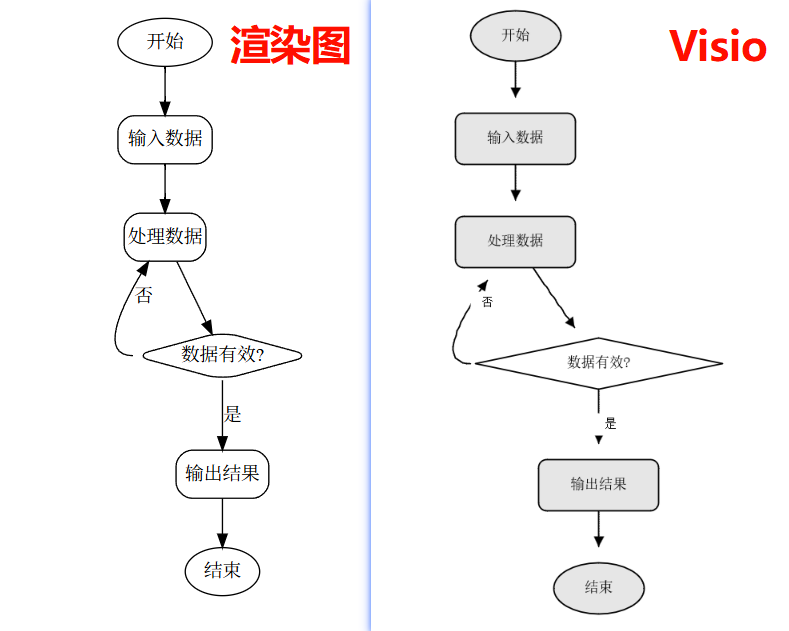

# Graphviz2Visio

**将 Graphviz DOT 流程图转换为可编辑的 Microsoft Visio (.vsdx) 文件。**

Graphviz2Visio 是一个命令行工具，利用 Graphviz 生成节点布局，再通过内置模板直接写入 VSDX XML。默认生成过程不依赖 Microsoft Visio；原有 COM Renderer 作为兼容后端保留。



## 工作流程

```
.dot 文件 ──(Graphviz dot -Tplain)──> .plain 文件 ──(正交路由 + VSDX XML Writer)──> .vsdx 文件
```

## 功能特性

- **dot2plain** — 调用 Graphviz 将 `.dot` 文件转换为 `plain` 布局格式
- **plain2visio** — 解析 `plain` 文件，通过模板直接生成原生、可编辑的 VSDX
- **validate-dot** — 检查判断分支、端口、`rank=same`、循环边和标签规则
- **validate-layout** — 检测原始路径、自动正交路由并验证修复结果
- **validate-vsdx** — 检查最终包结构、页面关系及边 Geometry
- 自动识别项目内嵌的 Graphviz，无需手动安装到系统 PATH
- 支持 box / ellipse / diamond 三种节点形状
- 每条逻辑边写成一个一维 Shape，Geometry 只包含 `MoveTo` 和 `LineTo`
- 保留 dynamic COM Renderer 作为兼容后端

## 环境要求

| 依赖 | 说明 |
|------|------|
| [.NET 8 SDK](https://dotnet.microsoft.com/download) | 编译和运行 |
| [Graphviz](https://graphviz.org/) | 已随项目打包在 `tools/` 目录 |
| [Microsoft Visio](https://www.microsoft.com/zh-cn/microsoft-365/visio/) | 仅旧版 COM Renderer 或打开结果时需要 |

## 快速开始

### 1. 克隆项目

```bash
git clone <repo-url>
cd DotPlainVisio
```

### 2. 编译

```bash
dotnet build Graphviz2Visio.slnx
```

### 3. 验证 Graphviz 识别

```bash
dotnet run --project src/Graphviz2Visio.Cli -- where-dot
```

正常输出：

```
D:\...\Graphviz2Visio\tools\Graphviz-15.0.0-win64\bin\dot.exe
```

### 4. 转换流程图

```bash
# DOT → Plain
dotnet run --project src/Graphviz2Visio.Cli -- dot2plain samples\flow.dot samples\flow.plain

# Plain → Visio
dotnet run --project src/Graphviz2Visio.Cli -- plain2visio samples\flow.plain output\flow.vsdx --visible

# 两步验证（失败时退出码为 3，并输出 JSON）
dotnet run --project src/Graphviz2Visio.Cli -- validate-dot samples\flow.dot
dotnet run --project src/Graphviz2Visio.Cli -- validate-layout samples\flow.plain

# 合并输出两层验证结果
dotnet run --project src/Graphviz2Visio.Cli -- validate samples\flow.dot samples\flow.plain
```

## 打包 exe

项目提供了 Windows 打包脚本，会执行 `dotnet publish`，并把 `tools/Graphviz-*` 复制到发布目录，保证打包后的 exe 能自动找到 `dot.exe`。

默认打包为依赖 .NET 8 Runtime 的版本：

```powershell
powershell -ExecutionPolicy Bypass -File scripts\package-win.ps1
```

输出目录：

```
publish\win-x64-framework\
```

入口文件：

```
publish\win-x64-framework\Graphviz2Visio.Cli.exe
```

如果希望目标机器不需要单独安装 .NET Runtime，可以打包自包含版本：

```powershell
powershell -ExecutionPolicy Bypass -File scripts\package-win.ps1 -SelfContained
```

输出目录：

```
publish\win-x64-selfcontained\
```

如果希望只分发一个独立 exe，并把 Graphviz 也嵌入 exe：

```powershell
powershell -ExecutionPolicy Bypass -File scripts\package-win.ps1 -Standalone
```

输出文件：

```
publish\win-x64-standalone\Graphviz2Visio.Cli.exe
```

该模式会把 Graphviz zip 嵌入程序。第一次运行 `dot2plain` 或 `where-dot` 时，程序会自动把 Graphviz 解压到当前用户的本地缓存目录，然后调用缓存中的 `dot.exe`。

单文件 exe 使用示例：

```powershell
# 验证内嵌 Graphviz 是否可用
.\Graphviz2Visio.Cli.exe where-dot

# DOT → Plain
.\Graphviz2Visio.Cli.exe dot2plain samples\flow.dot output\flow.plain

# Plain → Visio
.\Graphviz2Visio.Cli.exe plain2visio output\flow.plain output\flow.vsdx --visible
```

如果把 exe 放到其他目录，命令中的输入输出路径也按实际位置填写即可：

```powershell
.\Graphviz2Visio.Cli.exe dot2plain C:\work\flow.dot C:\work\flow.plain
.\Graphviz2Visio.Cli.exe plain2visio C:\work\flow.plain C:\work\flow.vsdx
```

也可以指定运行时和输出目录：

```powershell
powershell -ExecutionPolicy Bypass -File scripts\package-win.ps1 -Runtime win-x64 -OutputDir publish\release
```

普通模式和自包含模式需要整体分发发布目录，尤其要保留其中的 `tools` 目录。`-Standalone` 模式只需要分发生成的 exe。默认 XML Renderer 已嵌入 `template/base-easy.vsdx`，生成文件不需要安装 Microsoft Visio。

### 自动发布 GitHub Release

仓库内置了 GitHub Actions workflow：`.github/workflows/release.yml`。推送 `v*` tag 时会自动打包单文件 exe，并上传到 GitHub Release。

```powershell
git tag v1.0.0
git push origin v1.0.0
```

Release 附件会包含：

- `Graphviz2Visio-win-x64-standalone.exe`
- `Graphviz2Visio-win-x64-standalone.zip`

## 命令参考

```
Graphviz2Visio.Cli <command> [arguments]
```

| 命令 | 说明 | 用法 |
|------|------|------|
| `dot2plain` | DOT 转 Plain | `dot2plain <input.dot> <output.plain>` |
| `plain2visio` | Plain 转 Visio | `plain2visio <input.plain> <output.vsdx> [--visible]` |
| `plain2visio-batch` | 多个 Plain 生成多页 VSDX | `plain2visio-batch <output.vsdx> <inputs...> --page-name <标题>...` |
| `plain2visio-com` | 使用旧 COM Renderer | `plain2visio-com <input.plain> <output.vsdx> [--visible]` |
| `plain2visio-com-batch` | 使用旧 COM Renderer 生成多页 | `plain2visio-com-batch <output.vsdx> <inputs...> --page-name <标题>...` |
| `validate-dot` | 验证 DOT 结构规则 | `validate-dot <input.dot>` |
| `validate-layout` | 检测原始路径、自动正交路由并验证修复结果 | `validate-layout <input.plain>` |
| `validate` | 合并执行两层验证 | `validate <input.dot> <input.plain>` |
| `validate-vsdx` | 验证 VSDX 包、页面和正交边 Geometry | `validate-vsdx <input.vsdx>` |
| `where-dot` | 显示 dot.exe 路径 | `where-dot` |

默认 XML Renderer 中，`--visible` 会在生成成功后使用系统关联程序打开 VSDX；COM Renderer 中会显示 Visio 窗口。

## 项目结构

```
Graphviz2Visio/
├── src/
│   ├── Graphviz2Visio.Core/           # 核心库
│   │   ├── Models/                # 数据模型 (Pt, GraphInfo, NodeInfo, EdgeInfo)
│   │   ├── Parsing/               # Plain 格式解析器
│   │   └── Utils/                 # 工具类 (Tokenizer, BezierHelper, ColorHelper)
│   ├── Graphviz2Visio.Graphviz/       # Graphviz 模块
│   │   ├── GraphvizLocator.cs     # 自动定位 dot.exe
│   │   └── GraphvizRunner.cs      # 调用 dot.exe 执行转换
│   ├── Graphviz2Visio.Visio/          # Visio 渲染模块
│   │   └── Rendering/
│   │       └── VisioRenderer.cs   # 通过 dynamic COM 绘制图形
│   ├── Graphviz2Visio.Vsdx/           # 模板驱动的 VSDX XML Writer
│   │   ├── Rendering/             # 页面、节点和单 Shape 正交折线生成
│   │   └── Validation/            # VSDX 包和 Geometry 验证
│   └── Graphviz2Visio.Cli/            # 命令行入口
│       └── Program.cs
├── tools/
│   └── Graphviz-15.0.0-win64/        # 内嵌的 Graphviz
├── samples/
│   ├── flow.dot                      # 示例 DOT 文件
│   └── flow.plain                    # 示例 Plain 文件
└── output/                           # 默认输出目录
```

## 架构说明

项目分为 5 个模块，职责清晰：

- **Core** — 纯业务逻辑，不依赖 Graphviz 和 Visio；负责检测、曼哈顿正交路由和修复后验证
- **Graphviz** — 封装 Graphviz 的查找和调用，支持自动识别 `tools/Graphviz-*` 目录
- **Vsdx** — 默认后端；使用内嵌模板直接写 XML，每条逻辑边对应一个一维 Shape
- **Visio** — 兼容后端；使用 dynamic COM 调用 Visio 绘制图形
- **Cli** — 命令行入口，解析参数并调度对应模块

## 示例 DOT 文件


## 常见问题

### 找不到 dot.exe

确认 `tools/Graphviz-15.0.0-win64/bin/dot.exe` 存在。`GraphvizLocator` 会从程序所在目录向上查找 `tools` 目录中的 Graphviz。

### plain2visio-com 报 COM 错误

确保系统已安装 Microsoft Visio。程序通过 `Visio.Application` ProgID 调用 COM 接口，需要 Visio 正确注册。

### 编译报 dynamic 相关错误

本项目使用 `dynamic COM` 方式调用 Visio，不需要添加 `Microsoft.Office.Interop.Visio` 引用。确保使用 .NET 8 SDK 编译。

## 许可证

MIT License
